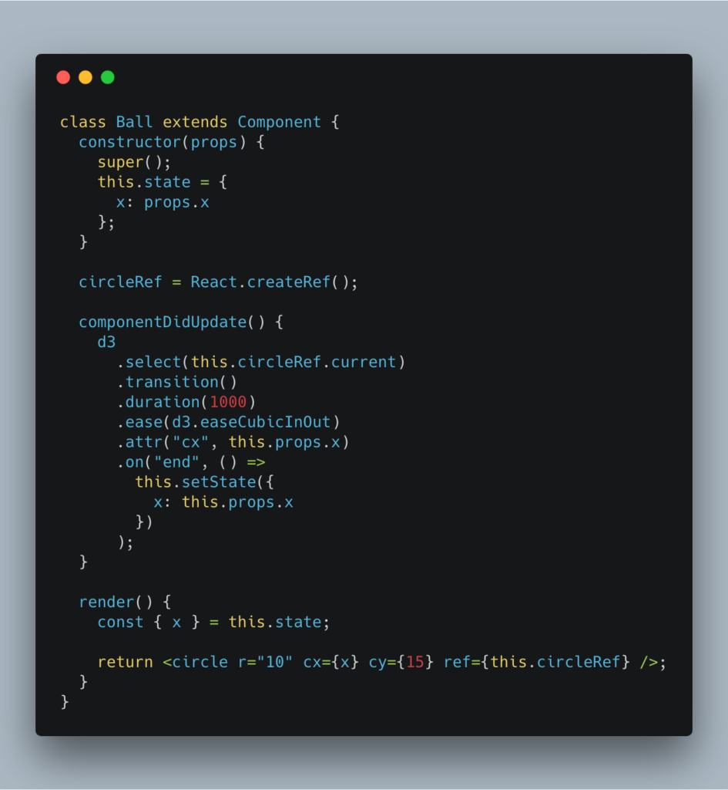

The new React 16.3 brings some changes to the ecosystem that change how we go about integrating React and D3 to build data visualizations.


`componentWillReceiveProps`, `componentWillUpdate` and `compnentWillMount` are on their way out. They were great for making [React and D3](https://swizec.com/reactd3js) happy together, but they cause issues with the async rendering that the React team is planning for React 17.


You tend to use those now-deprecated lifecycle methods to update D3 objects' internal state. Things like setting scale domains and ranges, updating complex D3 layouts, setting up transitions, etc.


But you don't need to! You can do it all with the new lifecycle API.


Here's a small example of building a transition with React 16.3. Using only approved lifecycle callbacks and the new `ref` API.


https&#x3A;//www.youtube.com/watch?v=dipl9j1gpM8


You can play with it on CodeSandbox 👇


## How it works


The core issue we're working around is that when you pass new props into a component, React re-renders. This happens instantly. Because the re-render is instant, you don't have time to show a nice transition going into the new state.


You can solve this by rendering your component from `state` instead of props and keeping that state in sync.


Something like this 👇





We define a `Ball` class-based component. Its state has a single attribute, `x`, which is set to the `props.x` value by default. That way our Ball component starts off rendered at the position the caller wants.


Next, we create a new `circleRef` using the React 16.3 ref API. We use this reference to give D3 control of the DOM so it can run our transition.


That happens in `componentDidUpdate`.


```
componentDidUpdate() {
    d3
      .select(this.circleRef.current)
      .transition()
      .duration(1000)
      .ease(d3.easeCubicInOut)
      .attr("cx", this.props.x)
      .on("end", () =>
        this.setState({
          x: this.props.x
        })
      );
  }
```


React calls `componentDidUpdate` whenever we change our component's props.


We use `d3.select()` to give D3 control of the DOM node, run a transition that lasts `1000` milliseconds, define an easing function, and change the `cx` attribute to the new value we got from props.


Right now, `state` holds the old position and `props` hold the new desired position.


When our transition ends, we update state to match the new reality. This ensures React doesn't get upset with us.


At the very end, we have our `render()` function. It returns an SVG circle. Don't forget to set the `ref` to `this.circleRef`.


## Declarative 💪


We made sure our implementation is completely declarative. To the outside world at least.


Making the ball jump left to right looks like this:


```
// state = { ballLeft: false }
// ballJump() flip ballLeft state
// render()

          
        
```


Our `state` holds a flag that says whether our ball is on the left. If it is, we pass an `x` prop value of `15`, otherwise `300`.


When that value changes, the `<Ball />` transitions itself to its new position. No need for us to worry.


If we flip positions _during_ a transition, D3 is smart enough to stop the previous transition and start a new one. UI looks perfect.


Try it. 🏀


_PS: I'm thinking about updating [my React+D3v4 book](https://swizec.com/reactd3js) for React 16.3 and D3v5. Would that interest you? [Tell me on Twitter](http://twitter.com/home?status=Yo%20@swizec%20you%20should%20update%20your%20React+D3v4%20book)._