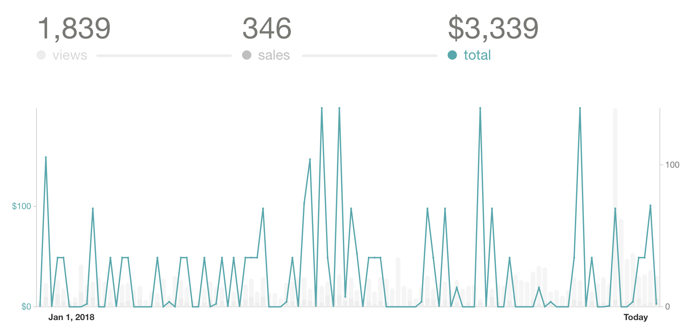
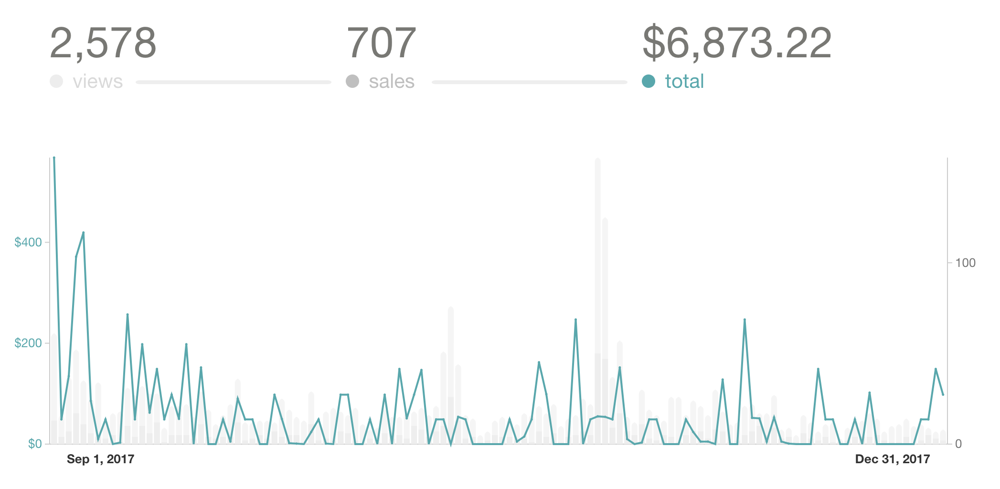
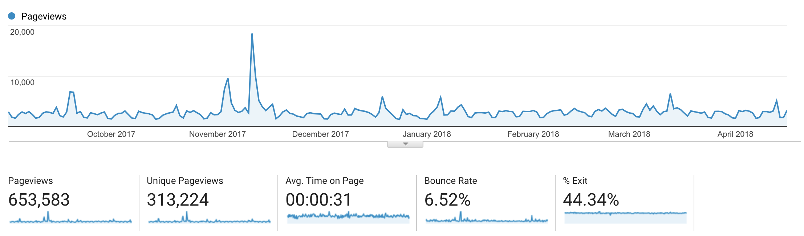
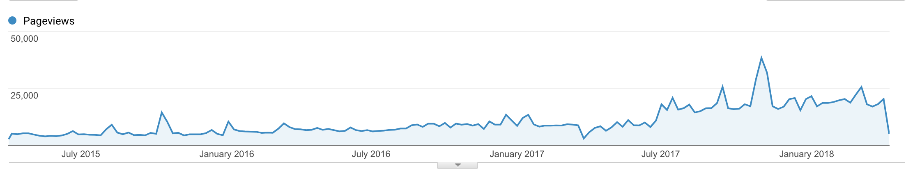
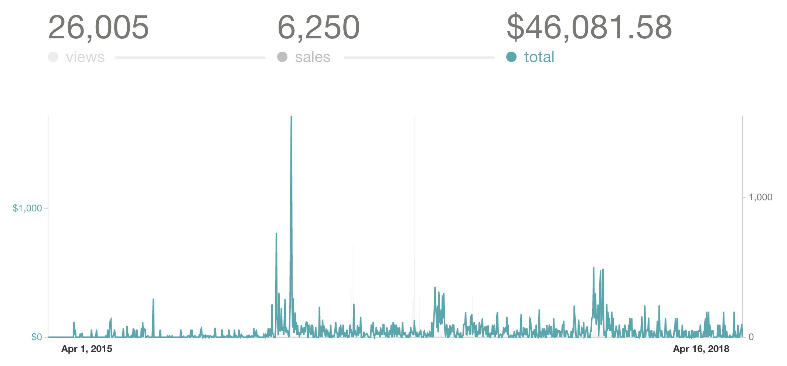
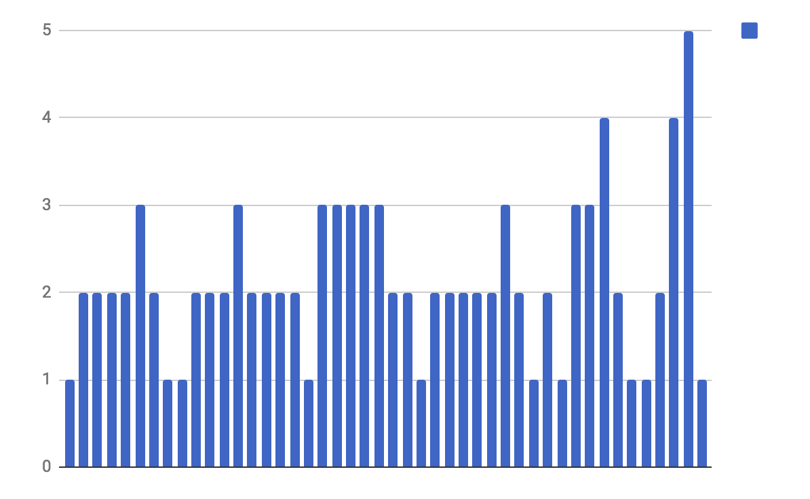
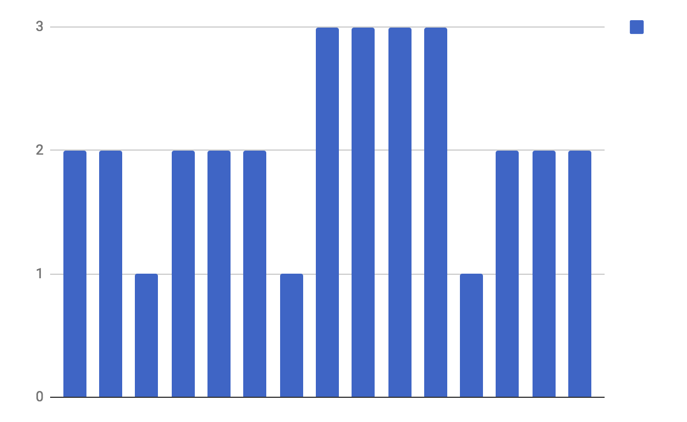
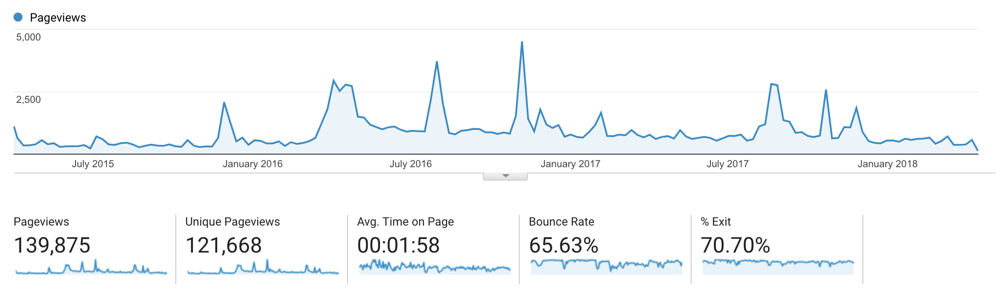
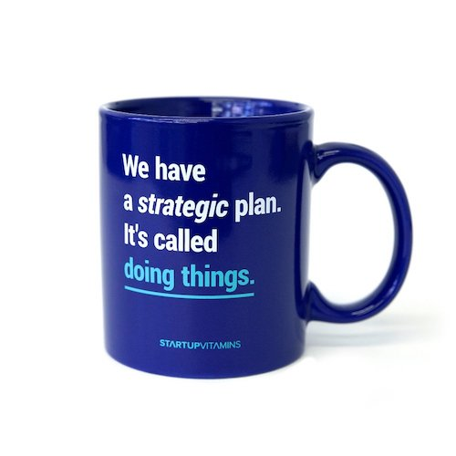

Wanna see a scary graph? Here's a scary graph.

\[caption id="attachment_8331" align="alignnone" width="2102"] Gumroad book sales for React+D3 Jan to Apr 2018\[/caption]

Those are book sales on Gumroad. Grey bars are views, and the green line is sales volume in dollars.

Can you spot the problem?

Here's the same graph for 4 months before New Year's with an outlier removed so you can see the trend. The 30-at-30 promotion I ran for my birthday makes the rest look tiny.

\[caption id="attachment_8337" align="alignnone" width="2094"] Gumroad book sales for React+D3 Sep to Dec 2017\[/caption]

About twice as much revenue. A little more than twice as much in fact, but there're two more weeks of April.

The beginning of September still feels the effects of a launch. Sales are high. Then it starts tapering off and sales become less and less frequent.

This trend continues all the way until the beginning of April where sales frequency starts picking up again.

🤔

Clearly my [React+D3](https://swizec.com/reactd3js) book is due for another launch. Otherwise, it's going to slip beyond the point of no return, and nobody wants that. It's a good book, and it deserves to live.

Let's correlate those sales with blog traffic.

\[caption id="attachment_8336" align="alignnone" width="2214"] swizec.com traffic Sep 2017 to Apr 2018\[/caption]

Stable traffic. Not bad, not spectacular. The lack of growth is worrying, but there's a lot of things I could do about that. Use the mailing list to drive traffic instead of audience relationship, do more to re-share old content, run ads, better SEO tricks, etc.

When you switch to a monthly view, you see a slight downward trend. _However_, over the past 3 years, traffic follows what could be the slow ramp up towards an exponential curve.

\[caption id="attachment_8334" align="alignnone" width="2206"] Blog traffic from Apr 2015 to Apr 2018\[/caption]

Traffic went from 5,000 pageviews per week in April 2015 to 20,000 in April 2018. Not bad for a bloke writing in his spare time.

Sales follow a similar pattern. Gumroad won't let me switch to a per-week view, but you can see density increase.

\[caption id="attachment_8330" align="alignnone" width="2130"] Gumroad book sales Apr 2015 to Apr 2018\[/caption]

Okay, so the relation between blog traffic and Gumroad sales volume is there. Not a super strong correlation, but it seems related nonetheless.

What about blogging volume?

\[caption id="attachment_8335" align="alignnone" width="1194"] Publishing volume per week 2017\[/caption]

\[caption id="attachment_8333" align="alignnone" width="1192"] Publishing volume per week 2018\[/caption]

🤔

It seems despite my valiant efforts, publishing volume has been pretty constant at 2 to 3 articles per week.

Publishing volume, therefore, doesn't have a direct impact on sales either. It might have a long-term impact in that the more I publish, the more chances there are Google will recommend my blog as an answer to your question.

That must be where the growing traffic is coming from. Because it sure doesn't seem to be coming from each individual article when I first publish.

Outside spikes when I get lucky, of course.

Now here's a graph that correlates with sales very well. Book landing page traffic.

\[caption id="attachment_8332" align="alignnone" width="2224"] React+D3 landing page traffic Apr 2015 to Apr 2018\[/caption]

When traffic goes up, Gumroad sales density increases. 🧐

Now we're onto something. The more people that come to my landing page, the more sales I make.

But if not from my blog, where are those people coming from?

To be honest, I don't know. Google says 40% come from "Direct" and another 40% come from "Referral" and "Organic Search"

And the biggest referral? [es6cheatsheet.com](https://es6cheatsheet.com/), which doesn't even link to [React+D3](https://swizec.com/reactd3js).

¯\\\_(ツ)\_/¯

There is a lesson in all this data. I think it's that I should launch more useful side projects and either spend less time blogging or more time optimizing and promoting each post and blog as a whole.

That said, more than 30% of my sales come from Email, and most email subscribers come from the blog. 🤯

Guess for the foreseeable future the strategy remains Doing Things.

Or maybe I just have no idea what I'm doing at all ...