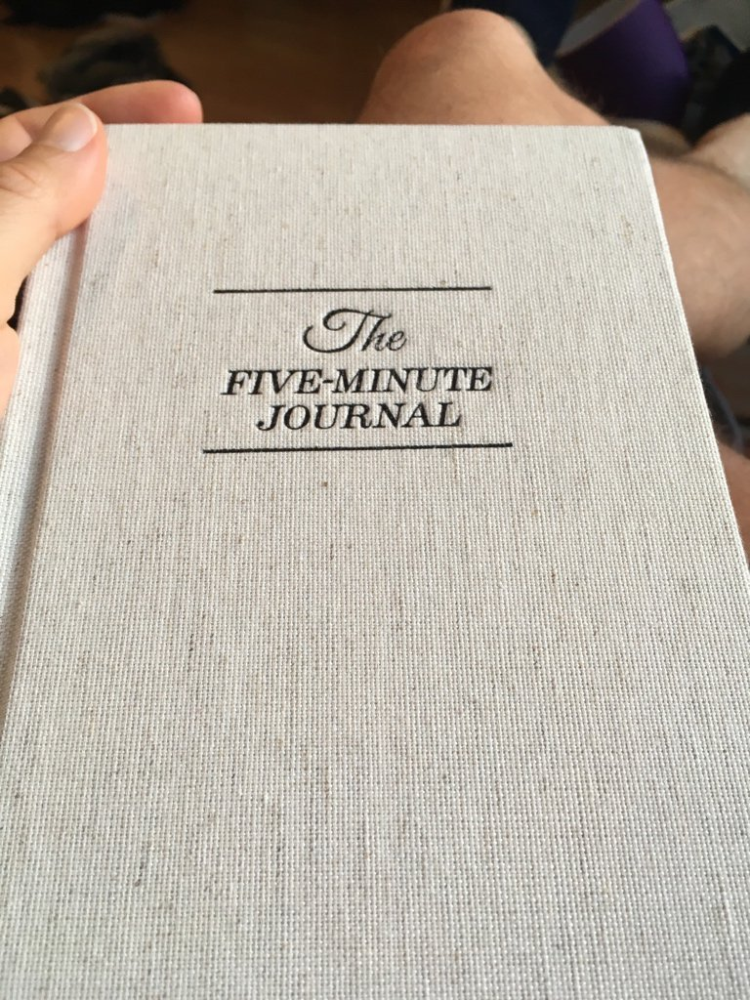

 _The Five Minute Journal: A Happier You in 5 Minutes a Day_, that's the tagline for this overpriced notebook. Right, okay, a happier me. I could do with that. Okay overpriced journal recommended by internet celebrities, I'll give you a shot. What's the worst that can happen?

> Five Minute Journal. Let’s do this  
>   
> Also brilliant way to ensure Product stickiness. Whomever made this thing is a genius in product design. [pic.twitter.com/waAidT11vf](https://t.co/waAidT11vf)
>
> — Swizec (@Swizec) [April 9, 2018](https://twitter.com/Swizec/status/983166955858227200?ref_src=twsrc%5Etfw)

The journal starts with a 50 page introduction that explains how it works. You're going to spend 5 minutes every day. 3 in the morning, 2 in the evening. Both are guided gratitude sessions. You start with listing 3 things you're grateful for, followed by 3 things that would make today amazing, and 1 line of self affirmation. The 50 page introduction explains the science behind gratitude, lists studies that showed it helps people live better lives, and mentions that while self-affirmations sound stupid, they do in fact work and are backed by science. It's not a stretch to think that telling yourself you're a horrible person who can't do nothing right every day, is going to have a different effect than telling yourself how great you are. The guide explains that you aren't meant to stroke your own ego. You're supposed to focus on one or two positive traits you don't have, and emphasize those. Imagine yourself being the person you want to become. For example, I often get distracted by the internet while working. So I started writing in my Five Minute Journal every morning that _"I am a focused person"_. I have become more focused. It's weird. But now I miss shooting the piss on Twitter. So sad. In the evening, you're going to do something similar. You get a prompt that asks for 3 amazing things that happened today, and 2 things you could have done better. Everything revolves around what _you_ are going to do and what _you_ could have done and what _you_ are grateful for. Writing down _"Winning the lottery today would be amazing"_ or _"It would be great if my boss gave me a raise out of the blue"_ will not fly. Yes those would be amazing things that could happen today. But they are not things that are in your control. This is about empowerment. The introduction is followed by one of the best tricks of product design I have ever seen: A page you fill out like a contract. _"I Swizec Teller am going to write this journal every day for 5 days. I will ensure this happens by doing the morning part before , and the evening part right after . I will ask persons to keep me accountable. If I do it, I will reward myself with [, and if I falter I will punish myself with **"**](<>)_ Brilliant.

## Holy shit gratitude is hard

So I did the thing for a week. Every morning. Every evening. It was easy at first. What are you grateful for? Oh my girlfriend and my bird and I have a nice apartment and I'm in the city I always wanted to be in and all the things. But then comes day 6. You're a little hung over. A little tired. A little over the novelty. A little annoyed at your snoring girlfriend drooling all over your pillow. What are you grateful for? Err ... uhm ... I'm alive? No that seems stupid. I like my girl? Nah she ate my cookie last night. The bird? Ugh, he's screaming to be let out of his cage, I can't even hear myself think about what I'm fucking grateful for. But you force it out of yourself. I am grateful for my stupid loud bird and my girlfriend is okay even though her feet are cold in the night. And your mood improves. You chuckle. You write down 3 amazing ideas for the day and you tell yourself you're beautiful. Now you're ready for anything.
