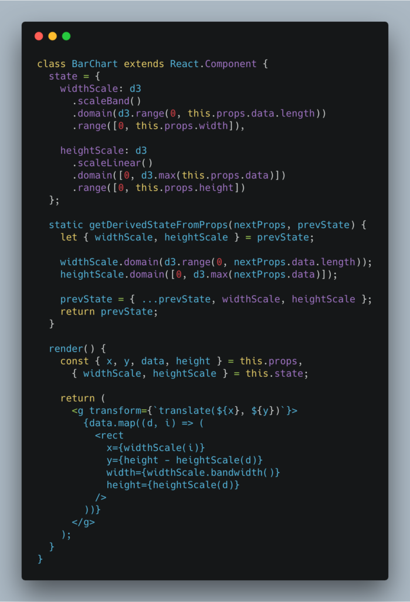
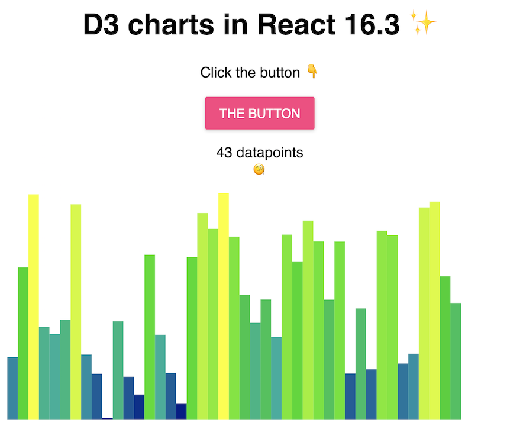

The new React 16.3 brings some changes to the ecosystem that change how we go about integrating [React and D3](https://swizec.com/reactd3js) to build data visualizations. I previously wrote about this in [Declarative D3 transitions with React 16.3](https://swizec.com/blog/declarative-d3-transitions-react/swizec/8323)


`componentWillReceiveProps`, `componentWillUpdate` and `componentWillMount` are on their way out. They were great for making [React and D3](https://swizec.com/reactd3js) happy together, but they cause issues with async rendering that the React team is planning for React 17.


You tend to use those now-deprecated lifecycle methods to update D3 objects’ internal state. Things like setting scale domains and ranges, updating complex D3 layouts, setting up transitions, etc.


But you don’t need to! You can do it all with the new lifecycle API.


Here’s a small example of building a bar chart with React 16.3. Using only approved lifecycle callbacks 😏


You can play with it on CodeSandbox 👇


## How it works


The core problem we're solving is that D3 objects like to keep internal state and React doesn't like that. We have to update D3 objects whenever our React component gets new props.


You have to update a scale mapping data to x-axis pixels whenever either data or width change. Traditionally you would do that in `componentWillReceiveProps`.


React docs recommend replacing `componentWillReceiveProps` with `componentDidUpdate`, but that leads to rendering stale charts. If you update your D3 scales _after_ your component re-renders, that's too late.


Instead, we can move our scales into `state` and use `getDerivedStateFromProps`. 🤯





That's right, you can have complex objects in state now. It's totally safe.


> No that’s fine, React won’t change them, it’s one of the new “was bad practice but is fine now” things that comes with async. You can even mutate their properties.
>
> — Ryan Florence (@ryanflorence) [April 12, 2018](https://twitter.com/ryanflorence/status/984513942696296448?ref_src=twsrc%5Etfw)


Here's the gist of it 👇


### D3 in state


Defining D3 objects as component properties used to be best. Now you should do it in your component `state`.


```
class BarChart extends React.Component {
  state = {
    widthScale: d3
      .scaleBand()
      .domain(d3.range(0, this.props.data.length))
      .range([0, this.props.width]),

    heightScale: d3
      .scaleLinear()
      .domain([0, d3.max(this.props.data)])
      .range([0, this.props.height])
  };
```


We define a `widthScale` and a `heightScale`. Each has a `domain` and a `range` that both depend on `this.props`. Yes you can do that in [JavaScript class fields](http://2ality.com/2017/07/class-fields.html) syntax.


### Update D3 in getDerivedStateFromProps


You then use `getDerivedStateFromProps` to keep those scales up to date when your component updates.


```
  static getDerivedStateFromProps(nextProps, prevState) {
    let { widthScale, heightScale } = prevState;

    widthScale.domain(d3.range(0, nextProps.data.length));
    heightScale.domain([0, d3.max(nextProps.data)]);

    prevState = { ...prevState, widthScale, heightScale };
    return prevState;
  }
```


It's a static method, which means no `this` keyword for you, you're running on the class, not an instance. You get the new props and the current state.


Take `widthScale` and `heightScale` out of props, update their domains, put them back. Probably should update their ranges too.


### Render your chart


Now that your scales are always up to date, you can render your chart. Same as usual, D3 for props, React for rendering.


```
  render() {
    const { x, y, data, height } = this.props,
      { widthScale, heightScale } = this.state;

    return (
      
        {data.map((d, i) => (
          
        ))}
      
    );
  }
```


Get chart coordinates, `data`, and `height` from props. Grab `widthScale` and `heightScale`. Return a `<g>` element full of rectangles.


Each rectangle is rendered in a loop and takes its coordinates and dimensions from our scales.


The result after a splash of color: A BarChart of random numbers where height and color correlate to the value. [](https://codesandbox.io/s/lq0yr1lnq) I also made a button that lets you add random values to the chart. That way you can see that it's updating perfectly declaratively. Update props and the chart updates. No need to understand implementation details.


You can [play with it on CodeSandbox](https://codesandbox.io/s/lq0yr1lnq).


## Pushing it too far


You can render 100,000 SVG nodes in CodeSandbox if you're patient. Then you can't edit your code anymore.


> You can render 100,000 SVG elements in [@codesandboxapp](https://twitter.com/codesandboxapp?ref_src=twsrc%5Etfw) and then you can't edit your code anymore.  
>   
> 👉 <https://t.co/8IQCpZteAq> [pic.twitter.com/NRjp7iVWrE](https://t.co/NRjp7iVWrE)
>
> — Swizec (@Swizec) [April 27, 2018](https://twitter.com/Swizec/status/989909019463630848?ref_src=twsrc%5Etfw)