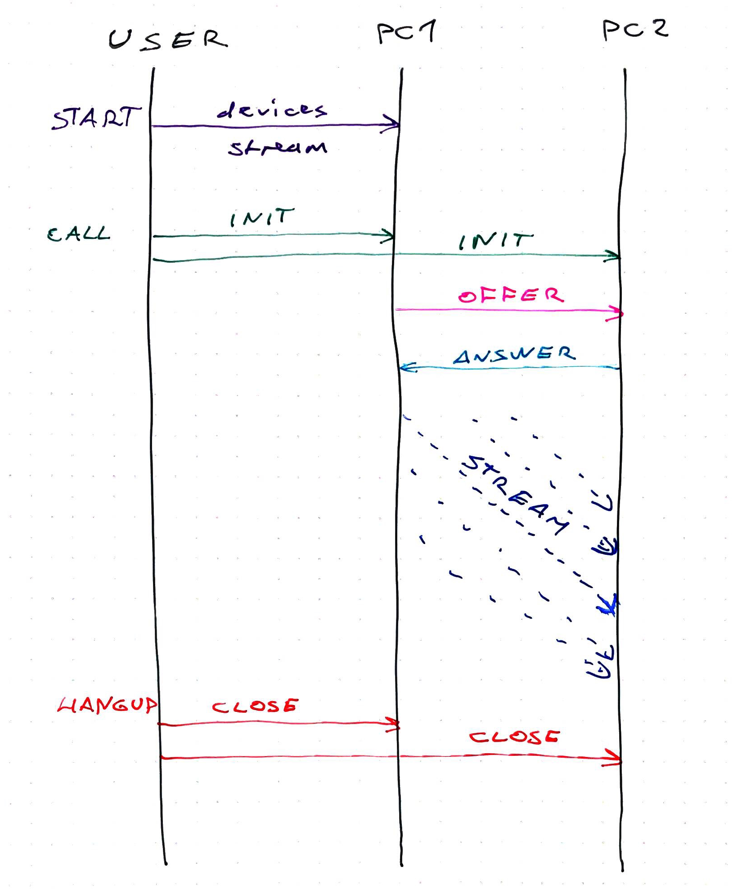

https&#x3A;//www.youtube.com/watch?v=pjoem5laCYQ Remember [blockchain-redux](https://github.com/Swizec/blockchain-redux)? Yeah, I'm still working on it. Last time, we got it to [share blocks between clients in real-time](https://swizec.com/blog/blockchain-redux-shares-blocks-between-clients-real-time/swizec/8320). But that still used Firebase as the communication channel. Our blockchain isn't really distributed. ☹️ I have to fix that before my talk at [WeAreDevelopers Congress](https://www.wearedevelopers.com/congress/) in Vienna. Otherwise, what's the point? WebRTC can do that for us. Get browsers to talk to each other without any servers at all. I built [a demo app](https://swizec.github.io/webrtc-sample/) that uses `RTCPeerConnection` to build a peer-to-peer connection with itself. You can see the [code on GitHub](https://github.com/Swizec/webrtc-sample/blob/master/src/WebRTCPeerConnection.js) or keep reading. https&#x3A;//twitter.com/Swizec/status/993269639235842051 Since iOS 11, WebRTC now works in all browsers people use. You can use it for real! 👍🏼 [Try my demo here](https://swizec.github.io/webrtc-sample/). I'd embed an iframe, but browser security rules say no. WebRTC offers 3 APIs:

-   get video and audio from devices [(`MediaStream`)](https://www.html5rocks.com/en/tutorials/webrtc/basics/#toc-mediastream)
-   establish peer-to-peer connections [(`RTCPeerConnection`)](https://www.html5rocks.com/en/tutorials/webrtc/basics/#toc-rtcpeerconnection)
-   send arbitrary data [(`RTCDataChannel`)](https://www.html5rocks.com/en/tutorials/webrtc/basics/#toc-rtcdatachannel)

In this article, we'll use 2 of them. Media and peer connection.

## RTCPeerConnection connects clients without servers

\[caption id="attachment_8358" align="alignnone" width="1629"] RTCPeerConnection process sketch\[/caption] You establish a connection between 2 clients on the same page like this 👇

1.  Instantiate two `RTCPeerConnection` objects
2.  Add each other as ICE candidates
3.  `createOffer` on the 1st object
4.  set local/remote "description" on both
5.  `createAnswer` on the 2nd object
6.  set remote/local "description" on both
7.  Enjoy your direct communication

Here's how that goes [in code](https://github.com/Swizec/webrtc-sample/blob/master/src/WebRTCPeerConnection.js). We start with a React component that renders 2 videos and 3 buttons. It has a bunch of default state that we'll use to drive everything.

    class WebRTCPeerConnection extends React.Component {
        state = {
            startDisabled: false,
            callDisabled: true,
            hangUpDisabled: true,
            servers: null,
            pc1: null,
            pc2: null,
            localStream: null
        };

        localVideoRef = React.createRef();
        remoteVideoRef = React.createRef();

        start = () => {
            // start media devices
        };

        call = () => {
            // initiate a call
        };

        hangUp = () => {
            // hang up connection
        };

        render() {
            const { startDisabled, callDisabled, hangUpDisabled } = this.state;

            return (
                

                    
                    

                    

                        
                            Start
                        
                        
                            Call
                        
                        
                            Hang Up
                        
                    

                

            );
        }
    }

We have 3 booleans that enable/disable our buttons, `null` peer connections `pc1` and `pc2`, I don't know what `servers` are for, and we render videos and buttons.

## Step 1 → start

When you click the `Start` button, we ask for audio/video permissions and start a `localStream`.

        start = () => {
            this.setState({
                startDisabled: true
            });
            navigator.mediaDevices
                .getUserMedia({
                    audio: true,
                    video: true
                })
                .then(this.gotStream)
                .catch(e => alert("getUserMedia() error:" + e.name));
        };
        
        gotStream = stream => {
            this.localVideoRef.current.srcObject = stream;
            this.setState({
                callDisabled: false,
                localStream: stream
            });
        };

Disable the start button with `this.setState`, get your media with `navigator.getUserMedia`. If you give permission, we start streaming in the `localVideo` element and add it to state.

## Step 2 → Call

You can now press the `Call` button. That starts two peer connections, `pc1` and `pc2`, and goes through the dance to get them talking to each other.

1.  `call` initiates the offer
2.  `onCreateOfferSuccess` updates both pcs and initiates the answer
3.  `onCreateAnswerSuccess` finishes the handshake
4.  `gotRemoteStream` wakes up and sets the second video

        call = () => {
            this.setState({
                callDisabled: true,
                hangUpDisabled: false
            });
            let { localStream } = this.state;

            let servers = null,
                pc1 = new RTCPeerConnection(servers),
                pc2 = new RTCPeerConnection(servers);

            pc1.onicecandidate = e => this.onIceCandidate(pc1, e);
            pc1.oniceconnectionstatechange = e => this.onIceStateChange(pc1, e);

            pc2.onicecandidate = e => this.onIceCandidate(pc2, e);
            pc2.oniceconnectionstatechange = e => this.onIceStateChange(pc2, e);
            pc2.ontrack = this.gotRemoteStream;

            localStream
                .getTracks()
                .forEach(track => pc1.addTrack(track, localStream));

            pc1
                .createOffer({
                    offerToReceiveAudio: 1,
                    offerToReceiveVideo: 1
                })
                .then(this.onCreateOfferSuccess, error =>
                    console.error(
                        "Failed to create session description",
                        error.toString()
                    )
                );

            this.setState({
                servers,
                pc1,
                pc2,
                localStream
            });
        };

This code is mostly boilerplate. We enable and disable the appropriate buttons, get `localStream` from state, and instantiate `servers`, `pc1`, and `pc2`. Both `pc*` objects get a bunch of event listeners. `onIceCandidate` will connect them to each other, `onIceStateChange` just prints debugging info, and `gotRemoteStream` will add it to the right `<video>` element. Then we take all tracks from `localStream` (audio and video) and add them to the first client. After that `pc1` creates an offer to receive its video and audio. When all that's done, we update component state.

### onCreateOfferSuccess

After `pc1` successfully creates an offer to be received, we update local and remote descriptions in our clients. I'm not sure what these "descriptions" are, but it's where the important stuff happens.

        onCreateOfferSuccess = desc => {
            let { pc1, pc2 } = this.state;

            pc1
                .setLocalDescription(desc)
                .then(
                    () =>
                        console.log("pc1 setLocalDescription complete createOffer"),
                    error =>
                        console.error(
                            "pc1 Failed to set session description in createOffer",
                            error.toString()
                        )
                );

            pc2.setRemoteDescription(desc).then(
                () => {
                    console.log("pc2 setRemoteDescription complete createOffer");
                    pc2
                        .createAnswer()
                        .then(this.onCreateAnswerSuccess, error =>
                            console.error(
                                "pc2 Failed to set session description in createAnswer",
                                error.toString()
                            )
                        );
                },
                error =>
                    console.error(
                        "pc2 Failed to set session description in createOffer",
                        error.toString()
                    )
            );
        };

`pc1` updates its local description, and `pc2` updates its remote description. `pc2` also creates an answer, which I think is akin to saying _"Okay, I accepted your offer, let's do this"_.

### onCreateAnswerSuccess

When `pc2` successfully creates an answer, we do another round of description setting. This time in reverse order.

        onCreateAnswerSuccess = desc => {
            let { pc1, pc2 } = this.state;

            pc1
                .setRemoteDescription(desc)
                .then(
                    () =>
                        console.log(
                            "pc1 setRemoteDescription complete createAnswer"
                        ),
                    error =>
                        console.error(
                            "pc1 Failed to set session description in onCreateAnswer",
                            error.toString()
                        )
                );

            pc2
                .setLocalDescription(desc)
                .then(
                    () =>
                        console.log(
                            "pc2 setLocalDescription complete createAnswer"
                        ),
                    error =>
                        console.error(
                            "pc2 Failed to set session description in onCreateAnswer",
                            error.toString()
                        )
                );
        };

`pc1` sets its remote description and `pc2` sets its local description. I think this acknowledges that, from `pc1`'s perspective, it is local to itself and `pc2` is remote, and vice-versa for `pc2`. ¯\\\_(ツ)\_/¯ At this point, we have two video streams talking to each other on the same page. https&#x3A;//twitter.com/Swizec/status/993269639235842051

### onIceCandidate

At some point during all this, both `pc*`s say that they've got an ICE candidate. Don't know when exactly that happens, but it gives us a chance to tell each client who they're talking to.

        onIceCandidate = (pc, event) => {
            let { pc1, pc2 } = this.state;

            let otherPc = pc === pc1 ? pc2 : pc1;

            otherPc
                .addIceCandidate(event.candidate)
                .then(
                    () => console.log("addIceCandidate success"),
                    error =>
                        console.error(
                            "failed to add ICE Candidate",
                            error.toString()
                        )
                );
        };

We guess the other client and add it as a candidate. If we had more than 2, this could get tricky.

## Step 3: HangUp

Hanging up is easy. You close both clients.

        hangUp = () => {
            let { pc1, pc2 } = this.state;

            pc1.close();
            pc2.close();

            this.setState({
                pc1: null,
                pc2: null,
                hangUpDisabled: true,
                callDisabled: false
            });
        };

## The tricky part

This works great as a tech demo. And that's when your dreams are shattered. The first part of your connection, where two clients find each other, is called signaling. The WebRTC spec doesn't say anything about signaling. It's easy in a single page, two client demo. Both clients are right there, in memory. And there's only two clients to boot. But in the real world, you want those clients to run in different browsers, on different machines, far apart in the world. How do you make them find each other? What if there's thousands? Well, you need some sort of communication channel that knows where all the clients are and can say _"Yo, connect here. You, over there!"_. A central server of some sort… That won't do for a distributed decentralized blockchain ☹️ Next step: Serverless WebRTC signaling. Stay tuned.  
&lt;strong_This is a Livecoding Recap – an almost-weekly post about interesting things discovered while livecoding. Usually shorter than 500 words. Often with pictures. Livecoding happens almost **every Sunday at 2pm PDT** on multiple channels. You should subscribe to [My Youtube](https://www.youtube.com/TheSwizec) channel to catch me live._
