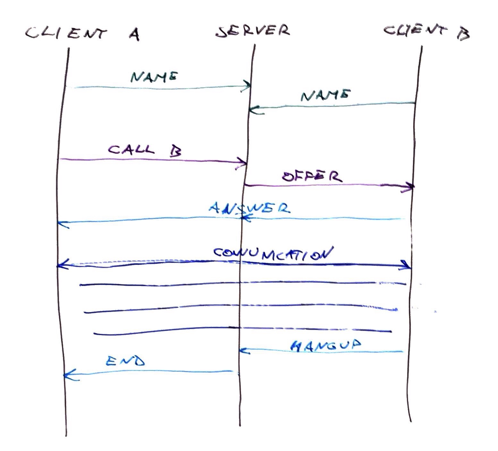
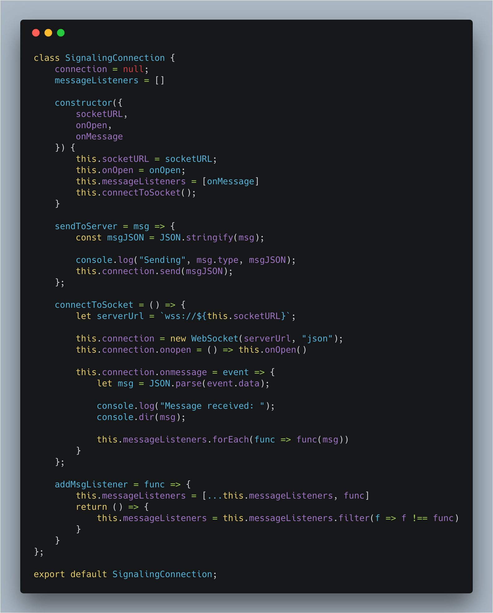
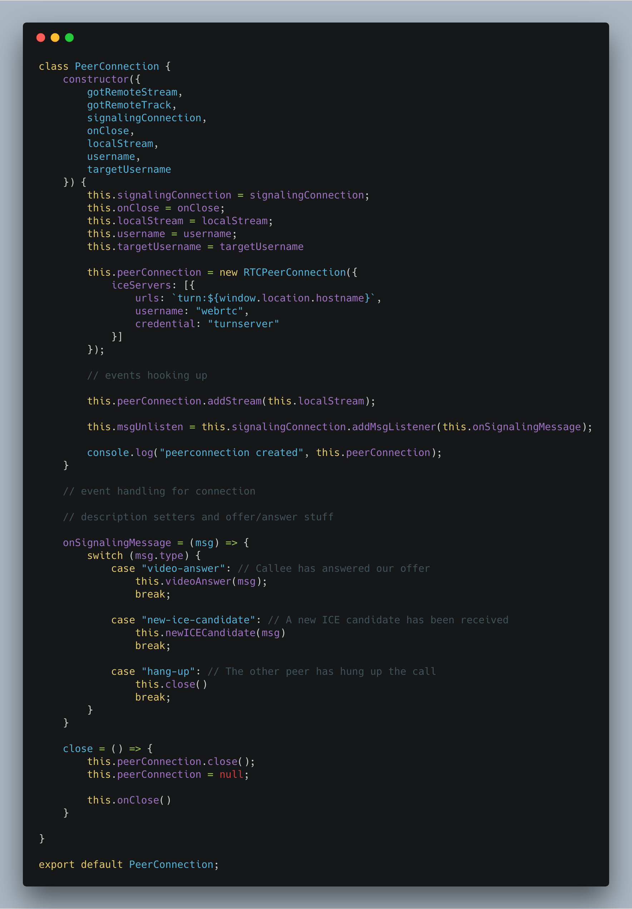

_This is a Livecoding Recap – an almost-weekly post about interesting things discovered while livecoding. Usually shorter than 500 words. Often with pictures. Livecoding happens almost **every Sunday at 2pm PDT** on multiple channels. You should subscribe to [my Youtube channel](https://www.youtube.com/user/TheSwizec) to catch me live._ It worked! We got two browsers on different machines talking to each other without a server. Well… after the initial handshake. You still need a server for that. https&#x3A;//twitter.com/Swizec/status/995933206187728896 That was a fun weekend. Two livecoding sessions. Finally got it working late at night when the cameras weren't rolling. I am nowhere near having it working in time for a true blockchain demo for my WeAreDevelopers talk this Friday. 😅 https&#x3A;//www.youtube.com/watch?v=8TFj_U5CyWQ https&#x3A;//www.youtube.com/watch?v=L8bsztuOEeQ You can [try it out here](https://swizec.github.io/webrtc-sample/). Open that link in two browsers, possibly on different machines. You might have to try a couple of times, it's a little finicky. 🤨 Here's how it works 👇

## How to use WebRTC to connect browsers on different devices

 You can use WebRTC to make browsers talk to each other directly without a server. But because there's no service discovery, you need a signaling server so browsers can find each other. The flow goes like this:

1.  Client 1 says hi to the server and registers
2.  Client 2 says hi to the server and registers
3.  Server holds list of identifiers (usernames)
4.  Client 1 tells server to call Client 2
5.  Server tells Client 2 there's a call
6.  Client 2 answers the call
7.  Client 1 and Client 2 are now talking directly

We followed [this WebRTC chat example from MDN](https://github.com/mdn/samples-server/tree/master/s/webrtc-from-chat) to model our code.

### Signaling WebSocket server

Signaling is the handshake process between two browsers. Our implementation uses WebSockets to do that. The [server part is the same](https://github.com/Swizec/webrtc-sample/blob/master/signaling-server.js) as the MDN example. Pure copy pasta. We made some changes to make it work with [now.sh](https://zeit.co). Namely, we removed all SSL stuff. Zeit wraps our servers in a secure SSL server that then talks to our actual server via an unencrypted connection. That was a painful gotcha to learn. WebSockets don't work in modern browsers without SSL. And they don't work with self-signed certificates unless you're running localhost. If you want browsers that are not on your machine to talk, you're gonna have to ensure a real SSL cert. Easiest way is to deploy on `now`.

### Connecting to the signaling server

Talking to the server happens via WebSockets with [a 40 line helper class](https://github.com/Swizec/webrtc-sample/blob/master/src/SignalingConnection.js). Instantiate the class, make a connection, listen for messages.  We create a `new WebSocket` in `connectToSocket`, add some callbacks, and hope for the best. The `onmessage` listener allows us to add additional message listeners later via the `messageListeners` array. `sendToServer` lets us send a JSON object to our server, and `addMsgListener` lets us add a new message listener. We'll use this to wire up our `PeerConnection` helper to our server.

### Establishing a peer connection

Learning our lesson from [WebRTC part 1](https://swizec.com/blog/learning-webrtc-peer-peer-communication-part-1/swizec/8359), we split our RTCPeerConnection stuff into [a helper class](https://github.com/Swizec/webrtc-sample/blob/master/src/PeerConnection.js). It's about 148 lines and handles the whole lifecycle. We [talked about the code before](https://swizec.com/blog/learning-webrtc-peer-peer-communication-part-1/swizec/8359), so here's a recap 👇  `constructor` sets a bunch of instance vars, sets up a new `RTCPeerConnection` object, tells it which `iceServers` to use, connects local event listeners, starts listening for messages on our signaling server, and adds our media stream to the `peerConnection`. The next step is `handleICECandidate`, interactive connectivity establishment, which triggers when a new connection is attempted. It pings our signaling server and says _"Yo, new ice candidate here"_.

        handleICECandidateEvent = event => {
            if (event.candidate) {
                this.signalingConnection.sendToServer({
                    type: "new-ice-candidate",
                    target: this.targetUsername,
                    candidate: event.candidate
                });
            }
        };

After that, we’ve got the `handleNegotiationNeededEvent`, which is called when `RTCPeerConnection` says some negotiation needs to happen. I don't know what makes it say that. But the function creates a new connection offer, updates the local SDP description, and tells our signaling server that we're trying to call someone.

       handleNegotiationNeededEvent = () => {
            const {
                username,
                targetUsername
            } = this;
            this.peerConnection
                .createOffer()
                .then(offer => this.peerConnection.setLocalDescription(offer))
                .then(() =>
                    this.signalingConnection.sendToServer({
                        name: username,
                        target: targetUsername,
                        type: "video-offer",
                        sdp: this.peerConnection.localDescription
                    })
                )
                .catch(console.error);
        };

#### Handling signaling messages

Then we have the fun stuff: handling messages from our signaling server.

        onSignalingMessage = (msg) => {
            switch (msg.type) {
                case "video-answer": // Callee has answered our offer
                    this.videoAnswer(msg);
                    break;

                case "new-ice-candidate": // A new ICE candidate has been received
                    this.newICECandidate(msg)
                    break;

                case "hang-up": // The other peer has hung up the call
                    this.close()
                    break;
            }
        }

When a message comes in, we can do a couple different things. Set ourselves up as the answer party, add a new candidate to our connection, or close. Those functions are thin wrappers over WebRTC APIs.

        videoAnswer = ({
            sdp
        }) => {
            this.peerConnection
                .setRemoteDescription(new RTCSessionDescription(sdp))
                .catch(console.error);
        }

        newICECandidate = ({
            candidate
        }) => {
            this.peerConnection.addIceCandidate(new RTCIceCandidate(candidate));
        }
        
       close = () => {
            this.peerConnection.close();
            this.peerConnection = null;

            this.onClose()
        }

That's our PeerConnection object. In theory, we could instantiate many of them to connect to multiple remote machines at the same time. That will be a fun experiment. 

### Putting it all together

Holding it all together is our `WebRTCPeerConnectionWithServer` React component. It renders the UI, instantiates both helper classes from above, and handles the user clicking on buttons to drive the process. You can see [the whole file on GitHub](https://github.com/Swizec/webrtc-sample/blob/master/src/WebRTCPeerConnectionWithServer.js). Here are the salient parts. 👇

        call = user => {
            this.setState({
                targetUsername: user
            });
            this.createPeerConnection();
        };

        hangUp = () => {
            this.signalingConnection.sendToServer({
                name: this.state.username,
                target: this.state.targetUsername,
                type: "hang-up"
            });
            this.peerConnection.close();
        };

        createPeerConnection = () => {
            if (this.peerConnection) return;

            this.peerConnection = new PeerConnection({
                gotRemoteStream: this.gotRemoteStream,
                gotRemoteTrack: this.gotRemoteTrack,
                signalingConnection: this.signalingConnection,
                onClose: this.closeVideoCall,
                localStream: this.state.localStream,
                username: this.state.username,
                targetUsername: this.state.targetUsername
            });
        };

        closeVideoCall = () => {
            this.remoteVideoRef.current.srcObject &&
                this.remoteVideoRef.current.srcObject
                    .getTracks()
                    .forEach(track => track.stop());
            this.remoteVideoRef.current.src = null;

            this.setState({
                targetUsername: null,
                callDisabled: false
            });
        };

`call` is where the fun starts. Saves whom we're calling to state and creates a peer connection. `createPeerConnection` passes all the things into our `PeerConnection` class. `hangUp` and `closeVideoCall` work together to finish our call. We need both because one is user-driven and the other is called when hangup comes from the other side.

### One last thing

There's one message from the signaling server we have to handle in the glue area: An offer for a call.

        case "video-offer": // Invitation and offer to chat
            this.createPeerConnection();
            this.peerConnection.videoOffer(msg);
            break;

When the server tells us someone wants to connect, we have to create a new `PeerConnection` object on our client and handle the offer. Handling the offer means setting a remote SDP description and sending an answer.

       videoOffer = ({
            sdp
        }) => {
            const {
                username,
                targetUsername
            } = this;

            this.peerConnection
                .setRemoteDescription(new RTCSessionDescription(sdp))
                .then(() => this.peerConnection.createAnswer())
                .then(answer => {
                    return this.peerConnection.setLocalDescription(answer);
                })
                .then(() => {
                    this.signalingConnection.sendToServer({
                        name: username,
                        targetUsername: targetUsername,
                        type: "video-answer",
                        sdp: this.peerConnection.localDescription
                    });
                })
                .catch(console.error);
        }

👌

## And then it works 🤞

If all the stars align, you can now have a call between 2 browsers on different machines without talking to the server again. https&#x3A;//twitter.com/Swizec/status/995933206187728896
