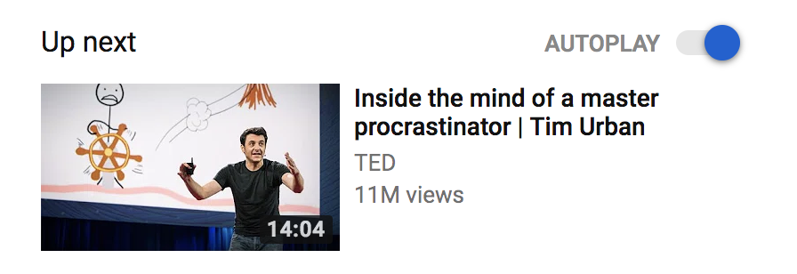

_"It worked last night, I promise.”_

https&#x3A;//www.youtube.com/watch?v=GcOAzREWgFo

Last week, I presented my crazy [blockchain-redux idea](https://swizec.com/blog/blockchain-redux-becomes-useful-part-1/swizec/8311) at WeAreDevs world congress, a conference of 8,000 people.

One person called it refreshing; another said it's the first time they’d seen an idea, not a product, at a conference. 💪

Of course, the next related video YouTube shows after [my vlog about preparing for the talk](https://www.youtube.com/watch?v=GcOAzREWgFo) is Tim Urban's Inside the Mind of a Master Procrastinator. 🤔

Their AI be good 😅

## Anyway, here's some stuff I learned at [We Are Developers 2018](https://www.wearedevelopers.com/) →

1. You _can_ prepare a talk in 3 days at the tail end of 3 months of casual research, but you probably shouldn't
2. The best talks are built like a standup routine on top of a life well lived
3. Woz is cool but kind of a strange person. His insights are curious
4. There are waaaaay more VR devices out there than you'd think
5. Now is a good time to get into VR
6. You can have 100,000 monthly active users with a few Alexa skills
7. Only those Alexa skills promoted by Amazon will live. Others die
8. If you are presenting, put your handle on every slide so people know how to quote you when they post photos on social media
9. 8000 people is too big and intimidating for effective Meet New People activities. Hard to strike up random conversations when there's nothing intrinsically in common other than "We both write code"
10. Blockchain/crypto is a cult
11. Vienna is beautiful. Go visit
12. You write code that runs in the future, it is therefore de facto legislature
13. Developers might be the only profession that doesn't even pretend to know what we're doing. We just dive right in and figure it out.
14. Woz says managing is easier than coding, and it's unclear whether that was a joke, honest opinion, or pandering to the crowd
15. Also company values without action are bullshit
16. Oh, and Angular is doing some iiiiinteresting things with automatic code mods to make upgrading JavaScripts and such easier

https&#x3A;//twitter.com/Swizec/status/997487063221047328

https&#x3A;//twitter.com/Swizec/status/997429978944950273

https&#x3A;//twitter.com/Swizec/status/997425060850921473

https&#x3A;//twitter.com/Swizec/status/997426249646649344

https&#x3A;//twitter.com/Swizec/status/997400957775482881

https&#x3A;//twitter.com/Swizec/status/997407124727611392

https&#x3A;//twitter.com/Swizec/status/996742469147680769

https&#x3A;//twitter.com/Swizec/status/996668145300639744

## You get a big room if you put enough buzzwords in your talk title.

https&#x3A;//twitter.com/Swizec/status/997470708396675072

https&#x3A;//twitter.com/ngKalbarczyk/status/997469861591879680

Guess now I have to build the stuff I promised in my talk.