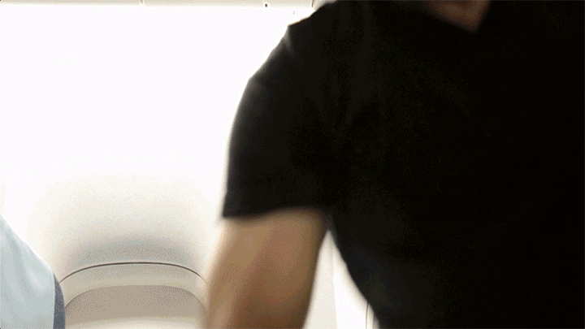

 If you're like me, you've tried VR before, and you thought, _"Meh, this is useless"_. Times have changed, my friend. I first tried VR in a semi-legal underground art gallery in 2009. You put on a pair of bulky goggles, tripped over wires, and manipulated a heavy pen thing attached to even more wires, and you could paint in 3D space. \[caption width="600" align="aligncenter"] I don't have photos of that night, but this is the building.\[/caption] Head and pen tracking were done through cameras attached to the ceiling. ARKit-style gyro chips were far in the future still, barely a dream. It almost worked. You got nauseous after 60 seconds. My friend was very proud of his art installation. There was a line out the door. The next time I almost tried VR was at a conference. There was a headset, some sort of early Oculus, with a rollercoaster experience. No interaction, just sit there and get seasick. There was a line out the door, I got impatient and left. The public 2D screen of what people see looked like fun. You'd get nauseous after 5 to 10 minutes. Last year, I finally tried real VR. A room scale sort of thing with 6 dimensions of freedom or whatever it's called. You had goggles with a bunch of wires attached to a strong computer, and I think cameras on the ceiling somewhere. The controllers were wireless this time. You could paint and move and it was fun for about 2 minutes and then you'd get bored. The line wasn't too long. Every techie got jaded about VR long ago. It's fun but useless. Nausea after 20 to 30 minutes. Wires everywhere. Need a gaming rig to play. Cumbersome. Last week, I got an Oculus Go, and holy shit, my life changed forever.

## Oculus Go changed my life

Oculus Go is everything I always wanted in a VR headset. It's self-contained, meaning there are no wires to get tangled in, no powerful gaming rig you have to buy, no fancy cameras to set up, and no large empty room you need. No phone to plug-in either. You put it on, press a button, and you're in VR. You don't even need to turn it on. Somehow it always knows when it's on your face and turns on. Plus it's small enough to fit in your backpack next to a book and other knickknacks you need on a plane. 👌 Best thing? No nausea. You can spend _hours_ inside VR, and you never get nauseous or anything. You just have to remember to blink. Yes, it's a problem. Your eyes go dry and start to itch. Sure, it's sit-down VR that doesn't do much more than put a fancy display up on your face, but there's a lot you can do with that and a controller. There are fun games (I like shoot-em-ups), you have social experiences watching movies and Netflix… there are even experiences where someone took a 360-degree camera on an adventure. My mum loved those. So did my grandma. They were blown away by just staring into the abyss of the Grand Canyon. Said they never realized how deep it was. https&#x3A;//twitter.com/Swizec/status/998951408518029318 Personally, I enjoy games, Netflix, and movies. It's like IMAX on your face. Your immersion is surprisingly good even when watching 2D content. I think it's the 3D sound. Like, you're watching Star Trek, and you're surprised to find yourself in your bed when the goggles come off. Or on a plane. It's hard to explain how shocking it is to realize you're in a mundane location when you take off the goggles. I've never experienced anything like it. That's a lie. It's like when you hyperventilate in a grassy field to make yourself pass out for 2 seconds when you're a stupid 12-year old. Coming out of VR is just like that moment when you come out of having passed out and everything feels a little off, a little unreal, like the place you just left is the real reality. VR really is the future. https&#x3A;//twitter.com/Swizec/status/996742469147680769 I just wish Oculus Go had more serious games. There's only so far you can go with arcade stuff. And the resolution isn't quiiiiiiteeee there to read articles comfortably. I see a lot of promise in VR browsers, especially if they improve it to where you can have multiple windows strewn around virtual space. That would be great for research. Like that scene in Snow Crash where Hiro has bits of info strewn about so it looks like he's in a galaxy. I want to do everything in VR now :D
