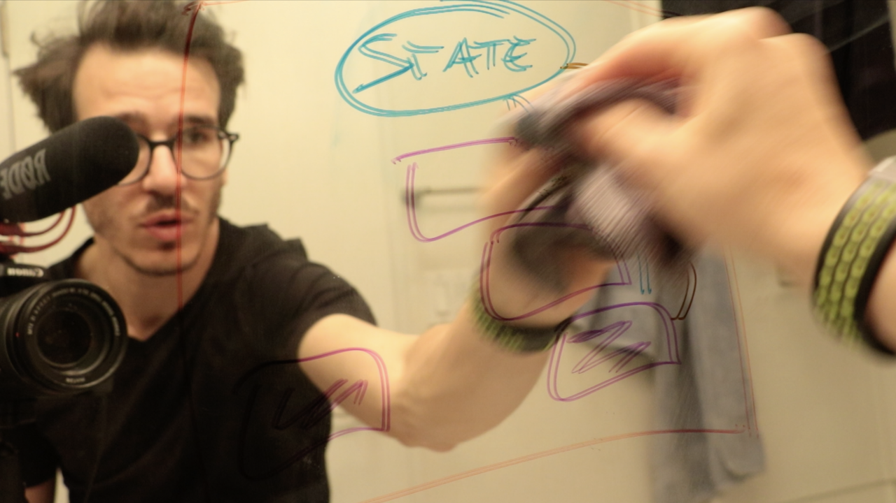

 From April 5th to May 9th, I published [30 videos about React](https://www.youtube.com/playlist?list=PLF8WgaD4xmjWuh7FTYTealxehOuNor_2S) on the internets. All of the internets. [Twitter](https://twitter.com/Swizec/status/981932124231024640), [Facebook](https://www.facebook.com/swizecpage/), [YouTube](https://www.youtube.com/playlist?list=PLF8WgaD4xmjWuh7FTYTealxehOuNor_2S), [learnwhileyoupoop.com](https://learnwhileyoupoop.com/). Each video up to 2 minutes 20 seconds long, each part of my initial [Learn While You Poop](https://learnwhileyoupoop.com) series, each starting in my bathroom, some with drawings on mirrors, others with computer screencasts. Goal was to publish 30 instructional videos in 30 days and test the hypothesis that a quick lightweight approach to teaching new technical skills exists. It went great 😎 https&#x3A;//twitter.com/tuomasj/status/998526109317828608 Altho… the full playlist is just 29 videos. Did I lose count? 🤔 And there's 34 days between Apr 5th and May 9th because staying on the wagon is hard but not too hard, heh 😇 6560 views on YouTube 12019 views on Twitter 5729 views on Facebook (+ 56k paid but meh) Overall, great success! 💪 As I prep to start the next 30-day module, here are some things I'll have to keep in mind 👇

### 1. Keep your head still

George Clooney in an interview with David Letterman once said the director of ER told him: _"Man, you could be a great actor one day if only you learn to keep your head still!"_ I don't know about that director, but I find the less I move my head, the easier it is to fix problems in my line delivery with editing tricks. Missed a word? Started rambling? Cut it out when editing. If your head doesn't move, the viewer won't even notice the cut.

### 2. Eye contact with the camera

Make eye contact with the camera. You are talking to the person who is watching, and your eyes are captivating. The better you keep focus on the camera, the better they'll keep focus on the video. Avoid darting your eyes to the screen to check if your shot is good. Your shot is okay and the camera is on. Look deep into the lens.

### 3. Keep your volume stable

When you forget a word, you tend to draaaaag out the previous word then say the next word super loud when you remember it. You gooooooo INTO THe woods. This is hard to edit and annoying to listen to. Keep your volume stable and you can cut out any awkward pauses. Cover up a lot. The viewer won't even notice.

### 4. Don't draaaaaag out words when you forget a line

Even better than keeping your volume stable is to avoid dragging out words when you forget a line. You don't have to keep making noise. Forgot your line? Shut up. Silence is easy to cut out. Especially if you keep your head still.

### 5. Forgot a line, try again

If you forget a line, just try again. Do not stop the camera. Do not reset the shot. Just shut up for a second or two, then try again. You can cut out the false starts. You will save a lot of time, if you just keep going and repeat the same stuff multiple times. Especially if you keep your head still.

### 6. Change your shot

Watching still video is boring and your audience will drift away. Try to change the shot every 20 to 30 seconds. The reason you can't keep your eyes of the TV is that you're both predator and prey. Your brain is hardwired to motion interrupts. If you see motion out of the corner of your eye, you look. You then give it your attention for a bit, then return to whatever. Still shots don't hold your attention. Shots changing too often overwhelm you and don't hold your attention. Shots changing just often enough make it impossible for you to look away because whenever your attention is about to wander, your subconscious motion detector gets pinged again. This is why screencasts and college lectures are so hard to watch while a TV running in the room steals everyone's attention.

### 7. Build a buffer

Staying on the wagon is hard. Making video every day is hard. Sure, it takes just 1 hour to make a 2-minute video when things go well. But shit happens. Bug in your code? Oops, video took 3 hours, and you're not getting sleep tonight. Bug in your gear? Aaaargh. Girlfriend wants to have a nice dinner and spend some time with you? Shit, no video tonight, I guess.

### 8. Mornings are not quiet

Morning time is quiet time. You are left alone and you can write a lot. It's great. But video requires actual silence. Your microphone picks up all the noise that comes from the street and from your girlfriend in the bathroom and from your bird waking up and… Basically, you have to record at night. Or in a special room that you don't have.

### 9. Timebox

Your video is never going to be perfect. Your taste is better than your skill. Your time is more limited than you think. If you want to publish every day, you often have to say _"Fuck it, this is good enough"_ and press the magic button. That's okay. Not everything has to be a hit. Some videos will get more views some will get less. They all contribute to getting in front of people and building your audience. Keep pressing publish. [Your skills will catch up to your taste.](https://zenpencils.com/comic/90-ira-glass-advice-for-beginners/)
