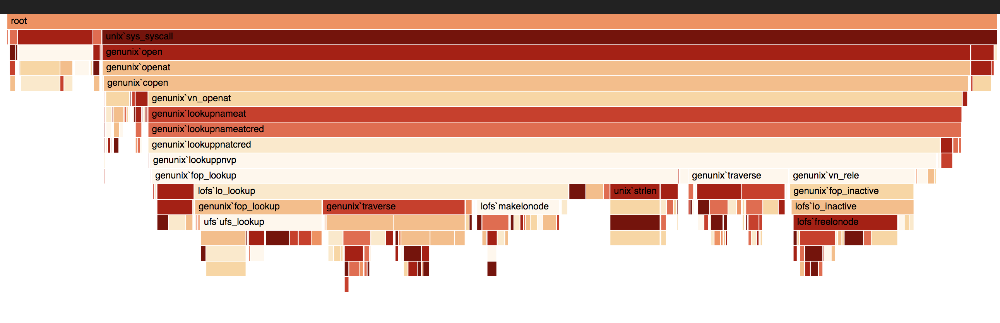

_This is a Livecoding Recap – an almost-weekly post about interesting things discovered while livecoding. Usually shorter than 500 words. Often with pictures. Livecoding happens almost **every Sunday at 2pm PDT** on multiple channels. You should [subscribe to My Youtube channel](http://youtube.com/user/theswizec)(https&#x3A;//www.youtube.com/user/theswizec) to catch me live._ https&#x3A;//www.youtube.com/watch?v=eOenovuDHxE [Flamegraphs](http://brendangregg.com/flamegraphs.html) are great. They show you when you've been bad and made the CPU cry. Here is a flamegraph built with React & D3. It shows some stack data I stole from [the internet](https://github.com/spiermar/d3-flame-graph/blob/master/examples/stacks.json): https&#x3A;//twitter.com/Swizec/status/1003402982552002560 You can try it out [here](./img/), and see the [code on GitHub](https://github.com/Swizec/react-d3-flamegraph). Consider it a work in progress. Releasing as open source once the animation works smoothly :) 

## Here's how it works 👇

You have two components:

1.  `<Flamegraph>`, which recursively renders the data tree
2.  `<FlameRect>`, which renders a particular rectangle and its label

### Flamegraph

The `<Flamegraph>` component without animation takes your data, loops it through the array of entries at this level, and calls itself on `data.children`.

    import { scaleLinear, schemeOrRd, color as d3color } from "d3";

    class Flamegraph extends React.Component {
        render() {
            const { x = 0, y = 0, width, level = 0, data } = this.props;

            const xScale = scaleLinear()
                .domain([0, data.reduce((sum, d) => sum + d.value, 0)])
                .range([0, width]);

            return (
                
                    {data.map((d, i) => {
                        const start = data
                            .slice(0, i)
                            .reduce((sum, d) => sum + d.value, 0);

                        return (
                            
                                
                                {d.children && (
                                    
                                )}
                            
                        );
                    })}
                
            );
        }
    }

Our `render` method takes a bunch of params out of `props`, creates a linear D3 scale to make calculations easier, then renders an SVG grouping element. Inside that element, we loop through the `data`, and for each entry, we create a new `<React.Fragment>`. The fragment contains `<FlameRect>` which represents the current datapoint, and a `<Flamegraph>` which renders all the child nodes. We decide each element's `x` position based on the sum of all node values up to the current one. And we make sure the child `<Flamegraph>` uses the same width as the current node. This creates the neat stacking effect. 

### 

The `<FlameRect>` component takes care of choosing a random color on initial render, highlighting when clicked, and displaying a label if there's enough space. It looks like this:

    import { scaleLinear, schemeOrRd, color as d3color } from "d3";

    class FlameRect extends React.Component {
        state = {
            hideLabel: false,
            selected: false,
            color: schemeOrRd[9][Math.floor(Math.random() * 9)]
        };

        labelRefCallback = element => {
            if (
                element &&
                element.getBoundingClientRect().width > this.props.width
            ) {
                this.setState({
                    hideLabel: true
                });
            }
        };

        onClick = () => this.setState({ selected: !this.state.selected });

        render() {
            const { x, y, width, height, name } = this.props,
                { hideLabel, selected } = this.state;
            let { color } = this.state;

            if (selected) {
                color = d3color(color).brighter();
            }

            return (
                
                    
                    {!hideLabel && (
                        
                            {name}
                        
                    )}
                
            );
        }
    }

We render a grouping element that contains a `<rect>` and a `<text>`. The rect gets sizing and color information, and the label gets a ref callback and some text. We use the ref callback to dynamically detect the size of our label and hide it if necessary. That happens in `labelRefCallback`. `onClick`, we flip the selected state. And well, that's it. You can think of this component as a basic toggle component. Uses all the same logic, just renders as a colorful rectangle instead of a button.

## Fin

That's the basic `<Flamegraph>` component. Uses recursion to render a tree data structure and lets you highlight individual elements. Where it gets tricky is adding animation that lets users explore their data. Turns out deeply nested React elements are hard to animate smoothly. https&#x3A;//twitter.com/Swizec/status/1003904212755857408 The worst part is how long it takes before React even propagates `prop` updates through the tree before the animation even starts. Once the animation is running, it's smooth as silk. But getting it started, ho boy. This warrants further research. I'll be back :) https&#x3A;//www.youtube.com/watch?v=MLchhOfiOwM PS: version [0.1.0 is in fact on npm](https://www.npmjs.com/package/react-d3-flamegraph) if you want to play.
