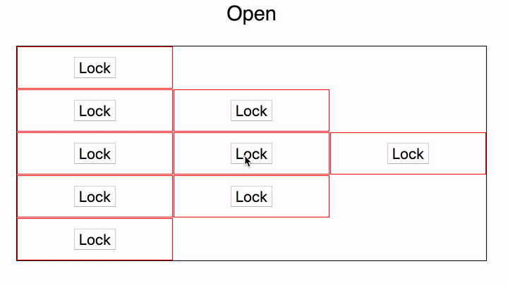

https&#x3A;//www.youtube.com/watch?v=zCYuhqW2Qeo My first webinar! How I hate the word, but that's what it was. The plan was to get a bunch of [prospective tech interns](https://swizec.com/blog/tech-intern-job/swizec/8454) together on a stream, teach them a React concept, and give them something to build. Sunday night, I'm seeing what they build and figuring out who I want to work with. The goal? To judge people's [slope vs. y-intercept](http://qr.ae/TUphry). Are they fast learners, or do they just know a lot? I want to hire someone who learns fast, not someone who's already a pro. That way I'm working with a future pro and helping them get there. Imagine `y` is your skill and `x` is time. Slope always beats out y-intercept in the long run. https&#x3A;//twitter.com/Swizec/status/1007281218570711040

## What interns learned

We learned about the new React context API and built a [silly little app](https://swizec.github.io/react-context-example/) that shows off two benefits of context: 1. Shared state between components 2. No prop drilling [](https://swizec.github.io/react-context-example/) [Here’s the source on GitHub.](https://github.com/Swizec/react-context-example) We used `React.createContext()` to create a context:

    const LockContext = React.createContext()
    ```

    And a top level component to hold the state and callback we wanted to share. It's like a Redux or MobX store, you want your state and your callbacks to travel together.

    ```javascript
    class ContextualThing extends React.Component {
        state = {
            locked: false
        };

        toggleLock = () =>
            this.setState({
                locked: !this.state.locked
            });

        render() {
            const { locked } = this.state;

            return (
                

                     This is a lock 
                    


                        {locked ? Locked! : "Open"}
                    


                    
                        
                            {[1, 2, 3, 2, 1].map(n => )}
                        
                    
                

            );
        }
    }

When state and callbacks go hand in hand, they're easier to manage. Helps you think in state machines. But I forgot to mention the state machine part in the webinar 😅 Each `ToggleRow` renders as many table cells as you ask it to:

    const ToggleRow = ({ n }) => (
        
            {new Array(n).fill(0).map(_ => (
                
                    
                
            ))}
        
    );

Notice the lack of prop drilling. `<ToggleRow>` gets only a number, `n`. Nothing about callbacks or the locked state. It doesn't even pass any props into `<LockToggle>`. That's because `LockToggle` is a smart context component 👇

    const LockToggle = () => (
        
            {({ locked, toggleLock }) => (
                
                    {locked ? "Unlock" : "Lock"}
                
            )}
        
    );

LockToggle renders a context consumer, which takes a function as children render prop. This render prop gets the necessary `locked` state and `toggleLock` callback in its arguments and returns a button that flips the lock. Et voilà: shared lock/toggle between components without prop drilling.  I also answered a lot of questions about when you should use context versus Redux or MobX. Watch the stream 😉

## What Swiz learned

Here's what I got out of the experience in a nutshell 1. Waiting for people to show up is nerve wracking 2. Lightly advertise in advance and people _will_ show up 3. Start the stream on time. no need to be there the first 10 minutes 4. You can wing it if you know your shit 5. Good way to practice conference talks, I think 6. Maybe have some slides 7. Drawing ideas out on paper while explaining them is a great interactive way to produce slides in real time 8. The delay between what you say and what people hear is massive 9. Giving the audience time to ask questions is nerve wracking

## What's next

More webinars I think. Great way to develop new content and a low friction approach to video production. That gives me ideas. 🤔 Plus, answering questions from the audience is a great way to see what you forgot to cover. That's slope right there!
