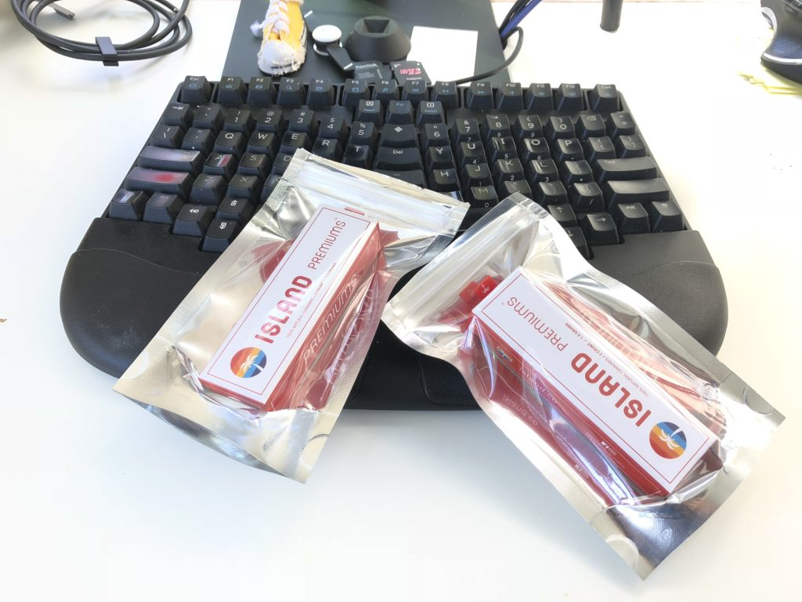

This is not your high school weed experience anymore, my friend. Wow 😱

Here's what weed looked like in high school:

1. You have that one classmate who knows how and where to get "large" amounts of weed; he's everyone's dealer.
2. You and a couple of buddies scrounge together some money, like ten or twenty bucks.
3. You tell that one classmate that you would like to purchase an entire gram of weed. Two grams if you're feeling rich.
4. A few days later, before school, or after school, or at recess, you exchange your $10 for 1g of green stuff.
5. You carefully inspect the green stuff for any traces of sand or other shit that makes it heavier than it needs to be. Make sure there's no twigs that would break your papers. Yes, people cut weed.
6. You buy a bunch of rolling tobacco and some papers.
7. You fumble around and make a joint. Tobacco with a little bit of weed because that 1 gram has to last you 4 or 5 joints. You ain't made of money.
8. You smoke and wheeze and cough and god knows what kind of shit you bought.
9. Every time you wonder: _"Is this the one time he sold me sprayed weed and I'm gonna have an insane crazy high?"_
10. You are stoned out of your mind. Knees heavy, arms spaghetti, you eat everything in sight, and you can't think straight to save your life.

Stoner comedies are the best. Going back to school after… that was not a good idea the few times I tried.

Don't smoke weed during recess. It doesn't work. Especially if you have a surprise English test you forgot about right after. Heh 😅

## The modern weed experience 👌

Compare that to weed in 2018.

1. It's legal, at least where I am.
2. You open an app on your phone. I used [Eaze](https://www.eaze.com/menu).
3. You send a photo of your passport so they can verify your age. Gotta be over 21
4. There is a fine selection of different marijuana strains, different THC levels, CBD levels and every product comes with a helpful table that says _"Yo, you gonna be hungry!"_ or _"This will help you focus"_ and shows you the different tradeoffs behind every joint.
5. You order and wait.
6. An hour later, the most relaxed delivery person I have ever seen in my life shows up, checks your ID, and hands you a plain white bag.
7. Inside is your order. Neatly packaged, nicely pre-rolled, well-labeled.
8. No tobacco, no shit weed, no surprises. You know exactly what you're getting and the experience you're gonna have.

I got a pair of Indica joints and a pair of Sativa. Indica is supposed to help you relax, loosen up your muscles, and go to bed. Sativa is meant to give you a little euphoria and a lot of focus.

## The result

I finished about half a joint each time. Then I got bored sitting outside by myself.

Weed just isn't as much fun on your own as it is when you're sneaking around with your best friend at a children's playground late at night and giggling like maniacs every time you think a passerby spotted you.

Plus my spidey senses were saying I'd had enough. You can't really tell how high you are until you stand up. Funny, that.

So, the first night I tried an indica strain.

The indica worked as advertised. I was relaxed. I was what you would call stoned. Somehow, I wasn't too hungry. But I spent an hour deciding what to watch before I gave up and went to bed.

As soon as I put the laptop away, I was asleep and I slept like the dead for just the right amount of hours. In the morning, I woke up refreshed and feeling great.

Then I went on a 40km run, and the weed had done exactly what I wanted. My muscles were loose and relaxed. I can't remember the last time I felt so un-sore when waking up.

Run went well. Indica worked.

https&#x3A;//www.instagram.com/p/Bka1FhQF9S-/

The second night, on Sunday, I tried a sativa strain.

Sativa is meant to give you laser focus. And it did. It gave me so much focus that it was crazy.

Anything I looked at, I was pulled into with complete clarity and total focus. Look at a chatroom? Nothing else exists in the world. Look at a productive task? Nothing else exists in the world.

It was a strange experience. I don't remember ever being focused like that before. Anything you start doing becomes the only thing in the world and that internal pull to stop doing stuff and go do something else… it just goes away.

But if something _does_ distract you, you're in trouble. You switch focus, and you won't come back on your own.

So that was kind of weird. I had intense focus, but it was switchable focus.

Like pushing a marble over a series of gravitational wells. Falls into a well. Takes a lot of effort to push over the crest to the next one, then falls right in and stays there.

It's hard to explain. You have to try it to get it.

## Try again?

I think I will, but with vaping. Looks more civilized. 😇

Indica works great before long runs. Helps with how sore I feel.

Sativa for focus… needs more testing. Or maybe I need practice with what it feels like to have focused attention.