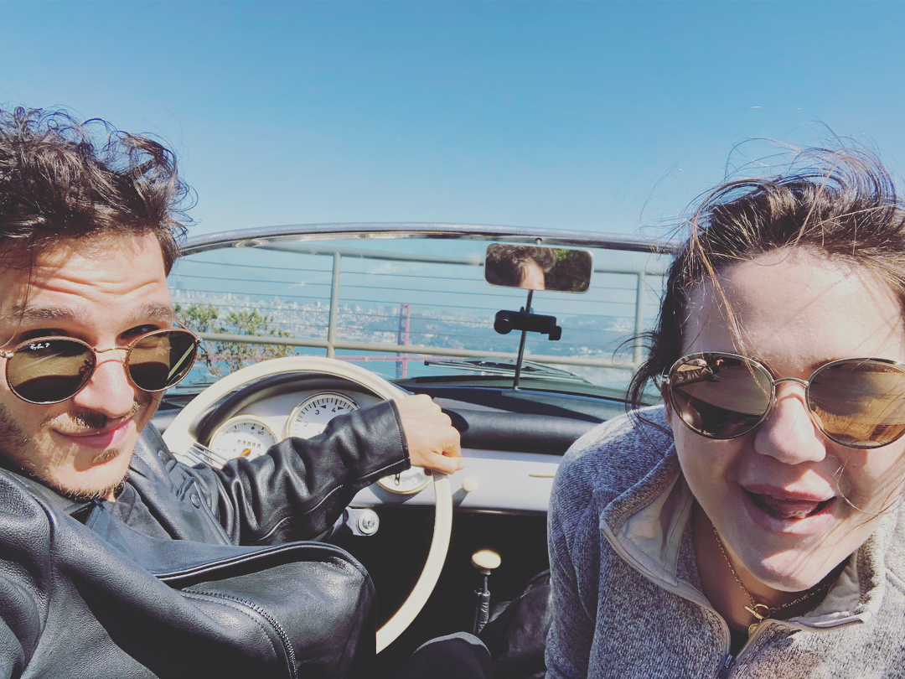

\[caption id="attachment_8493" align="alignnone" width="1080"] Me and my girl in a vintage Porsche\[/caption] Driving a 1957 Porsche 356 Speedster was the purest driving experience I've ever had. All manual, no electronics, no servos, no driver assists of any kind. It was heaven. A very stressful heaven. Picture this 👇 You're flying down Highway 101 at 60 miles per hour towards the Golden Gate Bridge. Top down, wind in your hair, sunset covered with a gentle haze. You're going as fast as you dare with the driver side door rattling like that. Your face is freezing. There's no top to put up and no heating to turn on. It's just you and the car and a race against the light. When you picked up the Porsche 356, its owner said _"Driving at night ... it's scary, the lights aren't as bright as you're used to"_ https&#x3A;//www.dailymotion.com/video/x6ntm6y At speed, you have to steer a little just to keep the car going straight. There's some play in the wheel. You thought driving without power steering would be hard work, but the wheel is so loose that it inspires no confidence at all. And yet it’s too hard to turn when you're parking.[1](#fn1) When you drive over a bump, the car steers. When you brake hard, it veers to the right. You're always counter steering. Maybe it's a design flaw, maybe something's up with the chassis. Whatever it is, you gotta work hard to go straight.[2](#fn2) The car is so light that gusts of wind move you half a lane over. You always steer into the wind. While you're dealing with all this, modern cars zoom past you, and you can't see them. The rear view mirrors are there for show. Tiny and mounted on the bonnet far away, you cannot adjust them. All you see are bushes near the road. Whenever a car flies past, it's a surprise. The main mirror adjusts a little. Every lane change is a stressful game of turning your head all the way around and hoping you spotted everyone. https&#x3A;//www.dailymotion.com/video/x6ntm6v In fact, nothing in the car adjusts. The seats don't move, the wheel doesn't move, the shifter doesn't move. You can't even adjust the seat back angle. Can't reach a pedal? Tough. Hard to shift into third coz your arms are short? Tough. You squeeze yourself into the car and deal with it. The clutch is hard and far away. The brakes are soft and far too close. The gas is just right.[3](#fn3) The wheel is in your lap and hard to hold. Too large to turn without adjusting grip, too thin to hold tight. The shifter is so far you have trouble reaching 3rd. But then you hit those twisty mountain roads, and it's bliss on wheels. Pure driving. No gimmicks, no music, just the engine. https&#x3A;//www.dailymotion.com/video/x6ntm6x You're connected to the car with all your senses. The car talks to you through your butt to say when it needs to turn. It talks through noise to say when the engine struggles and you have to shift down. It lets out a little smell of oil burning when you shift too late and it suffers for a split second at 4000rpm. And it doesn't tell you anything through the wheel. The wheel might as well not be connected to the wheels. But you're in heaven. The smell of petrol is intoxicating. The intense focus mesmerizing. Up down up down brake clutch gas clutch shift. Heaven. The view just makes it better. https&#x3A;//www.dailymotion.com/video/x6ntm6w And if you crash, you die. No headrest, no 3-point seat belt, no airbag, no roll cage. Worth it. Best $400 I ever spent. 7/7 would go again. Even though it was a Porsche 356 Speedster replica and really I was just driving an old VW Beetle with a customized engine, a custom body, and some original Porsche parts. ❤️

1.  Modern cars have adaptive power steering where you get a lot of assist at low speed and the steering is artificially hardened at speed so it's easier to keep stable. [↩](#ffn1)
2.  Probably unadjusted suspension or something, but at least [the original WW2 Jeep had a design flaw and steered right under braking](https://jalopnik.com/the-legendary-world-war-ii-jeep-had-a-dangerous-enginee-1797186236); could be similar problem here [↩](#ffn2)
3.  My right shin muscle still hurts from having to raise my toes when moving from gas to brake because I couldn't pull my leg far back enough without that. Maybe I was supposed to left-foot brake? But then, who holds the clutch ... [↩](#ffn3)
