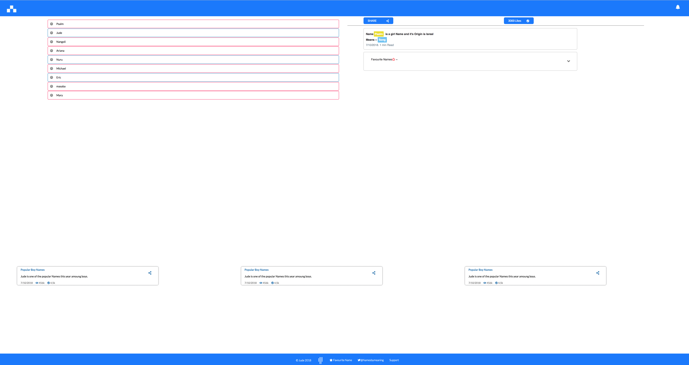
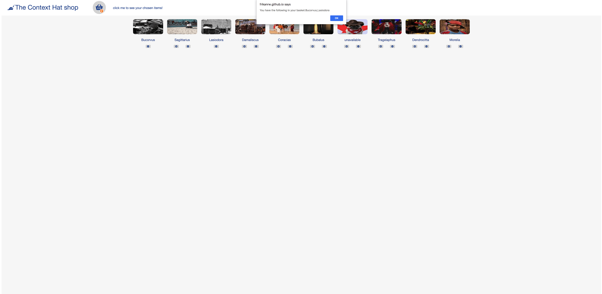
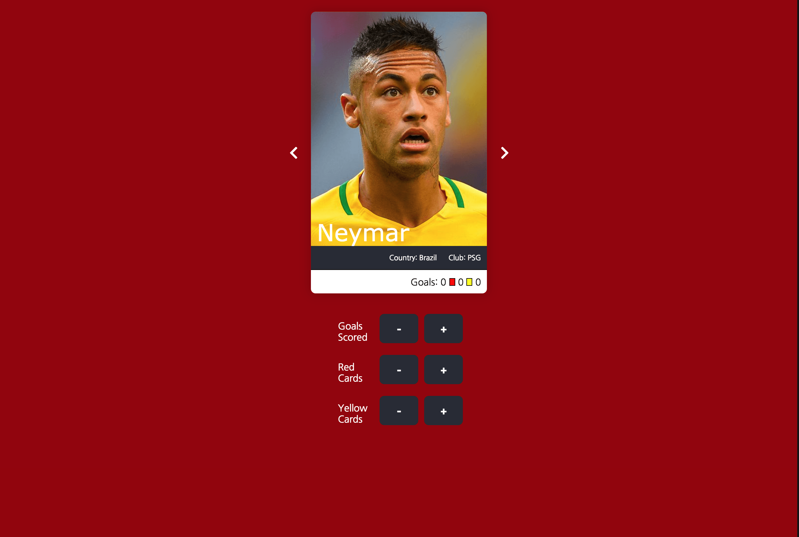
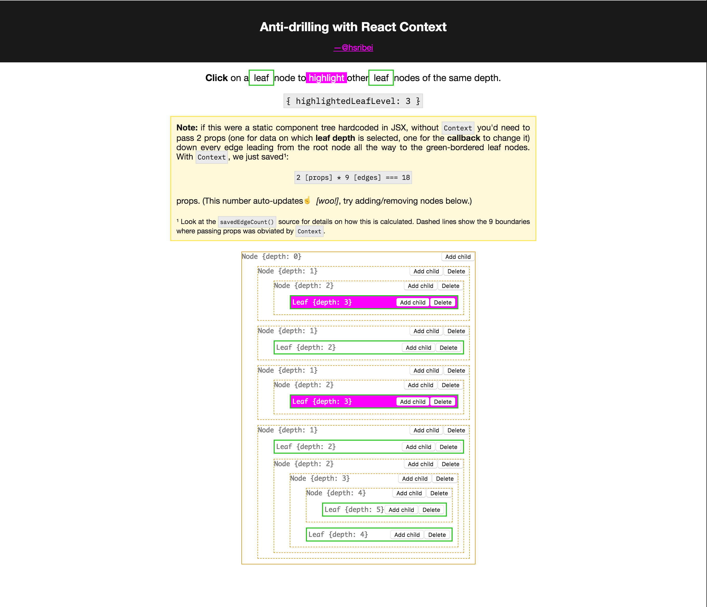
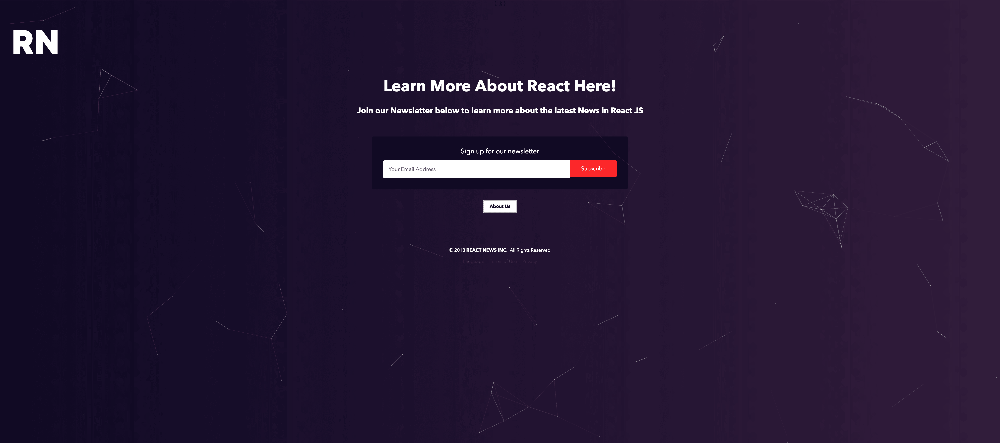

A few weeks ago I made an offer: _Come work with me, and I'll pay you to learn React._

20 people applied. I am not famous 🤔

But I only had room for 1, so that's plenty. Now I was faced with a challenge: _How do you pick 1 person out of 20 to help you code things you don't have time to code?_

The original problem I'm solving is all about time and energy – I don't have enough of either. Interviewing everyone individually was out of the question.

So I designed [a sort of interview audition system](https://swizec.com/blog/tech-intern-job/swizec/8454). Something like this:

1. Hold a one-to-many webinar where I explain a React concept. Learning something is valuable to applicants, I hope.
2. Ask for app submissions built with this concept. Building something for practice is valuable to applicants, I hope.
3. Rank folks based on how fast they learn. This is based on my subjective spidey senses, I'm afraid. I don't know how to make it objective.

Many said they don't have time for this bullshit and dropped out before the webinar. That's okay. I designed the process this way. If you don't have time to talk to me, you won't have time to work on stuff either.

You might _make_ time if I could offer oodles of money or super crazy interesting problems. But I don't have either of those yet. Sorry.

Some new people showed up at the webinar. That's cool, too. The more, the merrier.

https&#x3A;//www.youtube.com/watch?v=zCYuhqW2Qeo

The webinar got 226 views. 49 while it was live.

Of those, 6 sent me an app to look at. 🎉

That's a conversion rate of 30%. Pretty good considering the best I can offer is a sort of intern apprenticeship with a bit of money involved.

Although some folks applying had like 2 or 3 years of experience, and that's crazy. Is nobody hiring juniors anymore? 🤔

## Here's what people built

Here's some stuff that people built. I promised I'd share it with the world, and who knows, you might decide you need someone to help you code, too.

[**Jude**](mailto:judenangoli@yahoo.com) built a cool names meaning thingy. Great styling, lovely use of React context. Works great and has many buttons that show there's good ideas to go forward.

[**Frikan**](mailto:ferwee@gmail.com) built an entire hat shop! Uses React context to share state around and works pretty well. Nice simple styling, good code behind the scenes.

[**Fred**](mailto:fred.thefriedone@gmail.com) built a World Cup red/yellow card app of sorts. Helps you keep track of how many red and yellow cards your favorite players got this time around. Great idea!

[**Xiaoru**](mailto:hello@xiaoru.li) had the best cover letter I have ever seen and he built an amazing Pomodoro timer. Looked great, worked great, tugged at my heart strings. Loved some of the older projects he built as well.

[**Helder**](mailto:hsribei.pub@gmail.com) built a cool recursion visualizer that shows before your eyes how you can use React context instead of prop drilling to make your life easier. Said it helped him explain stuff to his dad who is learning how to code. Wow.

[**Shawn**](mailto:shawnhosea@shawnhosea.com) built a neat newsletter sign up form with an animated background. A little forced for a React context example, but I like how it looks, and he seems cool.

## How I picked

Ranking people is strange and weird, and it took me a long time to not make a choice in the end. I hired both Shawn and Helder.

Best way to see who you wanna work with is to work with them for a little and see what's up. Right?

My stated goal was to pick based on slope – how fast they learn. I did my best to follow that principle, but human factors came into play, too.

Shawn is the most excited person about React I've ever seen, and Helder has a lot of professionalism. Xiaoru looked amazing, but he's still in school, and I remember what freelancing was like when I was still in school. Balls got dropped.

I'm gonna be dropping plenty of balls on my own! I don't want the people helping me dropping them, too :D

Oh, and I used [bubble sort](https://en.wikipedia.org/wiki/Bubble_sort). Bubble sort is great. Instead of looking at a heap of people and being overwhelmed, you compare 2 at a time. It's easier to decide that way and eventually the best bubble up to the top.

Need some help building your side projects or whatnot? Consider the folks above! Each name links to their email. They'd love to help!