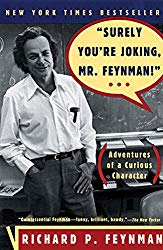
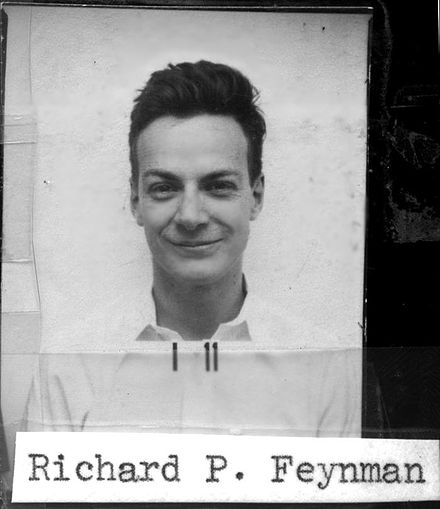
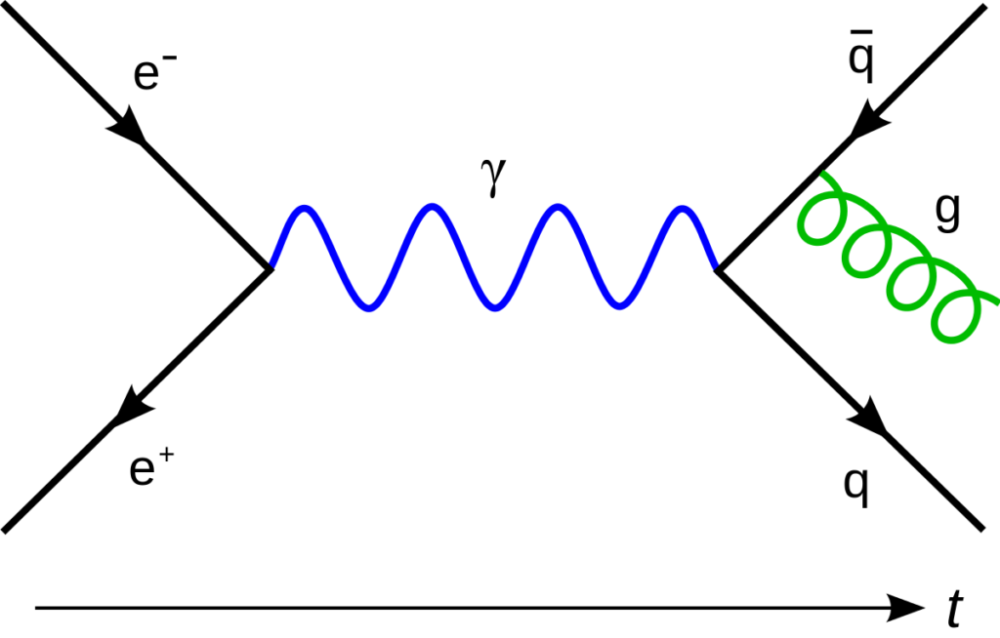

_Surely You're Joking, Mr. Feynman_ is magnificent. A biography in spirit, reads like a series of anecdotes from the life of a great man. Adapted from taped conversations with a friend, apparently.

The paperback has been collecting dust, unopened, on my bookshelf for many years now. 😅

But the audiobook! The audiobook was perfect.

Captures the spirit of how Feynman speaks perfectly. He has this distinct way of talking that you can recognize from a mile away.

Here he is talking about why you can't answer _why_ questions 👇

https&#x3A;//www.youtube.com/watch?v=MO0r930Sn_8

Alas, Feynman didn't narrate the audiobook. It's the only thing that could possibly make it better. I found myself avoiding pressing play on shorter runs just so I could savor the book and drag it out over many more weeks.

I kinda wish it was longer ...

## Feynman in a nutshell

Feynman, if you don't know him yet, is the prototypical intellectual merry prankster.

A brilliant professor of physics who played bongo drums, delivered mind-blowing lectures, and always found some way or another to play a practical joke.

He got a Nobel Prize for something or another with the spin of electrons. Worked on the [Manhattan Project](https://en.wikipedia.org/wiki/Manhattan_Project) barely out of college, and invented those subatomic particle diagrams you've probably seen before.

Feynman's interaction with [Niels Bohr](https://en.wikipedia.org/wiki/Niels_Bohr) describes him best, I think:

> He was sought out by physicist Niels Bohr for one-on-one discussions. He later discovered the reason: most of the other physicists were too much in awe of Bohr to argue with him. Feynman had no such inhibitions, vigorously pointing out anything he considered to be flawed in Bohr's thinking. He said he felt as much respect for Bohr as anyone else, but once anyone got him talking about physics, he would become so focused he forgot about social niceties. Perhaps because of this, Bohr never warmed to Feynman.

## What Feynman taught me about joy

So the book was great, and I enjoyed listening to it. But what did I learn?

What struck me most is how Feynman was able to weave pure joy into his life and everything he did. Little pranks, inside jokes, stuff he found funny while others didn't and that didn't matter at all.

Like how he felt burned out on physics and the immense pressure bestowed upon him by Cornell. Free reign, we know you're smart Mr. Feynman, famous practically, you'll be the best for us!

So he turned his mind to pointless things and having fun with physics and playing around. Returning back to what gave him joy when he first became a physicist.

And that led to a Nobel Prize.

Or how he found Los Alamos boring because there was no fun to be had. Sure, they were inventing the nuclear bomb, and the war was going, and the faster they could make the bomb, the sooner the war would end.

And yet, he found time to learn safe cracking and steal everyone's documents. Instead of asking for reports, he would casually bring them back, and when someone protested that they were in a locked safe, he'd say, _"Yeah, the safe's no good. I’ve been telling you.”_

Or there's the story of how he became a professional musician because a ballet composer wanted to try writing a ballet with just percussion and she saw him play bongos in a school play. They went all the way to Paris with that one before he was discovered to be a fraud and a real musician said, _"Wait no, this isn't right.”_

Fun guy.

I need to do more of that. Stuff that's just for fun, not serious at all.

_Surely You're Joking, Mr. Feynman_ is fundamentally a book with a single lesson: Don't take yourself so seriously. Just because your work is serious doesn't mean you have to be.