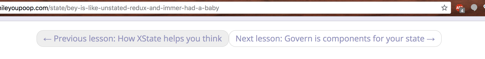

As you may know, I recently [hired some interns](https://swizec.com/blog/hire-these-interns/swizec/8500). Two interns because I couldn't decide which one I like more. Said I'd decide in two weeks. It's been two weeks. My mental state before hiring looked like this 👇 

> Aaaaaaaa I have so many ideas aaaaaa I have to make content aaaaaa I don't have time for all this aaaaaaaa this code does not excite me aaaaaaaa

You know, the whole spiel of “I have too much work, I can't handle all of this, so I'm going to avoid doing any of it instead.” Then you feel even worse about it and it's even harder to do any of the work. Time goes on, panic grows, you are not happy. So I hired two interns. Now my mood is more like this 👇  Feels like a superpower, my friend. I am calmer. I am more focused. I am less panicked. I am still behind on content. We'll get to why I'm behind on content in a bit. 😅

## Benefit 1: Don't keep it in the brain

When you hire people, you can't say _"Okay, these ideas in my brain 👉 build them"_. You have to transfer those ideas into their brain first. You might realize there aren't as many as you thought. https&#x3A;//twitter.com/Swizec/status/1013595847022374913 16… 16 ideas were keeping me up at night, stressing me out, and generally making me miserable for _months_. Why? Because they were all bouncing around in my head, attracting more ideas, and snowballing into a big scary monster that I just didn't want to deal with. Did you know my blog that gets the most traffic of any site I own _and_ it directly ties into my books, but it still doesn't link to the books it's trying to sell? It's been 3 years. Come on, man. Writing out all of those ideas, even just as 3 word Trello cards, relieved an immense amount of pressure. The stress fell off my shoulders like it was never even there.  The difference is night and day. Even my dayjob.exe boss said I look more focused, get more and better work done, and have become an all 'round better person. Offloading your worries, this shit works. Which leads us to 👇

## Benefit 2: Stuff happens when you're not looking

People taking care of the things you don't wanna take care of: it's like a superpower. You say, _"Wouldn't it be cool if so and so were true about my website or app?"_ And in a day or two, it's true. Like magic. You didn't have to do anything. You don't even have to be super specific about what it is that you want. 🤨 Many people go overboard with micromanaging and pixel perfection and stuff like that. None of it matters at my stage. I just want the features to be there. We can fix it later.

> Hey, we need a way to navigate back and forth between lessons on learnwhileyoupoop.com. Can you figure it out?

Two days later, you get a PR: "Navigation buttons on each lesson" You try it out. See that it works. Give some feedback on the code, maybe some recommendations. Tweak a few minor details yourself. That evening, your site has new buttons and it's easier to use 🎉 \[caption id="attachment_8518" align="alignnone" width="2128"] Navigation on learnwhileyoupoop.com\[/caption] It's not that I _couldn't_ build those buttons myself. It wouldn't even take very long. It's that I have higher leverage things to worry about.   
which brings us to 👇

## Benefit 3: High level programming 🤘

Last year, I experimented with building an AI that writes JavaScript. It didn't work, but the idea went something like:

> What if you could write code as if you were a product manager, not a programmer? You could just say what you want, give it a rough description, and the machine would figure out the details.

When you're a product manager, the machine figuring out the details is a human or a team of humans, sometimes entire companies. At the CEO level of a big company, you say **Make It So** and it happens. Eventually.  Same effect happens at every level.

> Hey intern dude, I would like for the fonts on learnwhileyoupoop.com to not be broken

Sounds easy, right? Swizec, come on man, you can fix some fonts. You're a goddamn full-stack engineer! It was very tricky. Something about CSS file loads being in the wrong order and Webpack not letting you configure it super well and then a font definition overrides another definition and the browser silently drops the font and never even loads… 🤯 Took my intern a whole day to fix. You know when I'd find a full day to tinker with something like that? Never. Next week, he's writing a blog about it, too ✌️

## I am become delegation man

Well, not really, I'm learning. But it sounds cool, doesn't it? 
