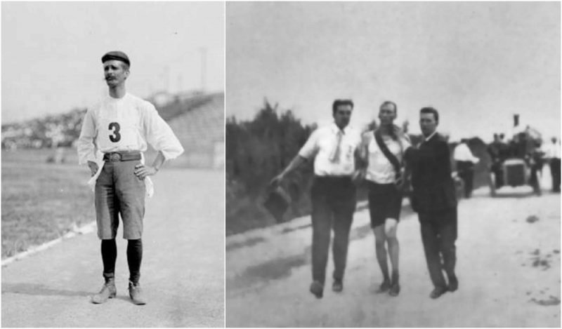

I'm about to run my third marathon on Sunday. I haven't trained as much as I should've, and it's going to suck, but my goal is easy:

Run faster than the winner of the first official marathon in 1904. 3 hours, 28 minutes, 53 seconds.

I was just 2 seconds short of beating the 1904 3rd place finisher [at the 2017 SF Marathon](https://swizec.com/blog/couch-sub-4-hour-marathon-4-short-years/swizec/7725). So, you know, hoping to beat the original winner this year.

\[caption width="800" align="aligncenter"] 1904 marathon where winners were helped across the line\[/caption]

Now, here's what I learned about marathons: Marathons are easy.

A marathon is simply putting one foot in front of the other for a few hours.

Very straightforward.

To train for a marathon you:

- run a lot
- run long distance to train your metabolism
- run short and fast to train your speed
- mess around with food and water until you find what works

In a marathon, your goal is to finish the race before your metabolism gives out. You can store about 45 minutes worth of glycogen in your muscles.

After 45 minutes, you have to eat something, or take a break, or both. But you don't have time for real food.

You eat a little something. Like a 100 calorie running gel. But in those 45 minutes, you've burned 800 calories.

You're at a huge deficit, and you won't make it up until you finish the marathon. _Eventually_, your metabolism will give out. You _will_ stop.

Every bench you see is like an irresistible magnet pulling you down. Sometimes you sit down before you even realize what you're doing. The struggle is real. Your body doesn't wanna do this stupid marathon.

The whole thing is a race against yourself. You gotta finish the marathon before your body finishes giving out.

Google "the bonk".

Running a business, or a music career, or a writing career, or anything of such nature alongside your full day job is very similar. You're in a race against time.

Where you're racing against metabolism in a marathon, you're racing against burnout in the job + side business situation.

The goal is to build your business big enough to support you before your mind and body finish saying _"Nope, no more"_ and you burn out completely and can't keep going at all. When that happens, you will be forced to choose, and if your side business isn't at a strong enough point, there will be but a single choice.

You can take vacations here and there. But you'll be too stressed to enjoy them. You can take 3-day weekends. But that's just more stress to deal with. It’s lost time you could be working.

Ultimately, there is only one way: Pick side business or day job.

You have about 3 years. Maybe 4.

That's the pattern I've seen in the wild. People give up or switch after about 3 years. Lots of huge, open-source indie people magically get a real job after 3 years of opensourcing on their own. 🤔

You cannot do both forever.

Best get your side business strong before you're done.