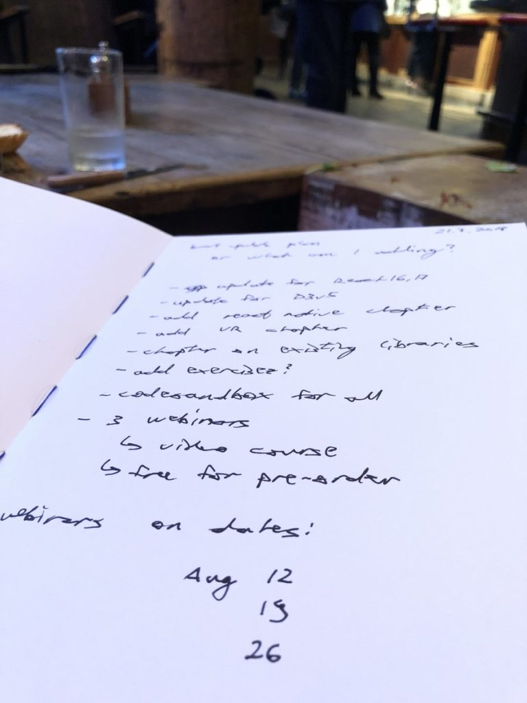

So the director of dataviz at VISA emailed me the other day. He said “Yo, we love your book on React data visualization. The team is learning fast, getting a lot done. Honestly, it’s helped a lot.” Wow! Fortune 200 companies use my stuff!! “But dude, some examples are out of date” 😵 He’s not wrong ... my in-person React dataviz workshop went through many changes over the past year. Updates to content, new techniques researched ... lots of stuff. SO I'VE DECIDED… 🎉 I’m updating React + D3v4 🎉 

<!--[if mso]>
  <v:roundrect xmlns:v="urn:schemas-microsoft-com:vml" xmlns:w="urn:schemas-microsoft-com:office:word" href="https://gumroad.com/l/pMtnZ" style="height:40px;v-text-anchor:middle;width:200px;" arcsize="10%" strokecolor="#1e3650" fillcolor="#ffa824">
    <w:anchorlock/>
    
Preorder now!

  </v:roundrect>
<![endif]-->

[Preorder now!](https://gumroad.com/l/pMtnZ)

  
  
It’s going to become React + D3 2018, or maybe it's time for a new title, I haven't decided. Here’s the plan 👇

-   Finish in time for the Reactathon conference on September 8th.
-   Lead a new and improved in-person workshop.
-   Moderate discussion table.
-   Launch book.

Here’s what you get 👇

-   ⚛️ updated content for how react works in 2018 and 2019. That means React 16+, React Suspense, etc.
-   📈 updated code for D3v5
-   🚟 exploration of React Suspense implications
-   🆕 a chapter on ready-made dataviz components you can use
-   🆕 new chapter on dataviz in React Native
-   🆕 new chapter on dataviz in WebVR
-   📦 move examples from Codepen to Codesandbox for a better experience
-   🏃 add more exercises and sample walkthroughs
-   🎥 all new 2 to 3-hour video in full 4K

### AND ONLY IF YOU PREORDER 👇

3 live online workshops on Aug 12, 19, 26. We'll build some dataviz and I’ll answer any questions you can come up with. Workshops will be recorded and you will keep access to them forever. Even if you can’t join live. But only if you buy now. 3 years of thought and research will have gone into this book. Countless hours spent talking through problems with in-person workshop attendees, coaching clients, and helping big Fortune50 companies. You don’t wanna miss this.  
  

<!--[if mso]>
  <v:roundrect xmlns:v="urn:schemas-microsoft-com:vml" xmlns:w="urn:schemas-microsoft-com:office:word" href="https://gumroad.com/l/pMtnZ" style="height:40px;v-text-anchor:middle;width:200px;" arcsize="10%" strokecolor="#1e3650" fillcolor="#ffa824">
    <w:anchorlock/>
    
Preorder now!

  </v:roundrect>
<![endif]-->

[Preorder now!](https://gumroad.com/l/pMtnZ)
