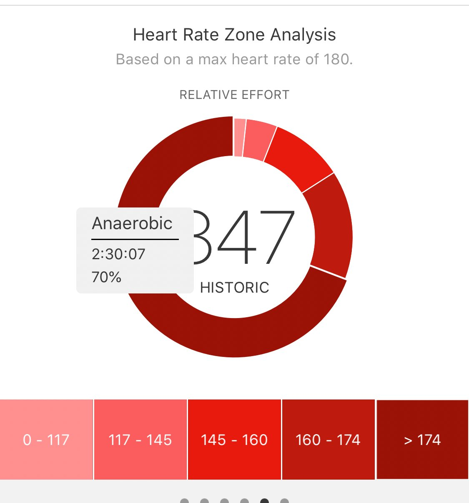
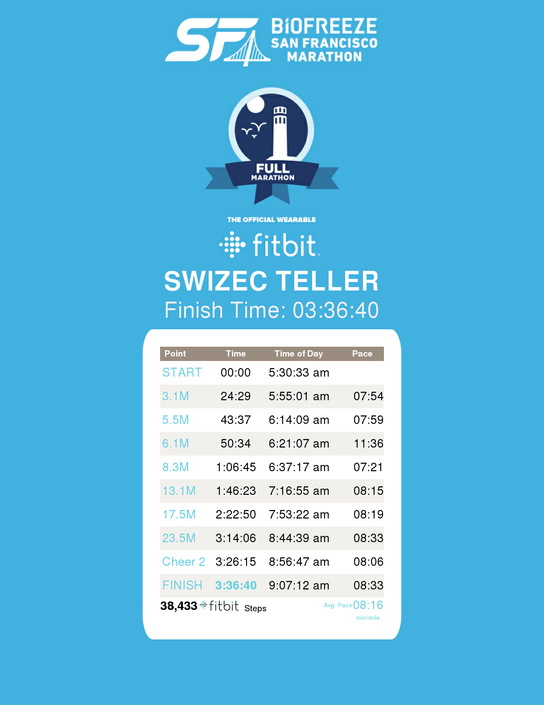

I tried so hard to sprint over the finish line, but nothing happened. I gave it my all and there was no more to give.

https&#x3A;//twitter.com/Swizec/status/1023604991653605376

That morning started at 4:30am. Really, it started the night before. I prepared all my gear. Best not to get flustered when you're rushing to be at the start line by 5:20am.

It's a 20-minute walk from my place to the marathon. Perfect to warm up and loosen up your legs. I also like to give it a light jog from gear drop-off to my corral.

You'll be cold after the marathon. Tired, wet, exhausted. You need dry clothes to keep warm. Some food and water is great.

So you bring a change of clothes and some knickknacks in a bag. You write down your name and leave it at gear drop-off. A long row of UPS trucks.

## And then you get ready

https&#x3A;//twitter.com/Swizec/status/1023544074521915399

Marathon start lines are broken into corrals. For crowd control.

Some 27,500 people ran the [San Francisco Marathon](http://www.thesfmarathon.com/). That many people in a long narrow corridor is the perfect recipe for a [crowd crush](https://www.news.com.au/technology/science/human-body/crowd-crush-what-happens-in-a-human-stampede/news-story/5ea6cd28dfc8744246e0bdd5500baa11).

Best way to prevent those is to break the area into corrals and have people start in groups with a few minutes in between. That way nobody gets trampled, and people are grouped with others who are running aiming for a similar race time. Everyone is happier.

You take off your sweater and donate it to the marathon. Bye bye, sweater. I'll never see you again.

The cable car bell rings. You waddle to the start line. Start your running app and away you go.

## And then you run

There's nothing special to running a marathon. You put one foot in front of the other for 26.2 miles, 42.2 kilometers.

Mostly, it's just kind of miserable. First person to run a marathon died from exhaustion.

https&#x3A;//www.youtube.com/watch?v=O8ElNO4bBCQ

👆 That's my insta story from the marathon. Read the pain in my eyes.

To survive a marathon, some say you should eat – some prefer not to. Some say you should drink – some say to load up on electrolytes the night before.

Salt retains water. The more water you retain, the less you need to drink.

I like to eat a running gel (I like Gu) every 10 kilometers and drink water with electrolytes (I like Nuun) whenever the mood strikes me. Best to listen to your body.

Everything includes lots of caffeine. Caffeine increases stamina, reduces pain, and gives you a mental boost.

Placebo or not, it doesn't matter. As long as it improves your time and helps you finish. Marathons are a mental game as much as they are physical.

## What happens to your body

A marathon is brutal on your body. Anyone who tells you it's healthy to run a marathon is an idiot.

Take your heart, for example. Max heart rate for a 30 year old, me, is 180. 210 minus age.

> The maximum heart rate (HRmax) is the highest heart rate an individual can achieve without severe problems through exercise stress
>
>
>
> /../ the most accurate way of measuring any single person's HRmax is via a cardiac stress test.
>
>
>
> /../ perform this test only in the presence of medical staff due to risks associated with high heart rates

My _average_ heart rate during the marathon? 174

Max? 196

That's 16 beats per minute over my theoretical max. Overall, I spent 70% of the time, two and a half hours, in the anaerobic zone.

You're supposed to use that zone for short bursts during high intensity interval training.

At times, it felt like my legs were ripping themselves apart. My muscles didn't burn, oh no, it felt like my quadriceps was literally ripping themselves from my knee.

Fun stuff.

I started that day at 56.9kg (125.4lbs) and 11.9% bodyfat. After the marathon, I was at 55.7kg (122.7lbs) and 11.5% bodyfat.

That means I lost 0.3kg (0.7lbs) of pure fat in a single run. Just over a whole kilogram overall. That might not sound impressive to you, but if you ever tried to diet, you'll know how hard it is to drop body fat percentages.

## And then you finish

\[caption id="attachment_8537" align="alignnone" width="1220"] Official marathon time 3h 36m 40s\[/caption]

You're done. Your legs don't work. Your mind is a blur. Did that really just happen? You ran for almost four hours straight. What the hell is wrong with you?

My legs locked up, so I had to sit down. Then I couldn't move for 20 minutes. At least the view of the bay and the Bay Bridge was nice.

I reflected on my time.

It wasn't what I wanted, 3hr 30min, but it was the best time I could get with my casual approach to training. The race itself went perfect. Nothing more I could've done.

But hey, if this were the first modern Olympic marathon in 1904, I would've got bronze. So there's that.

Eventually, I made it over to my gear, got dressed, and waddled my way back home. Shivering the whole time despite the warm weather and my cozy clothes.

There just wasn't any energy left to keep me warm.

## And then you eat

https&#x3A;//twitter.com/Swizec/status/1023649173571166208

The best part of all the running and the training is the food you get to eat. In ridiculous quantities.

On a normal day with no exercise, I am meant to consume 1740 calories. That's my base metabolic rate. Enough to keep my brain working, enable me to move, and stay warm. Without losing weight.

To put 1740 calories in perspective, [here is what a good menu would look like](https://www.verywellfit.com/two-meal-plans-for-a-1700-calorie-per-day-diet-2506565).

Or you can think of it as 2 proper hamburger meals at a pub.

During the marathon, I burned some 3000 calories. Almost twice my normal daily allotment of food.

If you don't eat it all back, you won't be able to walk the next morning. And yes, I put a lot of practice into being able to get through that much food in a single day.

4500 calories I ate.

**Breakfast** 1167 calories (includes running stuff)

- RxBar
- Rx nut butter
- 4 Gu gels
- Kind Crunchy Peanut Butter Bar
- Banana
- Chai latte

**Lunch** 1440 calories

- 1.7 scoops Quest protein
- 2 cups almond milk
- 2 slices bacon
- 5 duck eggs
- 1 roasted chicken patty from TJ
- 1 bread roll
- 2 potatoes
- 1 large peach roasted

**2nd lunch** 690 calories

- rye bread roll
- pickles
- salami
- coconut water
- banana
- square of chocolate
- large apple

**Dinner** ~1000 calories

- sweet potato fries
- lettuce wrap fried chicken sandwich
- ranch dressing
- glass of beer
- TJ almond matcha latte mix
- cup of ice cream

Yes, I pooped 5 or 6 times 💩

And today, I weigh 58kg (127.8lbs).

So, you know, next time you gain or lose 5 pounds, don't worry about it. Easy to achieve those swing.

Now let's hope I'm smart enough never to do that again.

✌️