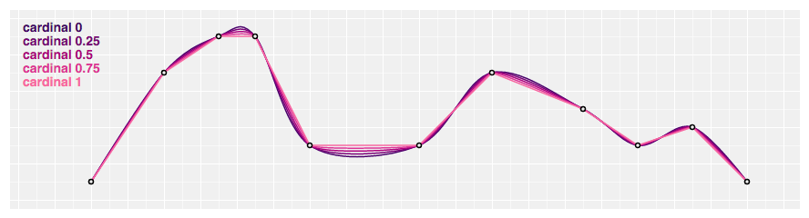
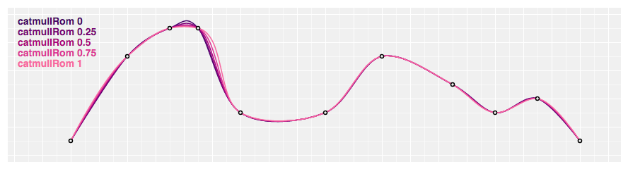
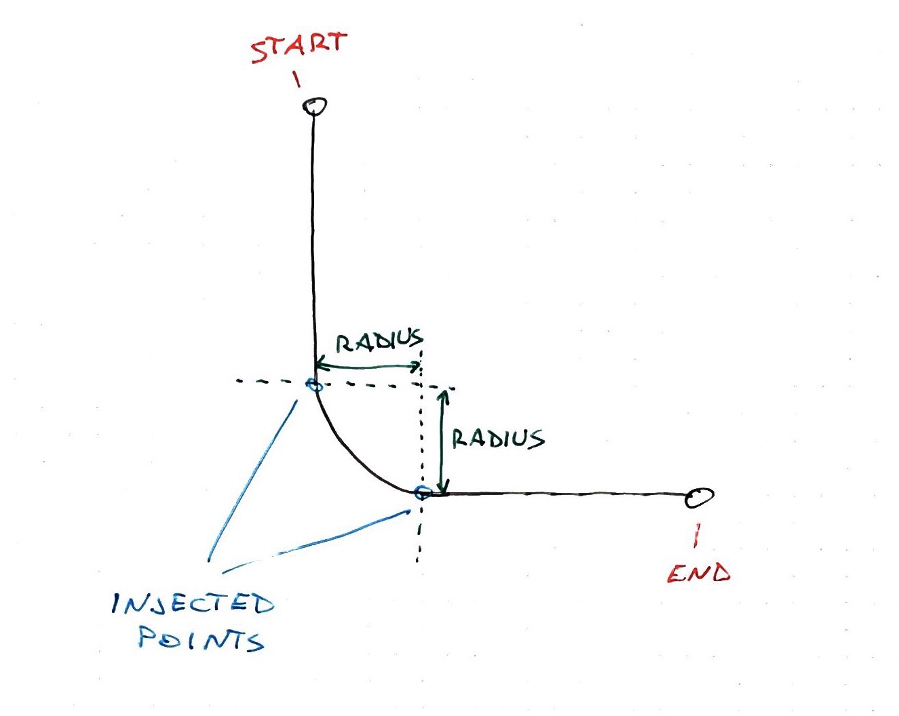

A coaching client showed me this design and asked: _Ok, how do I build this?_ \[caption id="attachment_8541" align="alignnone" width="1426"] Tree structure with rounded edges\[/caption] Well hmm… it's a tree of some sort. Each icon is a node, and each line is an edge. Nodes can have multiple children. I think 🤔 You can build this with D3. Calculate each node's position, then iterate and render. An image imported as an SVG component will do. Webpack can handle that for you. So you have node positions and you know which nodes are connected. Now what? You can turn that into pairs of coordinates. Point A to point B. A line between them. D3 is perfect for that! Drawing lines from A to B is super easy 👇

    // create a line path generator
    const line = d3.line();
    // pair of coordinates
    const data = [[0, 0], [100, 100]];

    // draw, using JSX notation

      

That draws a line from point `(0, 0)` to point `(100, 100)`.  But we don't want straight lines. Straight lines don't look good. Lucky for us, D3 has ample support for curves. Many different curve formulas to choose from. We can add some curve to our line with the `.curve` method.

    // create a line path generator
    const line2 = d3.line().curve(d3.curveCardinal);

If you try that, you'll see that nothing happens. Curves need multiple points in your line data to work well. Like this 👇  That's a nice curve and all, but not quite what we're looking for. And if you look at the [curve examples in D3 docs](https://github.com/d3/d3-shape/blob/master/README.md#curves), you'll see that nothing quite fits.   After some experimentation, I found a solution. https&#x3A;//www.youtube.com/watch?v=VyCP-3gL72k 👉 a React component that takes 2 points, injects 2 juuuust perfectly spaced points, and draws a D3 curve between them.  The poorly named `<RoundedCorner>` component is just 15 lines of Prettier'd code. All values discovered experimentally.

    const RoundedCorner = ({ start, end, radius = 5 }) => {
      const line = d3
        .line()
        .x(d => d[0])
        .y(d => d[1])
        .curve(d3.curveBundle.beta(1));

      const points = [
        start,
        [start[0], end[1] - radius],
        [start[0] + radius, end[1]],
        end
      ];

      return ;
    };

We take `start` and `end` coordinates, and the desired `radius`. Similar to CSS rounded borders. Experimentally, I discovered that for best results, you have to place 2 points between the two endpoints. One on each side of the rounded corner you want.  Then you have to use the `curveBundle` generator with the `beta` factor set to `1`. I honestly don't know what that means but it works. You can see I tried a few different configurations in the example CodeSandbox. That's because some curves produced weird edges when turned around like that. But not good ol' curveBundle.
