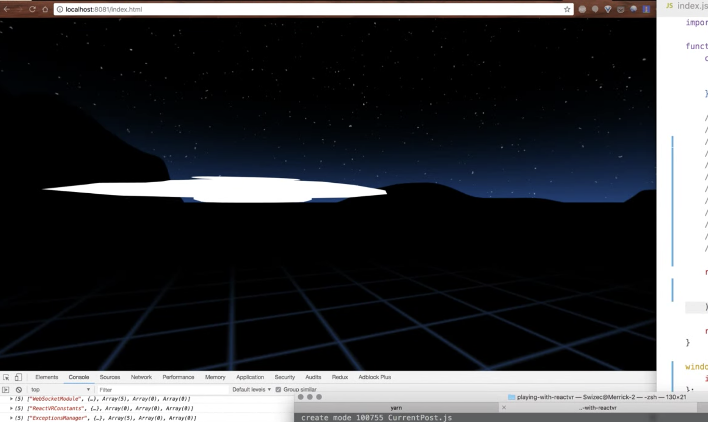
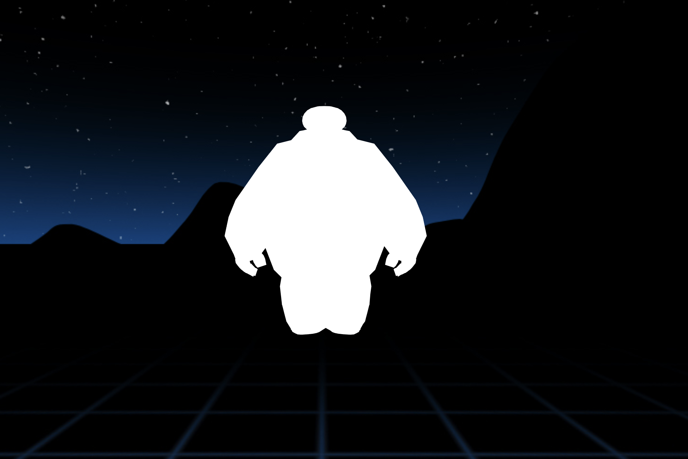
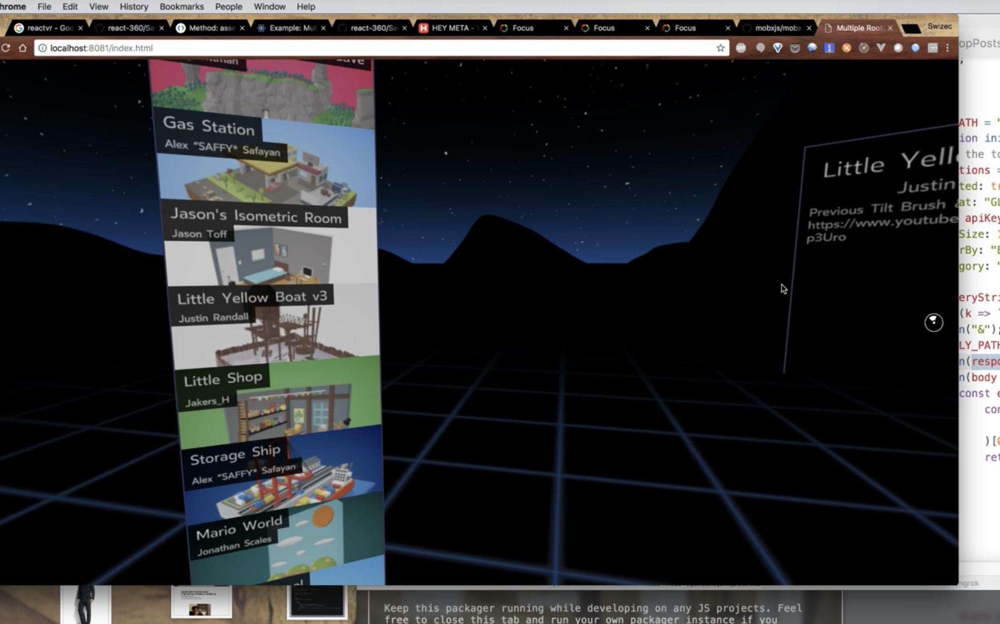

_This exploration will feed into a new VR/3D chapter in my React dataviz book. [Preorder it now 👉](https://gumroad.com/l/pMtnZ)_ My goal was to build a 3D scatterplot that you can explore. Stand inside your data and look around. Wouldn't that be cool? Instead, I got a squished [Baymax healthcare companion](http://disney.wikia.com/wiki/Baymax). 🤔  ReactVR, recently renamed to [react-360](https://github.com/facebook/react-360), doesn't have 3D modeling primitives like spheres and boxes. Instead, it asks you to import 3D models and build your scenes with that. The base example is a 3D viewer of models from [Google's Poly library](https://poly.google.com/). And that works great 👇 https&#x3A;//www.youtube.com/watch?v=49wBihodcso You can import a model, display it with a React component, and look around using VR goggles and the Oculus browser. Just gotta make sure there's a URL that shows your VR app.

## To display a 3D model…

To display a 3D model in VR space, you put it in a react-360 `<View>` component, add some light, and an `<Entity>`.

    class Baymax extends React.Component {
        render() {
            return (
                
                    
                    
                    
                
            );
        }
    }

Lighting doesn't do much in my `<Baymax>` example. I'm not sure why. Maybe because the whole model is white 🤔 Where it gets interesting is the scale transformation. _In theory_, you can scale your models on all 3 axes. In practice, the `scaleZ` transform is currently not implemented and throws an error. Even though it's in the docs. Oops. But I guess that's the problem with models you import from the web because you don't know how to make your own. Their scales are out of whack. The Baymax model, for example, looks great when it's 200 meters away. Yes, units for all vectors in ReactVR and react-360 are in meters. Love it. \[caption id="attachment_8556" align="alignnone" width="2176"] Baymax 200 meters away head on\[/caption]

## To position a react-360 view…

Positioning react-360 views happens through something they call roots. You can think of it as an anchor point for your components that you build on top of. This goes in your `client.js` and you can have as many roots as you need.

    r360.renderToLocation(
        r360.createRoot("Baymax"),
        new Location([0, -30, -200])
    );

Location is a 3D vector based off of the user's position. In this case, that's `0` meters to the left or right, `30` meters down, and `200` meters back. Go `200` meters in the other direction, and your user has to turn their head to see your scene. And that's where react-360 starts to shine. 360 degrees on 3 axes is a lot of space to play around with. Seriously. A _ton_ of space. You can't even imagine until you start to play around.

## react-360 shines at placing 2D views in 3D space

What I believe react-360 is truly optimized for is putting 2D panels in 3D space and giving your users more room to use different controls.  It's kind of a shame that this is the case, but there's a lot you can do with 2D in 3D. Imagine a data dashboard for your infrastructure that uses full 3-axis 360 views to place charts all around you instead of trying to squish everything into a small browser window. I don't know about you, but I always run out of space when making monitoring dashboards 😅 Code looks just like React Native by the way. You have `<View>`s and `<Text>`s and `<Image>`s and `<VrButton>`s. You put them together and voila, an interface. This builds that panel on the left 👇

    const TopPosts = props => {
        if (!props.posts) {
            return (
                
                    Loading...
                
            );
        }

        return (
            
                
                    Posts: {props.posts.length}
                
                {props.posts.map((post, i) => (
                    
                ))}
            
        );
    };

Take a list of posts from Google's Poly store, render a `<View>`, put some `<Text>` inside to know the count, then iterate through the data and render a `<PostButton>` for each entry. The `<PostButton>` component is a `<VrButton>` that gives us clickability and callbacks. It contains an image and two text labels. Pretty neat. You place the panel in 3D space with a root, a surface, and a render to surface.

    const leftPanel = new Surface(300, 1200, Surface.SurfaceShape.Flat);
        leftPanel.setAngle(-0.6, 0);
    r360.renderToSurface(r360.createRoot("TopPosts"), leftPanel);

The extreme 1200 height doesn't look so great in a web browser, but works great in VR goggles because you can look up and down. 360 degree really is a lot of room for activities. Really. Wish I knew how to record what I can see inside my goggles.

## Fin

There's a lot of potential here. In production mode, react-360 is fast enough to avoid nausea; in dev, not so much. The engineering UX is similar to React Native, and VR is growing like crazy. You might not realize it, but there's _a lot_ of VR users out there. 171,000,000 according to [statista](https://www.statista.com/statistics/426469/active-virtual-reality-users-worldwide/). Similar to the web in 1999. _Now_'s the time to start playing around 😉 Watch me build the squished Baymax 👇 and [preorder React + D3 2018](#), likely the first React book/course to include VR stuff 😛 https&#x3A;//www.youtube.com/watch?v=aGN9Nm-bHYs
