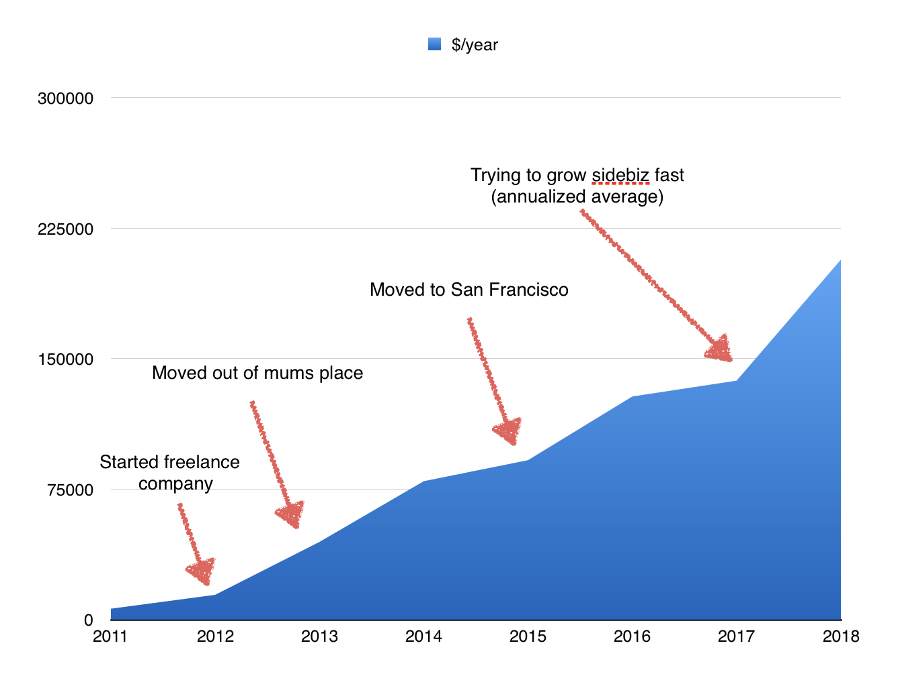
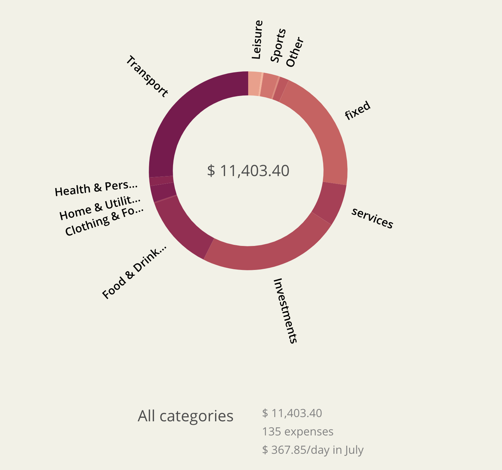

A good friend from college visited this weekend, and we got to chatting about life, beer in hand, as one does. He just bought a 2 bed 2 bath in Portugal, surfs every weekend, and plans to pay off his mortgage in 4 to 5 years working remote jobs for San Francisco. 👏 That same day, I almost didn't feel bad eating out twice in the same Saturday. That shit adds up. https&#x3A;//twitter.com/Swizec/status/1029103030652743685 Another college friend just bought a ranch, and some horses, and a freaking Bobcat excavator. Cash. A third is halfway into saving up for a second apartment… or maybe a long sabbatical. 🤔

> Well I wasn't in San Francisco, you know ~ Friend

Friend makes a good point. Making almost San Francisco salaries from Slovenia makes for some fantastic income arbitrage. The play goes like this 👇

1.  Become self employed
2.  Find startup clients in San Francisco
3.  Stay under $100,000/year in revenue
4.  Pay 2% income tax due to entrepreneurship stimulus gotchas
5.  Sock away some 60% of your income
6.  Live like a king

It's a good play. Working very well for many of my friends. Some living life on the racetrack, others surfing ocean waves in Portugal, traveling around Europe, or playing around on their ranch with a Bobcat excavator. Damn. Then there's me. Tired, grinding, hustling, stepping over poop on my way to the office every morning. San Francisco 🤘  Honestly, I don't know why. Some perverse combination of pride, hubris, and optimizing for future potential. While my friends reached their ceilings, complain about having no one to talk to about their problems because everyone around them is like _"Pfft, you're rich, how dare you speak of problems when we're barely getting by on less than $20k a year?"_, I often feel like I haven't even reached the starting line in this damn town. There's soooooo much further to go 😨

## So how expensive is San Francisco anyway?

Pretty expensive, let's see… 3 years ago, I published a look at my Toshl data: [How lifestyle inflation snuck up on me](https://swizec.com/blog/this-is-how-lifestyle-inflation-snuck-up-on-me/swizec/6630). There I discovered that my cost of living has been going up about 2x year over year. Part of that was business expenses, part was moving out of my mum's place, part of it was flying between Slovenia and San Francisco a lot. Four months later, I moved to San Francisco for realz, and I haven't left since. Paying rent in one of the most expensive parts of town because it saves on transportation _and_ time, funding a side hustle, and generally worrying less and less about the little expenses. 6 years ago, I thought $5 was a big expense. 3 years ago, I thought $20 was reasonable but worth considering. This Saturday, I paid $60 for brunch, and it didn't even register. Although I did just have coke and everyone else had cocktails, so how's an even split even remotely fair 🤔 \[caption id="attachment_8564" align="alignnone" width="1336"] My spending has grown crazy\[/caption] The annualized projection for 2018 is terrifying. $206k what the hell? O.o I sure hope that's because I'm frontloading a bunch of expensive crap and paid off a bunch of old taxes in one go. 😅

## Where does all that money go

[Toshl](https://toshl.com) to the rescue! Where _does_ it all go? Let's look at a typical month… July. \[caption id="attachment_8563" align="alignnone" width="1424"] Spending in July\[/caption]

-   `$2530` for airplane tickets so my mum and sister can come visit in September.
-   `$289` car rental for a friend's birthday weekend
-   `$88` for Uber
-   `$1000` into index funds
-   `$608` on Facebook ads
-   `$900` on freelancers
-   `$92` because I had to renew a bunch of domains
-   `$2900` my contribution to the joint account, covers rent, groceries, and cleaners for our apartment
-   `$617` on meals at restaurants
-   `$111` on takeout meals
-   `$100` on coffee shops
-   `$88` on energy drinks
-   `$35` on CogniTea
-   `$778` on various apps and SaaS services I use
-   `$155` boxing gym
-   `$64` lifting gym
-   `$247` on leisure stuff
-   `$158` on health & personal care, [most of which was Eaze](https://swizec.com/blog/tried-weed-performance-enhancement/swizec/8487)
-   `$27` on useful books
-   `$19` for clothes because I had to buy a sweater to throw away at the marathon

Everyone likes to make fun of me for paying rent in San Francisco, but when you share that with your girlfriend, it's not even that bad. I spent more than that flying my mum and sister here for a visit. Them restaurant prices, that's where it really adds up. And I'm sure I don't quite need all those apps and services, but San Francisco runs on that shit. Take my phone away, and it's like you chopped off an arm.

## It's not that bad!

My decision to live in San Francisco isn't _that_ bad at all! Sure, it completely changed my perception of money… nothing seems expensive anymore, and any price you give makes me say _"Sure, that makes sense"_, but take away being generous to my family and running a side business, and July comes down to some $7000, a cool grand of which is long-term savings. That's not so bad, is it? 🤔 No wonder I can't buy a house…
