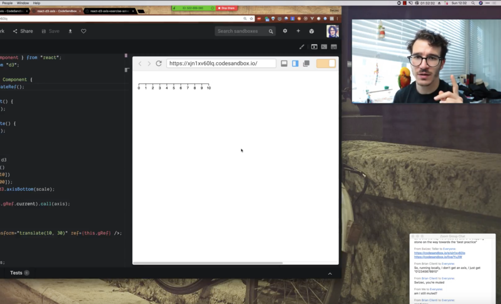

What happens when your computer runs out of memory? It pretends your hard drive is memory! What happens when you want to save your work, and there isn't enough space left on your hard drive after the chunk that is now memory?  You're shit out of luck! That's what happened to me during an online [React + D3 workshop](https://gumroad.com/l/pMtnZ) on Sunday. I was recording my screen in glorious 5K, got antsy about the whole thing being in memory, and tried to save. Not enough space. https&#x3A;//twitter.com/Swizec/status/1031301858030104576 Shit. So I finished the workshop. Recorded another hour of video. Ran to the Apple store. Bought a hard drive. Hoped my computer didn't crash in the mean time. Plugged it in. And… https&#x3A;//twitter.com/Swizec/status/1031318394987995136

## How virtual memory works

…saved the video. 4 hours, 4K, 40gigs. The Camtasia project came out to 61gigs at full 5K with a separate camera stream. Took my 2017 top of the line MacBook Pro about 3 hours to export to a 4K mp4. Took my Comcast about 13 hours to upload to YouTube. https&#x3A;//twitter.com/Swizec/status/1031367600075202560 So how come this worked? Why did I know my video was safe even though I drama'd it up? First of all, the makers of Camtasia aren't dumb. They know video is big and memory is small. Recording happens direct to hidden files on your drive so you can always recover from a crash. You might lose a minute or two. Second of all, modern computers use [virtual memory](https://en.wikipedia.org/wiki/Virtual_memory) that lets them seamlessly transition between using your memory and your hard drive to store temporary stuff.

## But why?

Memory is expensive. My overpriced computer only has 16 gigs. Many have less, some have more. Or rather, _fast_ memory is expensive. That's why you don't have a lot of it. It takes your computer [about 0.5 nanoseconds](https://gist.github.com/jboner/2841832) to read something from L1 cache. Super fast, but you only have [64kB](https://www.7-cpu.com/cpu/Haswell.html). L2 cache, 7 nanoseconds, 256kB. Main memory, 100 nanoseconds, 16 gigs. SSD, about 150,000 nanoseconds, 512 gigs. Don't look at the specific numbers they vary per computer. Look at the orders of magnitude. It's several thousand times slower to read and write to your solid state drive than it is to your L1 cache, which sits inside the CPU ready to take on any immediate memory needs. This saves cost and listens to the laws of physics. L1 is so fast in part because electricity doesn't have to travel as far. Yep, the speed of light is a problem. That's how fast modern computers are. But due to virtual memory, you never have to worry about any of this. Your entire memory hierarchy sits in a single address space.  Memory paging algorithms make sure that what you're using the most is always in the nearest and fastest type of memory. Read something from your hard drive, and the operating system moves it into memory. Work with a tiny bit of that file, and it moves into L3 cache, then a smaller chunk goes into L2, and an even smaller part into L1. L1, L2, and L3 are pretty frothy. They don't have a ton of room, so your computer constantly tries to keep only the most used parts of your data in there. As memory pages become old and stale, unaccessed for a long time, they slowly decay and move out of the fast memory. Writing works the same way but in reverse. Most operating systems use a write-through strategy, I believe. That means you write to L1, which writes to L2, which goes to L3, which writes into memory, which writes to hard drive. You're most likely to use data you just wrote immediately after writing it. That's why it stays in the fastest memory for a while before it naturally decays and remains only in long-term storage. And yes, when you connect an external hard drive, it becomes part of this same address space. It just happens to be super slow compared to an SSD soldered right onto your motherboard.

## Phew

 Thank you computer science for having my back. You're the best.
