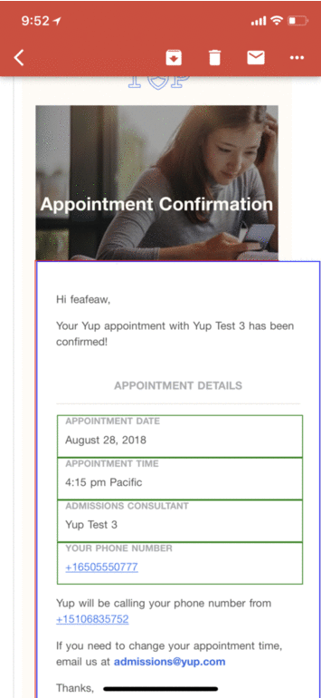
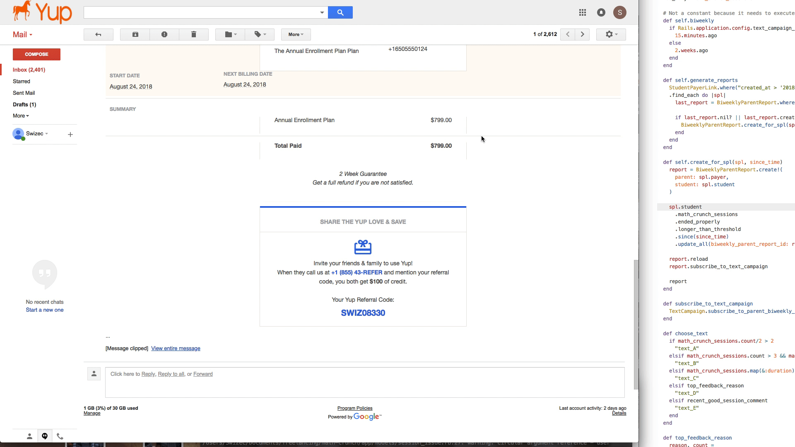
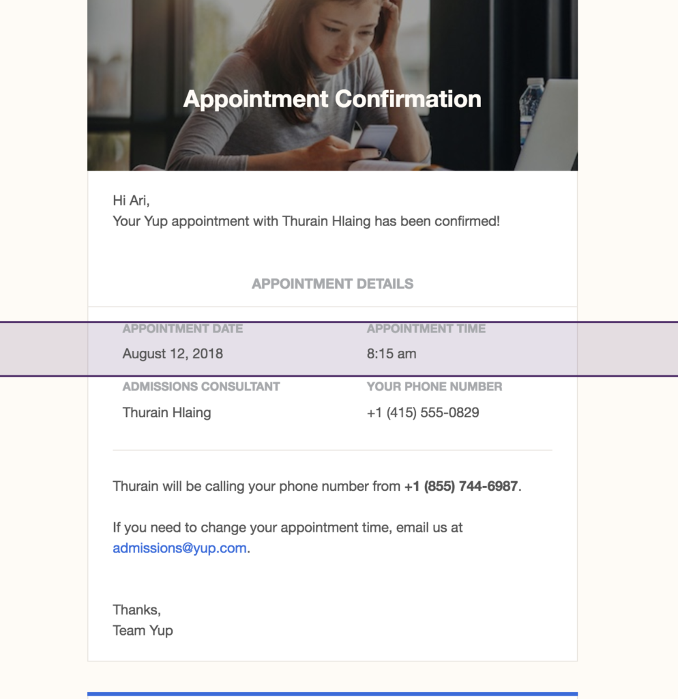

\[caption id="attachment_8595" align="aligncenter" width="177"] 57 debugging iterations\[/caption] Building emails sucks. Last week I was tasked with a project. _"We're rebranding, our emails were built 3 years ago and they look janky. Let's rebuild!"_ _"OK I can do that. But emails suck so I'm def not building that shit from scratch"_ Our designer built an email template in [BeePro](https://beefree.io/bee-pro/). Visual email builder, exports to HTML, promises that everything will work on all email clients, on both web and mobile, and look good no matter what you do. Wonderful. Look at us being a responsible team and avoiding all the hard finicky stuff. I look at the template and think _"Ok, central body area, some optional pre_body stuff, some optional post_body stuff. Body made out of a few basic widgets."_ \[caption id="attachment_8589" align="aligncenter" width="580"] What we built in BeePro\[/caption] To avoid bloating up our codebase and make it easier to build many different emails that look just like this, I cut it up into a few Ruby on Rails partials. A basic layout for the email with hooks for pre and post body stuff, a header partial, a title partial, an information row partial, stuff like that. All my partials were built through careful copy and paste. Inspect the exported HTML, cut out a relevant section, fill dynamic info with erb. Easy peasy. Here's what the emails looked like in my test environment. Opening as a browser tab instead of sending via SMTP. 👇 \[caption id="attachment_8590" align="aligncenter" width="1920"] How the email looked in test\[/caption] And here's what that same email looked like in GMail when my QA team tried it out. \[caption id="attachment_8592" align="aligncenter" width="1920"] Same code, but in GMail\[/caption] ... Ok, breathe, zennnnn. We can fix this. The problem is that BeePro builds weird HTML that I had to tweak a little and that email clients take out some of your CSS. Sometimes they tweak HTML to make it more correcter. You see BeePro doesn't think in boxes like you and I do. It thinks in full width divs and fakes containers. \[caption id="attachment_8593" align="aligncenter" width="580"] BeePro fakes containers\[/caption] Tweaked a few things, moved some CSS around, copy pastad some more HTML. Fixed the email yay! Looks great in GMail on the desktop. Surely it's fine everywhere.

\[caption id="attachment_8594" align="aligncenter" width="576"] My fix for containers broke mobile layout\[/caption]

Now here's the thing, you can't inspect elements in the GMail app on your phone. You can't even tell what's rendering, why things are doing what they're doing, or where any of the elements are. A-ha! I'll open GMail on my computer, set my viewport to iPhone size, and debug that way! Modern web development tools to the rescue. Huzzah 💪

GMail is too smart

Nope. GMail sees it's running in web mode and scales down your email instead of forcing it to reflow. I don't know how, but it does. Email looks like the desktop version, just smaller. Luckily I'm an old skool web developer. We didn't have tools when I started. I know how it goes! Back when PHP scripts returned a blank screen, if you had an error. Because showing errors on the web leads to security issues, you see. Back when browsers didn't come with developer tools until someone built FireBug for FireFox. Fun times. Those arcane skills came useful once more. In a nutshell 👇

1.  Guess which element is a problem
2.  Add a border
3.  Send email
4.  Check on phone
5.  Refine guess, goto 1

`1px solid red` is always my first try. Then I move on to blue and green and dotted and dashed and all sorts of things until I understand how things are rendering and why. Each time you tweak some CSS, some HTML, and move things around. When you're inspecting paddings and margins, you opt for pink and blue and white backgrounds. Background for the big div, background for the small div, hey presto margins and paddings show up. yay Sometimes you take things out to see if they're pushing stuff around. Binary search through the HTML tree to see which line is causing problems. It took me 57 iterations. Here's a gif. Enjoy 👇 \[caption id="attachment_8595" align="aligncenter" width="355"] 57 debugging iterations\[/caption] I may have lost my sanity, I may have begged on twitter for a bullet to the head, but by joe I got it done. The email is damn well perfect. Now watch as I walk into work this morning and QA says it doesn't work.
