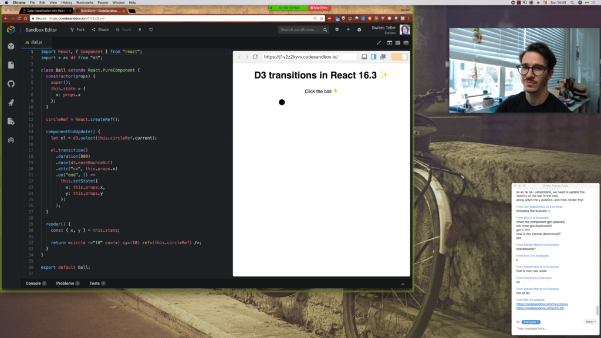

In August, I ran 3 online workshops about React Data Visualization. Little 4-hour affairs every Sunday for people who preordered my upcoming [React + D3 2018](https://gumroad.com/l/pMtnZ) book and course. You could call them webinars, but that sounds lame. They're workshops because they're interactive, last a while, and you write code on your own computer. Like an in-person workshop but not. Goal was 👇

1.  Give preorderers a nice bonus
2.  Practice my Reactathon September workshop
3.  Develop and polish some new material
4.  Record a new video course

 First workshop started with 8 people, and ended with 2. Ouch Second started with 8 people, and ended with 8. Yay Third started with 8 and ended with 11. O.o This can only mean one thing: My workshops improved! The audience was more engaged, grokked the material better, and learned more. 

## How I changed my approach

https&#x3A;//twitter.com/Swizec/status/1033746917782564864 My approach to in-person workshops has evolved and improved over the… years?… gosh it's been a while. The main improvements were to make them less ambitious, simplify my code, and do more follow-along exercises. Turns out saying a few words then announcing _"Now you code this while I watch"_ is not a great teaching approach. People get confused, are afraid to ask questions, and everyone has a bad time. Plus, you get bored. Online, I turn this approach up to eleven. Nothing worse than dead air when you're on air. So where an in-person workshop looks like this:

1.  Swiz talks for a while
2.  Swiz writes some code
3.  Swiz says "Do this next"
4.  Everyone except Swiz codes
5.  Swiz says "Okay, who got it?"
6.  Swiz shows how he'd do it
7.  Go to 1

An online workshop is _more_ interactive because I can't see the audience, so I have to make them actively play along with me. Keep them saying stuff in the chatroom, ask them questions, make them guess what I'm going to say next. Something like this 👇

1.  Swiz talks for a bit
2.  Swiz asks a question to make audience think
3.  Swiz waits for chats to fly in
4.  Swiz nods and says _"YES! Great guess."_
5.  Swiz shows his answer be it code or words or pictures
6.  Only at the very end does Swiz say "Okay I'll shush for 5min and you code this"
7.  Go to 1

I think in a four-hour session there were maybe two 5-minute periods where I was quiet and letting the audience work through some code on their own. Even then, I tried to get them into a live shared Codesandbox so we could work together. Codesandbox live shares are great by the way! You can write some code, then ask the audience to fill in the blank or to guess what has to happen next. It's great 👌 And then you get comments like this

> How quickly the content made sense. Last week I was having much more trouble than this week, some of the programming challenges were resolved within a minute or 2, which definitely felt rewarding. You did an amazing job putting this together, can't wait to continue reviewing the video!

> Workshop went great, really enjoyed it. You are a great teacher, and give good amounts of time to work things out and answer questions.

Lesson learned: Online doesn't have to suck. Now I get to try this interactivity

## The tech

Easiest way to do it is hosting a meeting on Zoom. Managing the invites and stuff is annoying and easy to lose track of. There are probably existing perfect tools for that. To record your screen and get a high quality recording, you should use Camtasia. Your computer might struggle running all this stuff. I don't have a solution for that. I used my Canon DSLR as the webcam, so that was high quality. Yeti Blue Mic for good quality audio. Everyone said it was clear and crisp, no background noise. Use a high resolution stream, as high as you can, to avoid having to zoom in too much on your code. The crispness means people can read small fonts. Zoom breakout rooms are great if you wanna help someone one-on-one, a lot like an in-person workshop, but they create dead air for everyone else, which sucks. Better to make the workshop so very interactive that one-on-one help isn't needed.

## More? Yes, maybe.

Online workshops are a lot more fun than I expected. It's a little nervewracking when you can't see the crowd, don't know if your jokes are landing, aren't sure anyone follows your argument, and don't quite know if your audience is even still there. But you know what? You can compensate for that by making it _more_ interactive than an in-person workshop _and_ it's easier to reach people around the world. Think I might host more of these. Interested? [Ping me on Twitter](http://twitter.com/swizec). 🤙
