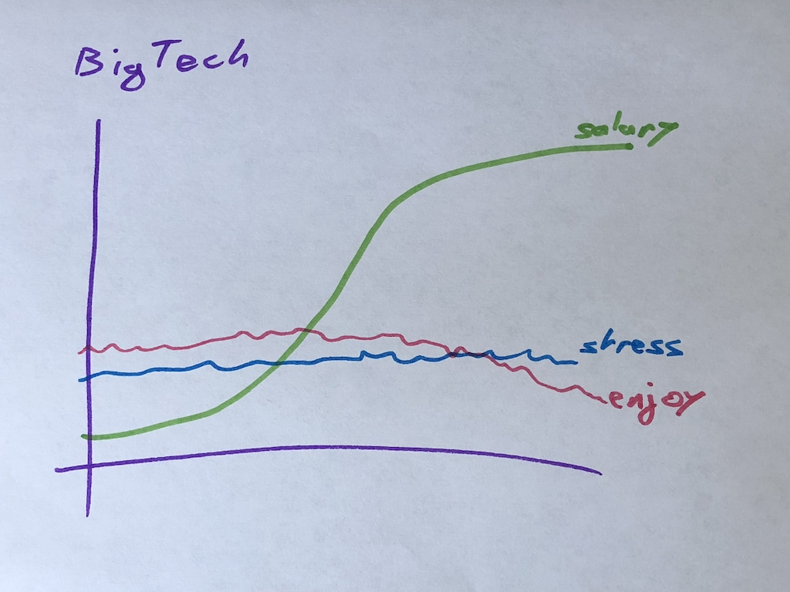
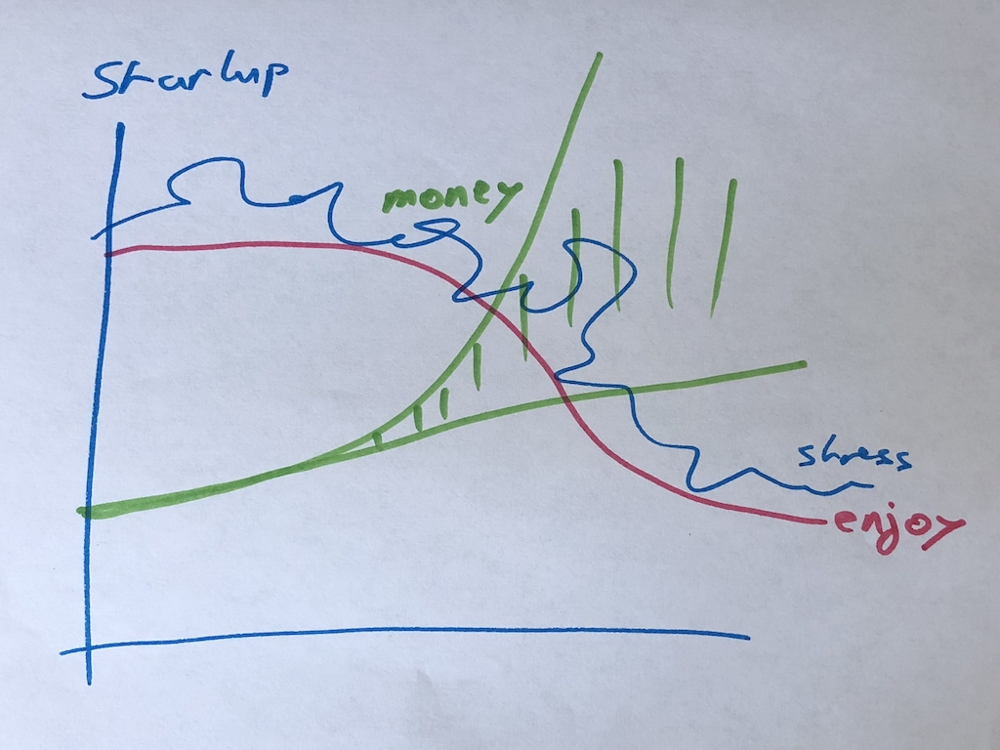
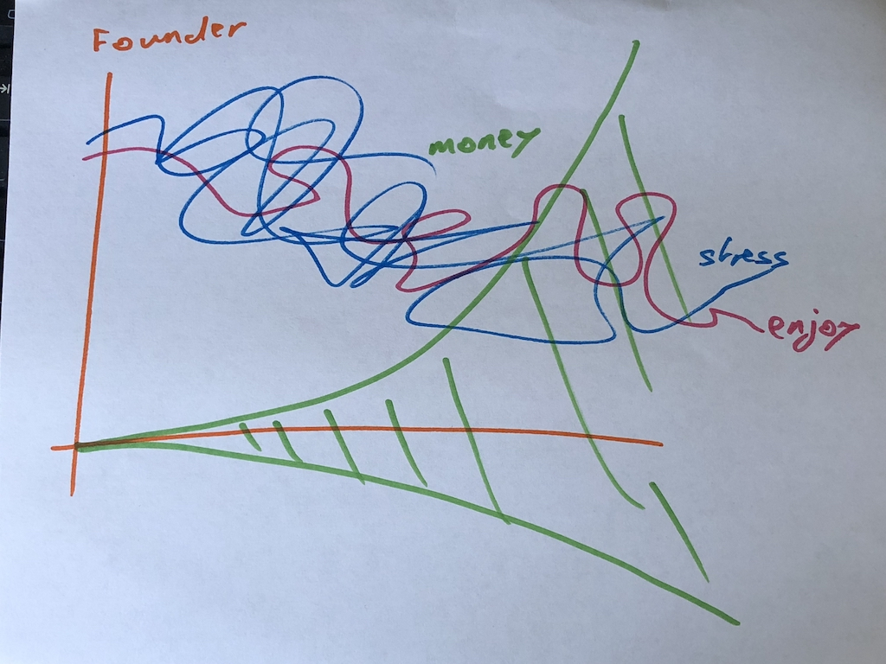

_"If you're so good at this, why don't you start your own business?"_ _"Dude, they pay me so much. Like so much. My skills are in such high demand these days. You have no idea. Starting my own business would be the dumbest thing in the world right now._ Press play, continue reading:  It was 6 or 7 months ago at some sort of dinner at Red Dog in SoMa. My friend likes to brag when you poke him, but he makes a good point 👇 If you can get paid really well, have stable income, work on problems you enjoy solving, _and_ work in nice offices with free lunch ... why would you resist? Go be a normie. Think about it. A software engineering job in BigTech pays anywhere from $150,000 to unlimited. Some cash, some stock. Another friend of mine sold his BigTech stock a year into his job. Paid for an MBA program in New York cash. No debt, just 3 years in Silicon Valley BigTech. Not even an engineer. 3 years, 2 jobs. My engineering friend from Red Dog? I ran into him outside a climbing gym the other day. 3rd job in 6 months. That sounds like a lot, but we seem to run into each other at the boundaries between his jobs. You know how greetings work in Silicon Valley? _"Hey, how are you?"_ _"Good, you?"_ _"Killing it. You still at ... what was it again?"_ Seriously, first thing you ask. Are you still at the same job you had last time we talked? Bonkers.

## The modern Silicon Valley hustler is an employee with the mindset of a freelancer

You get a job. You do the thing. You move on. If you like the company and think it's a rocket, you wait out your vesting cliff. Maybe even the whole vesting period. A business coach once told me that vesting is considered finished for retention purposes when an employee hits 75%. That's the point where their vested stock outweighs what's left to vest and they start looking. The way vesting works is that you get 4 years to gain the right to purchase all of your stock for a discounted price. Those are options. If you have RSUs, you buy your stock in advance and the company has options. After 4 years the company loses its options on your stock. Financial mumbo jumbo. Point is, you get 0% in the first year. Then you get 25% of your grant. After that you accrue monthly until you hit 100% four years later. This is how Silicon Valley companies retain their employees. Work at the right company and you get to build your wealth _and_ get the big cash bucks at the same time. Don't even have to save. But you still should. Stock, especially not-public stock, is a lottery ticket. But you'll notice that recruiter reach-out spikes 1, 3 and 4 years after you start a new job. At year 1 everyone's asking _"So are you liking it?"_, at year 3 and 4 everyone's emailing you _"Yo! New opportunities, this is fun, come have fun with us! We know you're bored of your job!"_ Uncanny.

## Startup vs. BigTech vs. Start Your Own

You went to an okay school, young with plenty of time, got the fire in your belly for the hustle, really good at what you do. No or few outside commitments. You can start your own business or startup, get a job at a startup, or go work in BigTech. Here we define "business" as a bootstrapped company growing on revenue: delivering value, making cash. No investment. Startup is a VC-backed company at any stage before unicorn. BigTech is a technology company that's unicorn or public. So what will it be?

### BigTech

 BigTech is a job. You won't love it. But you also won't hate it. You'll put up with everybody's bullshit, chant the company line about changing the world while knowing deep down you're just a capitalist machine pumping data for money. Your experience will depend on your boss. Get a great boss, have a great job. Get a bad boss, hate your life. When you climb through the ranks I've heard all sorts of great things can happen. Some even get paid big bucks to do whatever they want and work on open source. That's nice. Your big salary exists to keep you there. BigTech knows you're there for the money. This is a business relationship and there's no bullshit around that. We pay you big big while you're useful. Stop being useful, we drop you like a hot potato. Most common complaints I hear from friends:

-   this is boring, I'm bored
-   I have to fight 5 ranks of managers for a promotion
-   everything takes so long to get done
-   I'm not adding value to society
-   I have so many meetings I have to come early and stay late to get my work done
-   I can't tell how my work contributes
-   too much politics

A lot of those come down to bad managers. Say you start with $150k and switch jobs every 18 months for the standard 30% pay bump. Raises are crap because that's 5%. You gotta switch jobs to get a real raise. At the very least switch jobs internally. After 6 years you have: $329k/year compensation. Your wealth and savings depend on which companies' stock you've got, how much you've sold, and how good you've been at avoiding lifestyle inflation. I am confident that at $329k/year you can save at least $150k every year. Yes even living in San Francisco. FIRE (financial independence retire early) in your 40's for sure.

### Startup

 Startups are a job but not quite. Depends on the size of startup you're in. Small startups just starting out, you're gonna have a lot of fun building cool shit with friends. You have control of what happens, huge impact on company trajectory. Bigger startups morph into BigTech. The bigger the company, the less direct impact you have, the more layers of management, and the less fun you're having. Your compensation is low compared to BigTech, but you get a lottery ticket. This stock of yours, it's going to make it all worth it in the end. You're suffering right now for that huge payout later. In return, you have to trust. Believe. Drink the kool-aid. This startup, it's not just a job, it's your baby! We're in this together! Work long nights, early mornings, long weekends, focus hard all day, put in some muscle. Don't forget we're family. You're doing this for you! Nevermind your ownership percentage is laughable compared to everyone who assures you that this is your baby, your company, and you should work hard. Super hard. Complaints I hear from friends and feel myself:

-   burnout
-   stresss
-   changing company direction every 2 months
-   no idea if what you build today will still be useful tomorrow
-   tired
-   office ran out of paper towels the other day
-   can't plan grown up things because money is tight
-   founder disputes
-   manager disputes
-   will I be able to mention this company on my resume in 5 years?
-   too much politics

All the problems you get at a big company except you're not compensated for the bullshit. You're supposed to grin your teeth and love it. Believe the mission! You probably make enough to live your life, save a little, but your wealth and savings are tied to a lottery ticket that might or might not pan out. You never know. 6 years from now you could be a millionaire or you could be living on the streets. Ok maybe not the streets. Unless you're dumb enough to work just for equity. But that's on you buddy.

### Start your own

 Start your own is the most stressful option. Whether you bootstrap or get investment. You take away all the BigTech bullshit and all the Startup bullshit and you're left with all of the control, all of the stress, and none of the compensation. You will suffer, you will work hard, you will stress about money and about whether it's all going to work out. Hire people and _you_ are responsible for their livelihoods. _You_ are the person they complain about when they realize you can't pay as much as BigTech. _You_ are the bad guy when someone complains about drinking mission statement kool-aid instead of getting paid. It sucks. Why would anyone do it? Because it's the only way you can bring _your_ dream to fruition. _You_. _Your_ company. _Your_ dream. _Your_ results. Not somebody else's dream. Not somebody else's job. Your job, your dream, your company. You get to be captain of your own ship, but you also get to be captain of your own ship. Six years from now, maybe you're rich, maybe you're doing okay, maybe you're a beggar on the streets. But what's the worst that can happen? You fail and get a $300k/year job at BigTech from your experience and the network you've built. so cry

## So what do you do?

BigTech is stable and pays well, but can be soul crushing. Startup is stressful and pays okay, but can become soul crushing. Founder is stressful and opportunity cost is huge, but can set you up with something you enjoy doing for forever. Lyfe.
