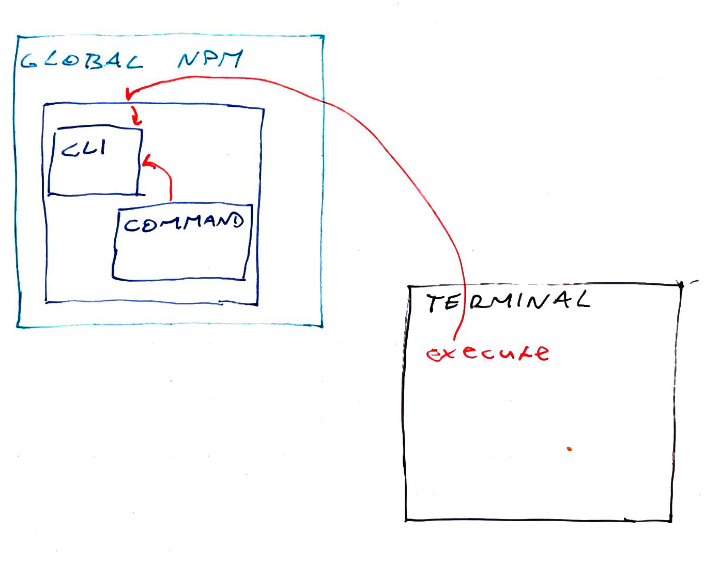
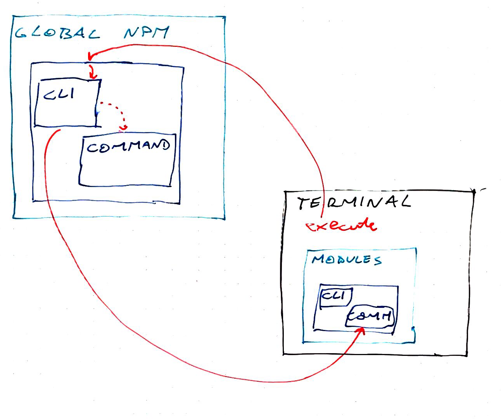

Here's a fun engineering problem for ya: You want to build a CLI tool. It should run as a command anywhere in the terminal.

    $ do-the-thing

And it does the thing. No `./` or funny paths or anything like that. Just a nice command you can run from anywhere. That's not too hard. Now what if you want that CLI to be easily updateable? Still not hard. What if you want different projects to be able to run different versions of your CLI? To avoid issues with breaking changes in future versions. 

## Make a globally executable Node CLI

Building executable CLIs with Node is pretty easy. Easy is a bad word in instructional writing, but it's true. Here's how you do it. **1)** You need an `npm` project. Run `npm init`, follow the prompts, do the things. **2)** Inside this project, create a `cli.js` file. This will be your executable. No real code in here, just handling the execution and possibly argument parsing.

    // ./cli.js

    #!/usr/bin/env node

    let command = require('./command')

    command()

The `cli.js` file uses the hashbang syntax to tell your terminal to use `node` to execute this file. You then import the adjacent `command.js` file that exports some function. Run that function. You can now run this code with `./cli.js` and it should run the command. Superb. **3)** To turn `cli.js` into a command, you have to add a `"bin"` directive to your `package.json` file. Bin tells npm which commands should become global bash commands.

    // package.json

    {
        // ...
        "main": "command.js",
        "bin": {
            "do-the-thing": "cli.js"
        }
    }

You can list as many `bin` commands as you'd like. Keys become bash commands while values are the Node files they map to. We set `command.js` as the `main` entry point into our module because that makes imports easier. **4)** Install globally.

    $ npm install -g your-thing

Installs your CLI in the global node_modules directory. Wherever that is on your machine. You can now run `do-the-thing` from anywhere on your computer. The `cli.js` file will execute, require its adjacent `command.js`, and do the thing. Wonderful. \[caption id="attachment_8664" align="alignnone" width="1362"] A sketch of how execution works\[/caption]

## Make an optionally local globally executable Node CLI

Here comes the fun part. How do we make it so that our global CLI runs different command files based on where you run the command? You want `do-the-thing` to call `cli.js`. But `cli.js` should first try to run `command.js` that's adjacent to where you're calling from. If that doesn't exist, it can run its own global version. Fortunately, Node has a great package resolution system that does just that. It climbs up the directory hierarchy looking for the nearest version of an import. Unfortunately, that doesn't work for us. We're executing the global `cli.js` you see. That one is already at the top. Node never checks files local to where you're calling from :( There's a few ways we can hack around that. But only one I was able to make work. The hackiest. Something like this:

    // cli.js

    let command = null;

    try {
        command = require(`${process.cwd()}/node_modules/your-thing`);
    } catch (e) {
        command = require("your-thing");
    }

Start with an empty command. Then try to import the closest `node_modules` to current working directory. If that fails, load whatever Node can find. Usually that's the global installation because it starts searching at `cli.js`, which is global. Now you can run `do-the-thing` from any project on your computer and each project can have its own version of your CLI. 👌 \[caption id="attachment_8663" align="alignnone" width="1292"] Sketch of how local execution works\[/caption] One downside is that calling it from a subdirectory of your project will fail. Has to be at the root. It's a solvable problem. You can implement the same hierarchy traversal that Node uses. But that seems fishy 🤔
