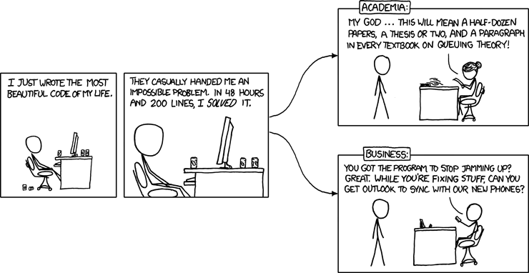
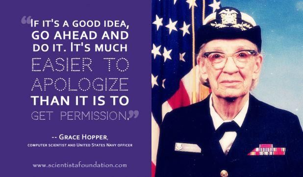
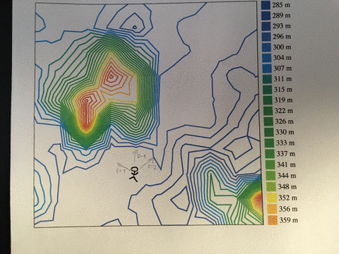
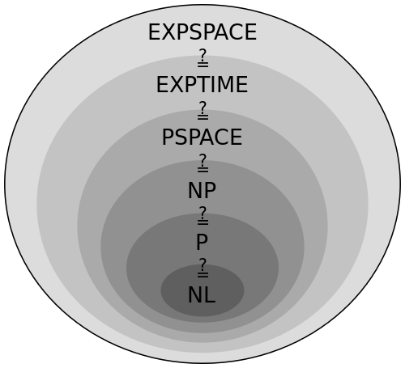

Computer science lurks beneath everything you do with computers. You may think you don't need comp sci and that practical down to earth software/computer engineering is where it's at, but believe me my friend when I say this: Computer science is amazing.


[](https://xkcd.com/664/)


Not only can you publish many papers for every little discovery, you can learn a lot about life from a little computer science. Whenever I come upon a hairy problem in life, work, and business, almost always there is a solved version in computer science.


Now granted, college is many years away, but the good shit stays 👇


## Amdahl's law


[Amdahl's law](https://en.wikipedia.org/wiki/Amdahl's_law) states that you can never make a system faster than its slowest part.


It focuses on parallelization. You can make algorithms faster by performing some of the work in parallel. But all algorithms have parts that cannot be parallelized.


No matter how much parallelization you throw at a problem, your code will never be faster than the slowest non-parallel part.


The implication for life (and code) is that to make a system fast, you should identify its slowest part and optimize that. Like hikers making life easier for the slowest hiker because that makes the whole group faster.


## Eager optimistic execution


Computer processors use [pipelines](https://en.wikipedia.org/wiki/Pipeline_(computing)). It follows from Amdahl's Law, in part.


Think about a processor instruction. It comes in steps or stages. The [ARM processor](http://infocenter.arm.com/help/index.jsp?topic=/com.arm.doc.ddi0301h/I1002919.html) has a bunch of them:


1. fetch the next instruction
2. decode it
3. read registers
4. shifter??
5. compute the thing
6. saturation??
7. writeback to the pipeline


I used to know these stages by heart. Getting hazy these days.


Each instruction takes multiple cycles to perform. The longer the instruction pipeline, the slower you processor.


Computing is only the 5th step! Do you want your arithmetic unit to sit idle 85% of the time? Of course not.


You stack the pipeline. Do stuff in parallel. As soon as an instruction moves on from the fetch stage, you can start fetching the next instruction.


Now your pipeline is always full.


But what about conditionals!? You can't know which side of the code you're executing when there's branches.


You guess. Heuristics can tell you which side of the code is more likely, so you eagerly start executing that, then throw it away if you were wrong.


Think of a `for` loop from 1 to 100. Your guess to execute the loop body is correct 99 times and wrong once. That's a massive speedup for the cost of tossing your result once.


You can apply this to life: When you get an opportunity, even if it's not final or absolutely certain, start acting like you have a Yes. Prepare that presentation, work on that project, whatever you soft agreed to, start working on it.


If it falls through, well, you lost some time and learned a lot. No biggie.


## Ask for forgiveness, not permission


I learned this one in the context of learning Python. But really it's a [Grace Hopper](https://en.wikipedia.org/wiki/Grace_Hopper) quote 👇





She was a bad ass computer scientist. Built some of the first compilers and championed the idea that programming languages should work on multiple computers.


In the context of computer science, her quote kind of describes exception-based error handling. You try something, and if it doesn't work, clean up after yourself. If it does work, you just saved the time it would take to check.


```
try:
    read file
except NoFile:
    oops
```


Versus


```
if file_exist
    read file
```


Depending on complexity of your `if` statement, the exception approach can be faster. I often find it cleaner to work with bubbling exceptions as well, but implicit versus explicit error handling is a huge can of worms and a topic of much debate.


Where this applies in life is that more often than not, you should just do stuff. By the time you get permission, you would have accomplished it already.


And it's harder to say No when they see the benefits 😉


## Divide and conquer


[Divide and conquer](https://en.wikipedia.org/wiki/Divide_and_conquer_algorithm) is an algorithm design paradigm that focuses on subdividing problems into smaller problems until the problem at hand becomes so tiny that it's solvable directly.


That's a mouthful. 🧐


Basically:


1. Take big problem
2. Split in half
3. Can I solve each half? If yes, solve. If no, goto 1.


[Quicksort](https://en.wikipedia.org/wiki/Quicksort) and [merge sort](https://en.wikipedia.org/wiki/Merge_sort) are great examples of this approach.


Say you have a huge book shelf that you have to sort alphabetically. With 100 books and, say, 5 seconds to compare and swap two books, it would take you 13 hours to sort that bookshelf.


13 hours for 100 books!


With a divide and conquer algorithm 👉 27 minutes.


Here's how:


1. Take stack of books, pick a middle
2. Everything on the left is your new stack. Pick a middle
3. Do this until your stack is 2 books
4. Swap them into order
5. Take the right-hand stack of 2 books
6. Swap into order
7. Take both stacks, swap into order
8. You now have 4 sorted books
9. Keep going back up the stacks until your whole shelf is sorted


That's quick sort. Very fast for computers, but not very handy for manual book sorting.


You can use a merge or a bucket sort instead. Throw books into piles based on their first letter. Sort those smaller piles using your favorite method. Put them back on the shelf in order.


This divide and conquer trick underlies every product management approach, every project management thing, even all productivity books, courses, and systems.


Take a task. Break it down until individual subtasks become trivial. You can do eet! 💪


## Complex search algorithms


Life is a [multivariate optimization problem](https://en.wikipedia.org/wiki/Multi-objective_optimization). You have many variables to optimize and no obvious solution.


For most, the variables are something like:


- health
- family
- work
- money
- sleep
- food
- community
- friendship


List goes on forever. Any time you ask yourself: Should I watch Netflix at home or go out with friends? You're solving a multivariate optimization problem.


And you _have to_ guess because finding the _optimal_ solution would take until the end of time. It's unsolvable.





In computer science, we model these problems as a multidimensional search space.


Think of a landscape of hills and valleys. You want to find the tallest hill, but you can't see very far, you don't know where you are, and you have no idea what's out there.


You know the tallest peak must be up from where you are right now. So you walk up the steepest slope you can see. That will get you the uppest the fastest.


You reach the peak. Only way forward is down. You're tired, but happy. You've found it! The tallest peak!


Not so fast! You've only found a local maximum. Out in the distance, you see a taller hill.


You have a decision to make. Is the local maximum good enough or do you want more? If you're good, you can stay. Exploit your hard-earned peak and enjoy yourself.


Or do you have energy left to find that better hill? The journey is long and perilous. You might not make it. And what's worse, you have to let go the trappings of your current hill first. You have to walk down into a valley that leads to the taller hill.


[This is your life.](https://swizec.com/blog/only-self-help-business-advice-you-need/swizec/7190)


The peak can be anything. For most, it's some combination of work, family, health, and friends that balances out the happy moments and the sucky moments.


That's great, but remember to shake things up once in a while. Only then can you find the hill that is tallest.


PS: that's called [simulated annealing](https://en.wikipedia.org/wiki/Simulated_annealing), and it's an improvement on [hill climbing](https://en.wikipedia.org/wiki/Hill_climbing)


## Unsolvable problems


Much of computer science deals with [computational complexity](https://en.wikipedia.org/wiki/Computational_complexity_theory). How hard is it to solve a particular problem?


Problems fall into multiple [complexity classes](https://en.wikipedia.org/wiki/Complexity_class) ranging from easy-to-solve, to problems where we can't find an answer but can validate a guess, to completely unsolvable.





When you're waiting for a process to finish, for example, you can never know whether it's still going or it got stuck and will never finish. You could wait for forever and never find out. Or it could spit out an answer in 5 seconds and you'll know it wasn't stuck


That's the famous [halting problem](https://en.wikipedia.org/wiki/Halting_problem), by the way.


Many types of these unsolvable problems exist, and they're fun to study. Most become easy to solve if you change some constraints.


Will this process finish in 10 seconds? Easy to solve.


Can you find a _good enough_ layout for these circular tables in a room? Yes. Can you find _the best_ layout? No.


That's a common pattern I've found. As soon as you're looking for _the best_ solution, you are almost always in unsolvable land. Especially when there's multiple dimensions involved.


But a good enough solution? You can almost always find that with some trial and error.


https&#x3A;//twitter.com/Swizec/status/1061409345777221632


Just like those search algorithms. They were designed to solve unsolvable problems well enough 😉


PS: If you like this sort of computer science to life application, [Algorithms To Live By](http://algorithmstoliveby.com/) is a great book I read last year and never got around to writing a blogpost about.