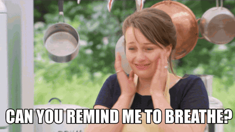
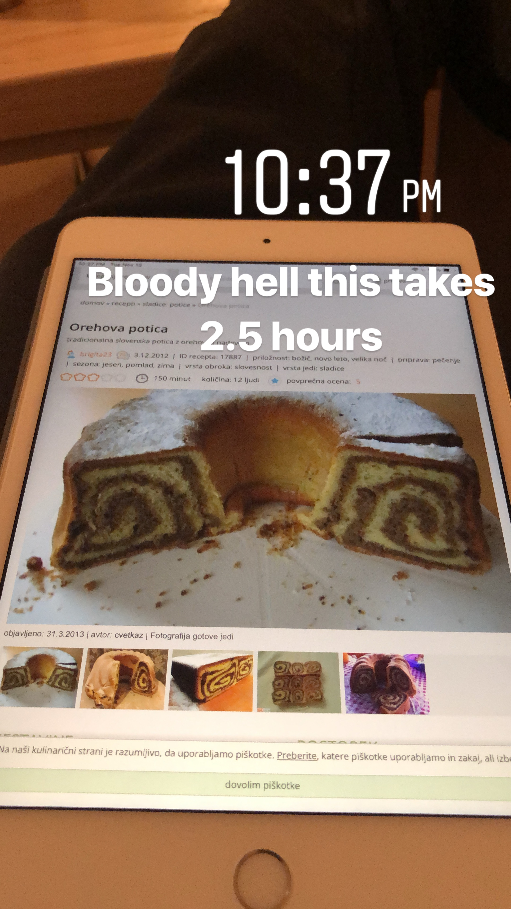
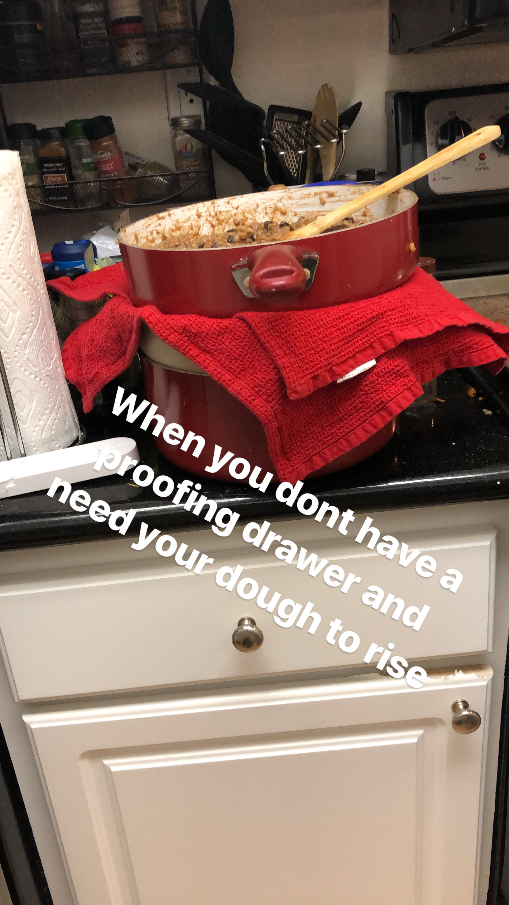
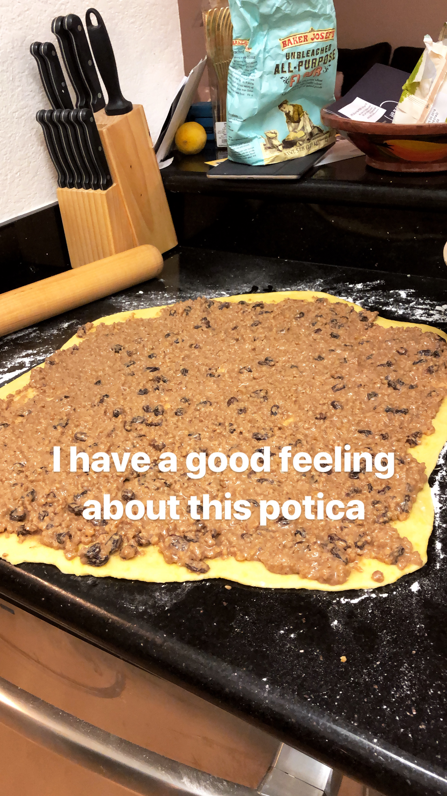
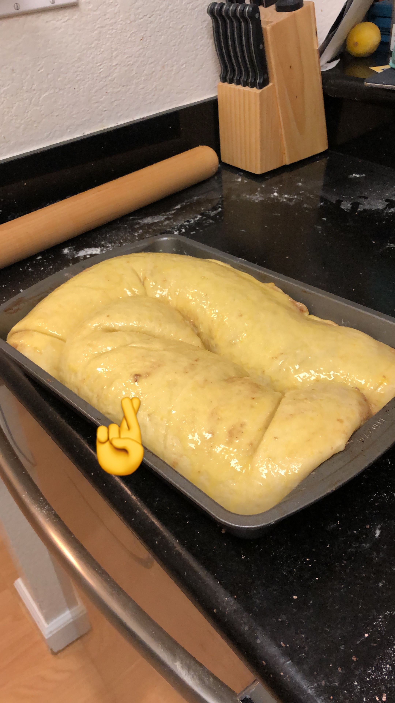
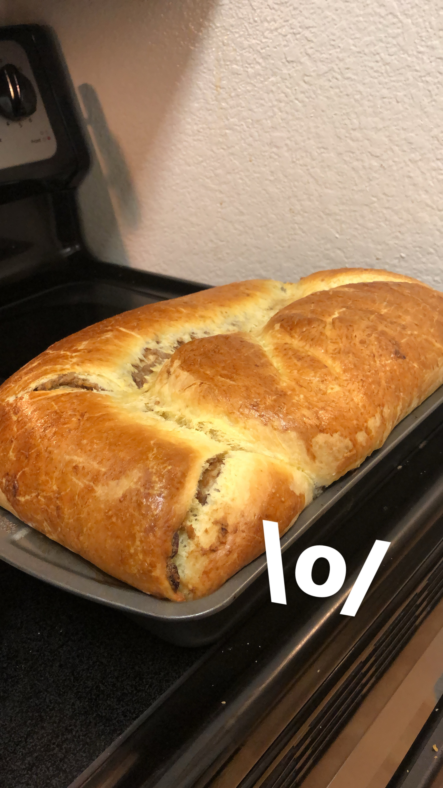
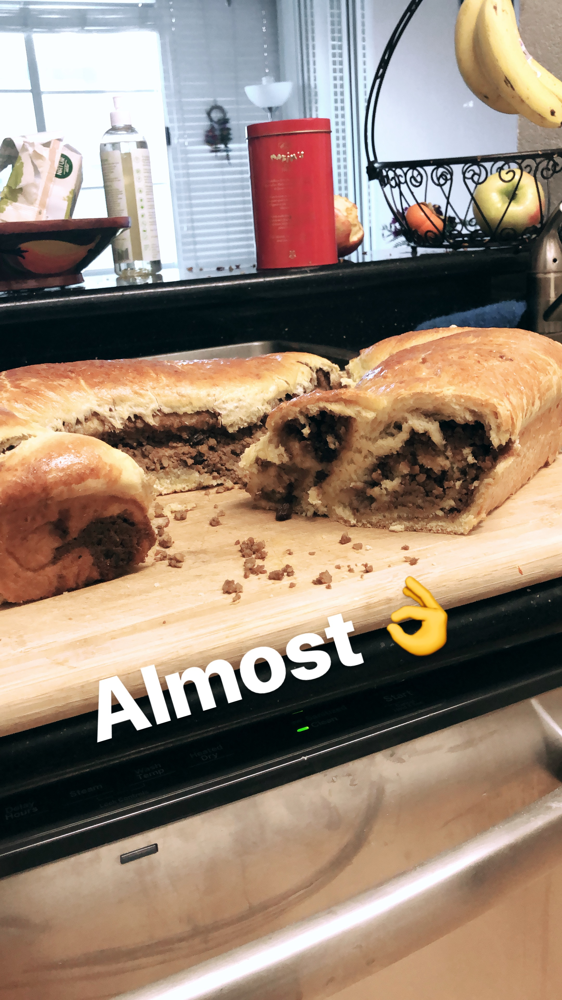

Programmers love flow. That state of total absorption where you work on a task and the world ceases to exist. You graze the keys. A gentle caress. Just you and your code. Fingers gliding across the keyboard like poetry. Code so elegant it would make [Dijkstra](https://en.wikipedia.org/wiki/Edsger_W._Dijkstra) cry. Five minutes later, you look up. Emerge from your perfect little world. 3 hours have passed. Dazed, displaced, and a little hungry, you close your laptop. Happy.  That's great and all, but have you tried baking? Holy shit. _Baking_, baking is the real flow. No time to rest. Once you start, you can't stop until it's done. Constant motion. Constant pressure. Constant adrenaline. Rest for even a second, and you may have just ruined your whole bake. Watch [The Great British Baking Show](https://en.wikipedia.org/wiki/The_Great_British_Bake_Off) if you don't believe me. It's on Netflix. Amazing show. Very wholesome and everyone's so nice to each other. Even the judges are super positive and constructive.  Last night, I made a [potica](https://en.wikipedia.org/wiki/Nut_roll#Potica). It's a traditional holiday pastry from Slovenia that I've been making every Thanksgiving or Christmas since I moved to the US. Mom and grandma aren't here so I gotta make it myself. ¯_(ツ)_/¯ A little slice of home. But it's not as good as when they make it. 👵 Here's what a two-and-a-half hour bake like that looks like. Pure flow. [Recipe](https://www.kulinarika.net/recepti/17887/sladice/orehova-potica/), if you can read it. You start at 10:30pm because of course you do. Put on some headphones, ask Spotify for a baking playlist. Yes, they exist.  You take a cup, warm up some milk, add a spoon of flour, bit of sugar, and a cube and a half of yeast. That's your timer. You gotta get the dough ready before the yeast starts spilling out of your cup. 5 minutes. Maybe 10. Hope you picked a big mug coz that yeast mix is about to grow to 5x its volume. Sift your flour. Makes it nice and fluffy. Add a bit of salt and your sugar. Mix. Melt quarter kilo of butter. Add 4 yolks, keep the whites. Add your milk. Pour the butter. Make sure it's cool. Hot butter kills the yeast. Add some lemon zest, bit of rum. Hope you're ready. Yeast is spilling. Add it to the dough and knead until you get a nice soft dough of good consistency. Let your dough rise. Oh, but shit, you cooled the butter too much and used milk straight out of the fridge. Cold kills the yeast. Make sure the dough is warm. Put it on a bowl of hot water. Keep it cozy.  While your dough rises, you have juuuuust enough time to prep the filling. Hope you started soaking them raisins in some rum two hours ago. Gonna be dry and un-aromatic otherwise. Grind many walnuts down to almost a powder. Americans don't sell them finely ground enough. Roast. Make sure it doesn't burn. Use low heat. Patience. Smells perfect just before they burn then suddenly they're black. Add cinnamon. Bunch of heavy whipping cream. Also sugar. Some more lemon zest. Throw in some rum and the raisins. Make sure you don't make it runny. Stir and let simmer on low heat. Whisk your egg whites. You remembered to store them when separating yolks from the dough, right? While the dough rises and the filling simmers, you have time to clean your kitchen. Put away the clean dishes. Put everything dirty in the dishwasher. You need a large clean surface for your next step.  Mix gently the egg white fluff into your filling. Add a whole egg. Needs to be of a nice spreading consistency. Not runny. Not hard. Too thick, add some milk. Too runny, add some breadcrumbs. Don't overdo it. Both milk and breadcrumbs dilute that delicious taste of roasted walnuts and cinnamon and raisins and rum and chocolate powder. You added the chocolate powder, right? And you didn't forget to use less sugar if your hot chocolate powder comes sweetened, yeah? Split the dough in two. Roll it to about the thickness of a pinky. Maybe thinner. Maybe fatter. Depends on how well you think it's gonna keep rising. Spread the filling, roll it up into a roll. Put in a greased baking tin. Repeat with the other half. Whisk an egg and smear it over your potica. This creates a nice golden sheen when baked.  Preheat your oven. Let the potica rise for another 20 minutes. Bake for 50 minutes or until golden brown. When you tap on the top and it makes a hollow sound, you know it's done. Wait too long and it's dry and crumbly. While your potica bakes, you can clean the kitchen. Wipe down that floured counter top, put away all the dirty bowls and utensils. Start the dishwasher. Always leave your kitchen cleaner than you found it. It's part of baking. It's 2 hours later. Now you can rest. Where'd the time go lol?  Your potica came out perfect. Your tin was too small and you can see it exploded. That happens when it doesn't have enough room to rise while baking. But just look at that beautiful color 😋 Let it rest. Cool down. Tomorrow, you find out if you were successful.  I rolled the dough too thin. There's no swirl. And my filling is too sweet. Forgot there was sugar in the chocolate. But the top layer didn't separate and the dough is perfect 🙌 That was fun. Getting better every year. Cheers, ~Swizec PS: No,seriously, try baking. It's very technical, super relaxing, and forces you in the flow. Your worries and concerns melt away when you're baking. There's no time.
