Look at this code. Do you know what it prints? 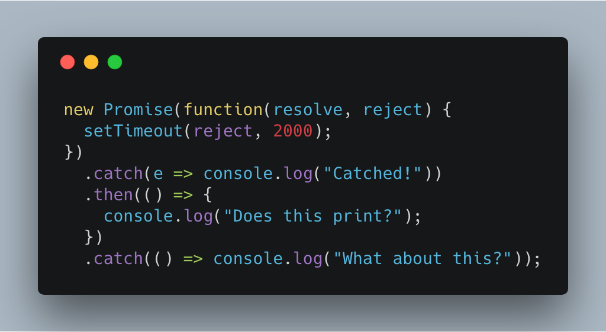 Correct.


First `catch` prints because that timeout rejected the Promise. First `then` prints because the error has now been handled, and we returned a new promise. Implicitly.


The last `catch` doesn't print. No more errors to handle.


Once a promise, always a promise.


Let's start at the beginning.


PS: there's gonna be some code. You can try it out in [this codesandbox](https://codesandbox.io/s/2yk3ywv4y). Most of the snippets are in there. Some are commented out.


## The Event Loop and you


JavaScript uses the [event loop execution model](https://developer.mozilla.org/en-US/docs/Web/JavaScript/EventLoop#Event_loop). That means the JavaScript engine runs in an infinite loop waiting for messages – events – to show up.


Once a message shows up, the engine processes it in full, then waits for the next one. Something like this:


```
while (queue.waitForMessage()) {
  queue.processNextMessage();
}
```


Everything is an event. Your main code, your click handlers, user interactions, talking to an API, timeouts. All comes to the JavaScript engine as an event.


This is an implementation detail but for one amazing emergent property: Your code never blocks.


You can split slow operations into two events. First you start, then you handle the result. In the meantime, JavaScript can handle other events.


Think of a `fetch()` request.


You set it up and fire off an API call to the server. You jot down a note and go off to do other stuff. When a `received response` happens, you look through your notes to find the `fetch()` it matches and do what needs to be done.


This lets you write asynchronous code. Single-threaded multithreading that's fast and avoids all problems with multi-threading.


As long as your code follows functional best practices.


## Functional basics


Write pure functions.


**Rely on your inputs.** A function must calculate its value from its inputs. Anything outside the function may have changed between when you scheduled and when you execute.


**Avoid side-effects.** When your function changes the outside world, be very very careful. You never know what might happen should you call it again.


In a nutshell: a [pure function](https://en.wikipedia.org/wiki/Pure_function) always creates the same result for the same arguments. No matter when, how, or why you call it.


Break this promise and subtle hard-to-debug bugs occur.


What does this print? 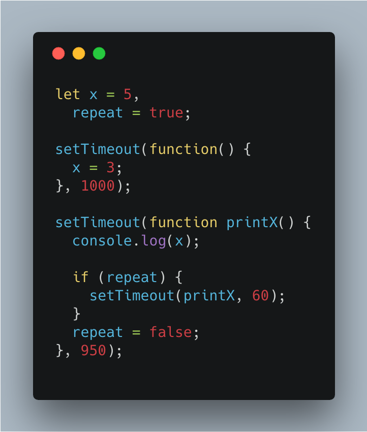 Hard to follow right? It's `5` then `3`.


## First there were callbacks


Those `setTimeout`s use callbacks. Callbacks are how JavaScript deals with its asynchronous nature.


You pass a function as an argument to another function, and it's called when is ready to call it. Great for small stuff like a timeout or a single API call.


Leads to callback hell when you run a bunch of stuff in sequence. 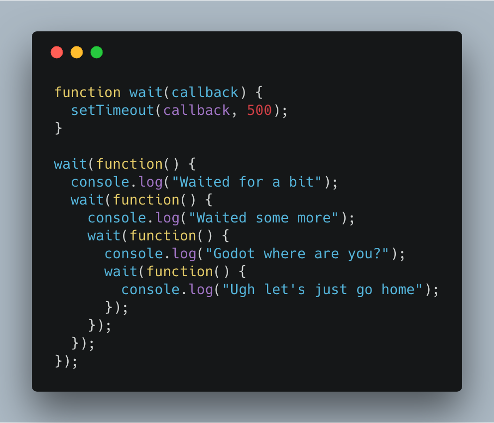 I always liked this kinda code. It's clear, readable, goes down the steps linearly. Super nice.


Error handling makes it harder. That usually worked like this: 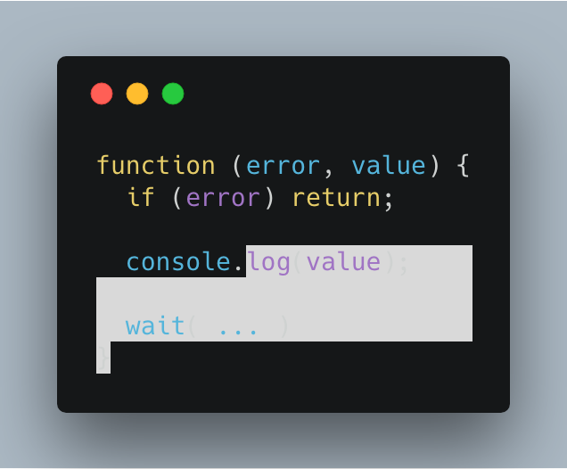 This gets messy. Making sure you handle all errors correctly and your UI shows what's up is hard. Super messy, super fast.


Your code gets especially fun when you want to run multiple things in parallel and want to ensure all are finished before you continue. You'd often use a library for that because it's so messy.


You can fix a lot callback hell with meaningful names and flattening your code them out. But people didn't do that.


## Then there were Promises


Instead, we invented promises.


A promise is an object that takes two callbacks. Resolve and reject. One for results, one for errors.


This makes your code cleaner right away: Two different functions to deal with two different flows. 👌


Here's an old video of mine explaining promises in 2 minutes:


https&#x3A;//www.youtube.com/watch?v=KVYm0qC4b1Y


Now that our callbacks are wrapped in objects, they're easier to pass around. Easier to make sure a promise always returns a promise. Easier to know everything inside a promise always stays inside a promise.


You can chain. You can handle errors. You can run things in parallel.


Like this 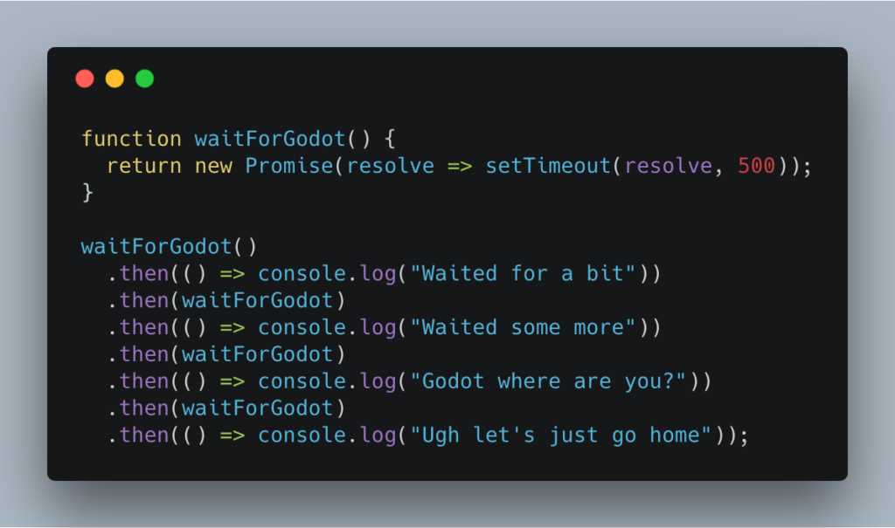 Some say this is easier to read. I think it's about the same. The flat structure does look nice.


You could write that same code like this: 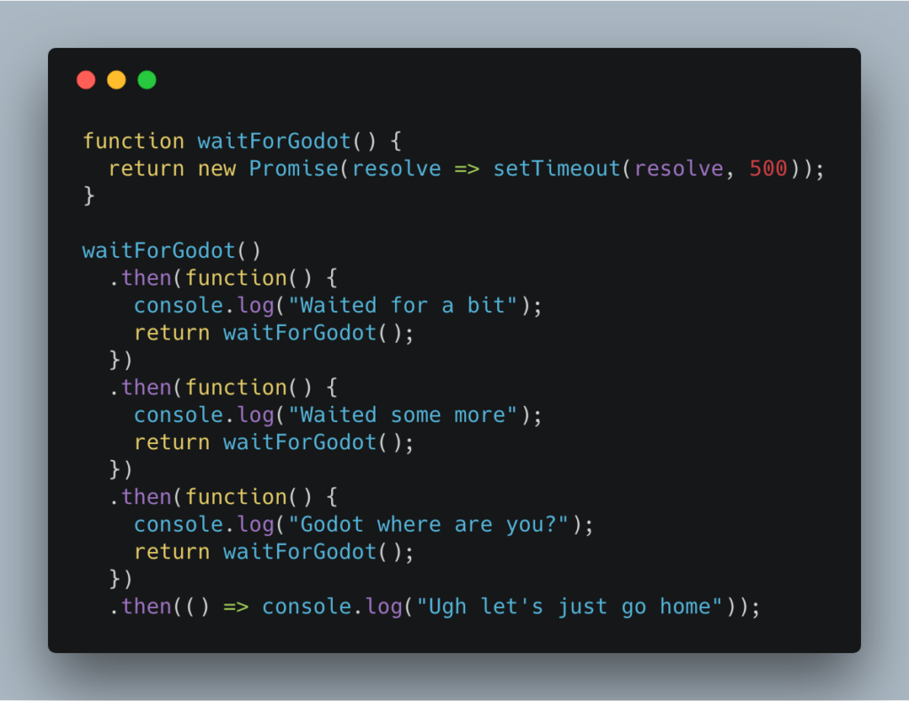 _Anything_ you return from a promise is wrapped in a promise. If you return a promise, it gets flattened. You don't need `.then.then` to unpack the value.


Observe 👇 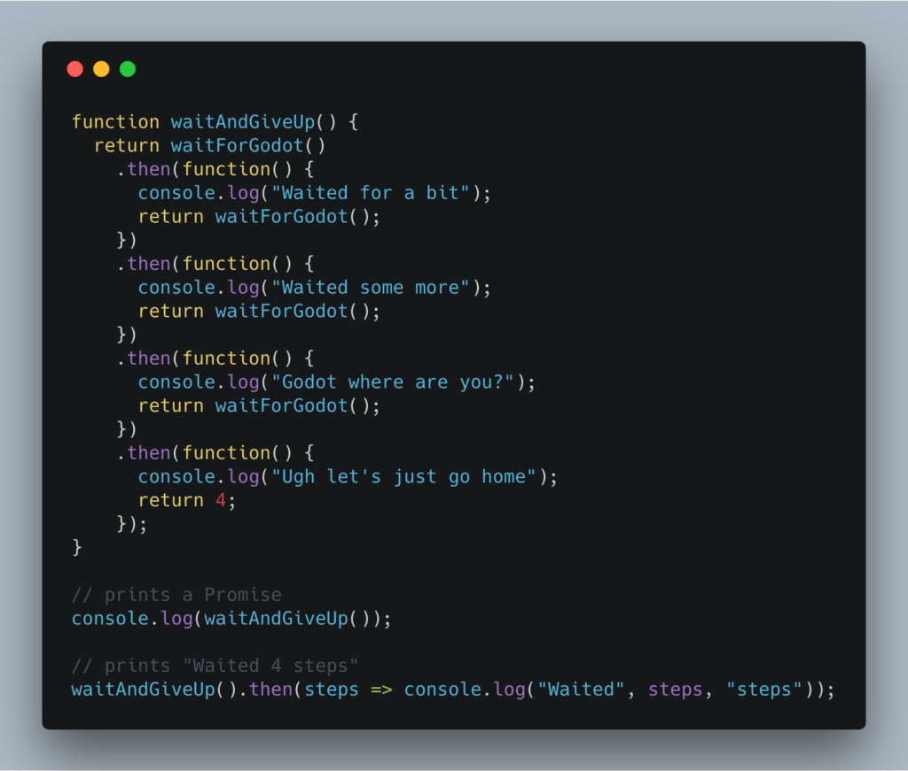 Print directly, and you get a `Promise` object. Mind you, it still executes. A promise doesn't care if you ever use the result. It executes right away.


That last `return 4` got wrapped in a promise ad we can get it with a `then`.


A `.then` always gets the latest value returned from a chain of promise resolutions.


A `.catch` always gets the latest `throw` _and returns a resolved promise_.


That's the tricky part.


We can make our wait faster with `Promise.all`. That lets us run promises in parallel and deal with their results all at once. 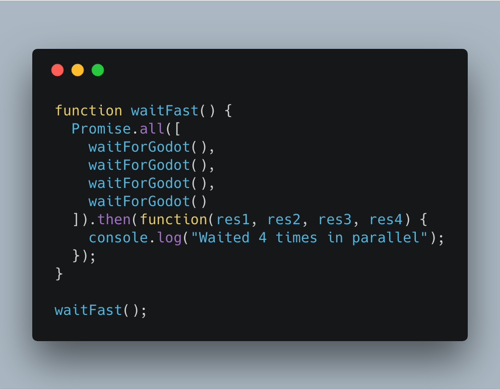 👌


So clean. Shows how you can pass promises around and get the value whenever you want. Doesn't even have to be chained.


Our `waitForGodot` function doesn't return a value, but if it did, those `then()` arguments would have the results.


## Now there's async/await


Promises are great and all, but you're still using callbacks. That's messy, I'm told. I like it, but I'm a weird functional programmer at heart. I enjoy passing functions around.


For everyone else, there's async/await.


Async/await is syntax sugar for Promises that replaces promise chaining with `await` calls.


Waiting for Godot looks like this: 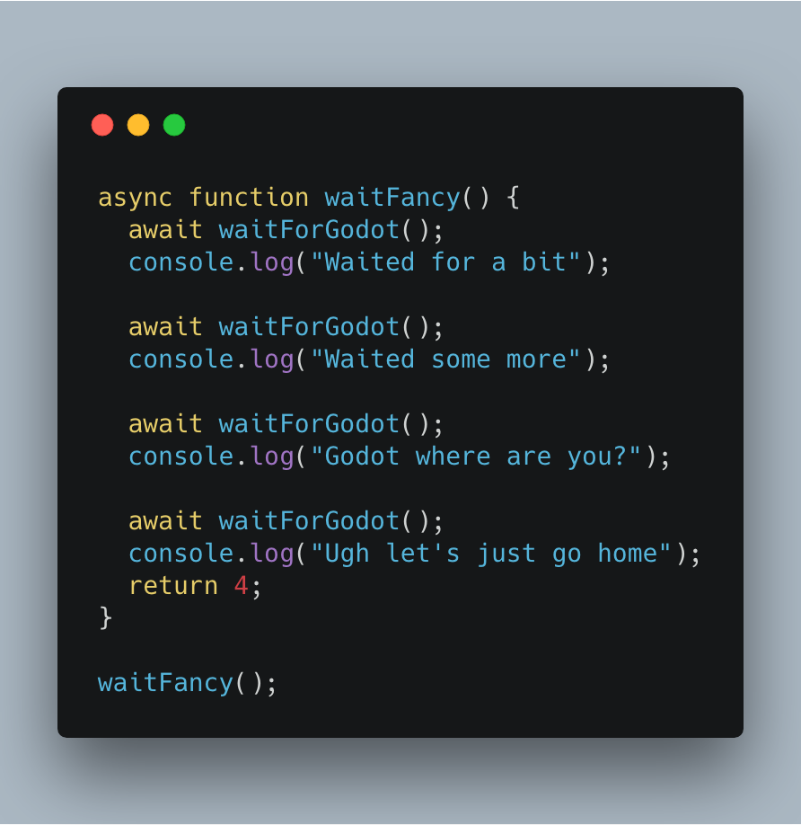 You now have code that's extremely linear. Reads just like normal imperative code you know and love.


Functions that use `await` have to be marked as `async` functions. That's how JavaScript knows to wrap them in a promise. Each `await` translates to a `.then()` that wraps the rest of the code behind it.


Although Babel compiles this code using generators 🤔


Either way, you can get values out of an async function using await just like you would with a Promise chain. Every async is await-able. 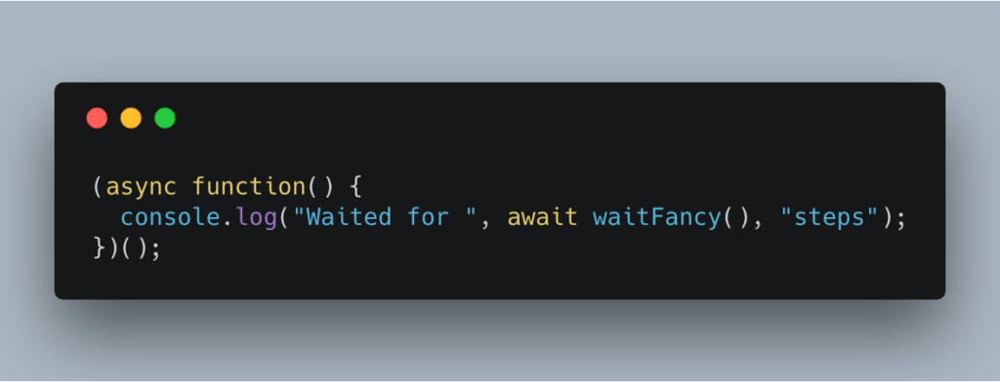 But you can't `await` outside an async function. That's why I had to wrap that code.


Monads strike again.


You can think of `async` as a monad. Once you're in async land, you have to stay in async land. You can't get out. The only way to access a value inside `async` is to step inside yourself.


But it does lead to some cool things. Like easy iteration:  You can use `await` to wait for values inside a loop. The next iteration happens only after your Promise resolves.


And if you want to wait in parallel, you can do that, too. Just use `Promise.all` as before. 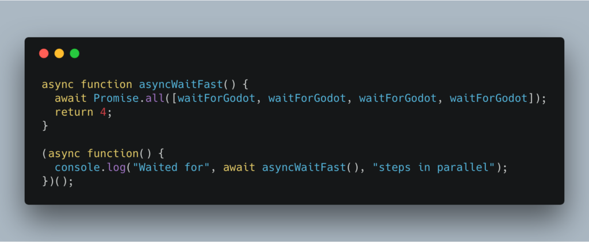 Remember, `Promise.all` returns a promise and `await` can wait for any promise.


## True multi-threading exists


Where all this asynchronous code breaks down is intensive computation.


The event loop is single threaded. That makes it great at dealing with problems that involve a lot of waiting. But when processing a single event starts taking too long, other events suffer.


You can see this when you run an intensive data visualization, or a tight loop over 50,000 elements in an array, and your input boxes start lagging.


The solution are [web workers](https://developer.mozilla.org/en-US/docs/Web/API/Web_Workers_API/Using_web_workers). Actual separate JavaScript processes you can communicate with via message passing.


But that's a topic for another day :)


And yes, because web workers work via message passing, that means you can wrap them in promises. You could create an await-able promise that runs its code inside a completely different thread. In a web worker.


That's gonna be fun to play with so I can show you how it works.


## Savvy?


To recap:


- **callbacks** are great, you're using them even if you think you aren't
- **promises** make callbacks easier to chain, a little easier to read, and much better to pass around your code
- **async/await** makes your code look linear so it's even more easier to read. You always know when some code is waiting for a result from some other code


This is a talk I'm giving to the DayJob.exe engineering team at lunch today. Hope they like it 🤞