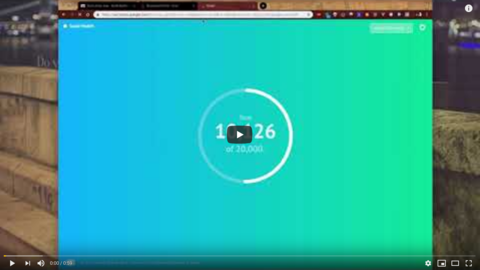
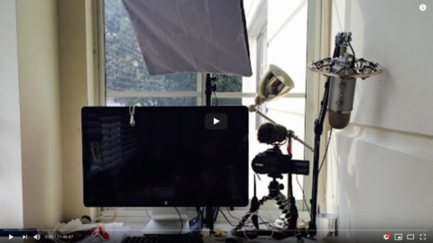

A fun weekend project can be one of the best ways to learn new tech and accelerate your career.

You pick a problem, no matter how small, trivial, silly, or already-solved-before. You clear some time in your day. You sit down and you hack away until you've solved it.

I did that for the [24hrstartup](https://24hrstartup.com/) challenge this weekend and built [techletter.app](https://techletter.app). A service that takes markdown and spits out these newsletters.

🐦 Tweets, 📹 YouTube, 🎨 images, and 🤖 code turn into thumbnails. Saves 15+ minutes per email 🤘

I built [TechLetterApp](https://techletter.app) because I love writing these newsletters but I hate making those screenshots, ensuring images are small enough, pasting code into carbon.now.sh, … it's a huge time sink and super hard to get just right.

Been wanting a service that does it for me and nobody was building one. So I did 😛

_PS: [launched on ProductHunt](https://www.producthunt.com/posts/techletterapp-build-better-newsletters) if you're into that sort of thing_

TechLetterApp is built with React and 👇

- [reactbulma](https://kulakowka.github.io/react-bulma/) for layout and basic styling
- [showdown](https://github.com/showdownjs/showdown) for markdown parsing
- [Zeit](https://zeit.co/) for hosting
- a single AWS Lambda function for screenshots
- an AWS API Gateway to give the Lambda a REST API
- it Chrome Headless to render & screenshot pages
- [Chrome Puppeteer](https://github.com/GoogleChrome/puppeteer) to drive the virtual browser
- [GraphicsMagick](https://github.com/aheckmann/gm) to resize and optimize images
- uploads all images to S3
- click to copyToClipboard method from a [hackernoon article](https://hackernoon.com/copying-text-to-clipboard-with-javascript-df4d4988697f)
- a hack to push code into [carbon.now.sh](https://carbon.now.sh/) from a random gist
- [Serverless](https://serverless.com/) framework to drive AWS deploys and packages
- uses [CheckoutPage](https://checkoutpage.co/pages) to collect optional $2/export payments because I didn't want to faff around with Stripe myself
- I used <https://megatags.co/> to generate social sharing tags
- and I tried and abandoned a bunch of other libraries on the way

Truly this project is a testament to how far The Web Platform has come that a single person with a little help from the audience can build something like this in just 17 hours. You can watch the first 12 of my stream on YouTube. 👀

The rest is on Twitch. I haven't added Twitch to TechLetterApp yet :P

But here's the real kicker:

> Before Saturday morning I didn't know any of those technologies and tools except React and Zeit. The rest I learned on the go.

Now I get to say I've shipped functioning working code with all of those. That looks great to a potential employer, client, or boss.

Oh you can build Serverless code to solve business problems fast? Hired!

😉