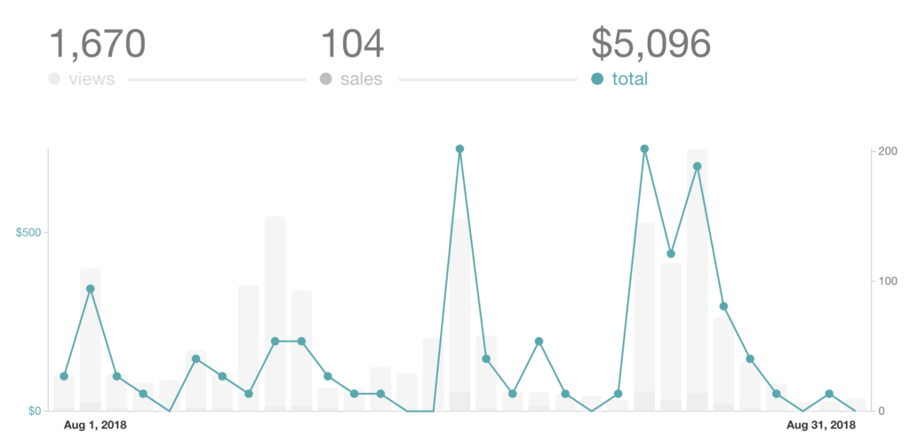
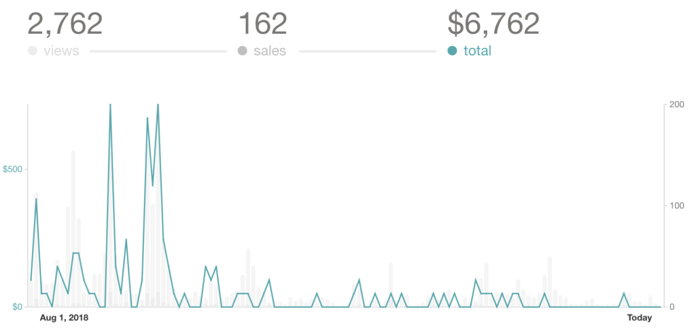
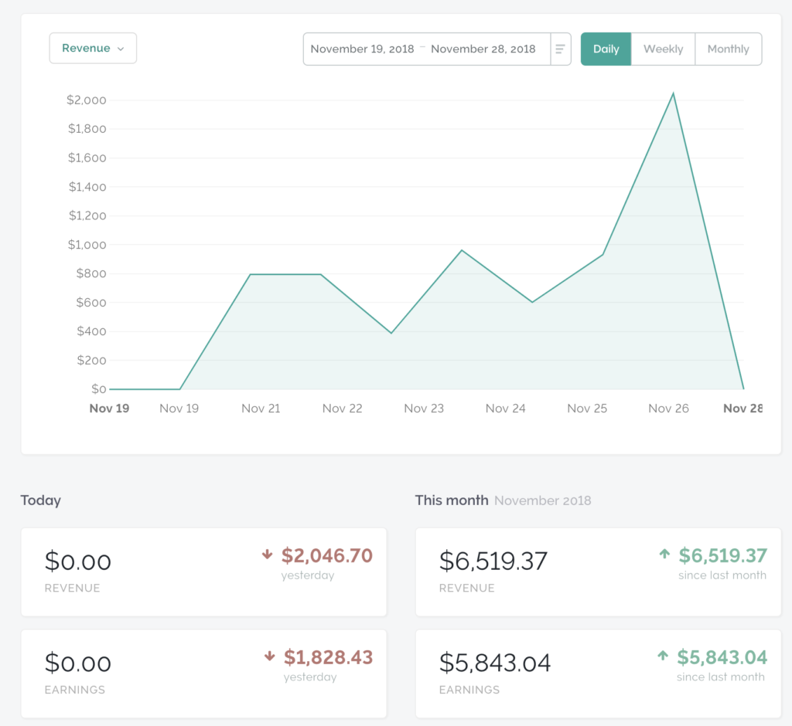

Launching [React for Data Visualization](https://swizec1.teachable.com/p/react-for-data-visualization/) on turkey day was a last minute decision. So last minute, in fact, that I renamed the course Sunday evening. 2 days before the first email went out.

See, I've been working on this since early August.

Well, the first version of my React data visualization stuff went [on sale in April 2015](https://swizec.com/blog/how-a-book-i-wrote-in-two-weeks-made-4000-in-its-first-month/swizec/6675). Made $4,000 in its first month, too. 💪

Fast forward to late 2018.

Book has seen 3 or 4 major rewrites. Kept up with React and D3. It's been a great project, but sales are stagnating. A little tired of the topic. Looking for the next thing and not quite finding one.

Knowing I should update the book but ugh who cares…

Then the Director of Data Visualization at Visa emails me in July. I didn't know such a thing as a director of data visualization existed, but he emailed me and said: _"Dude, we love your React + D3v4 book. But come on. Can't you update? It's out of date."_

When the director of data visualization at Visa emails you, that's a strong signal. The market still cares. Real people with real needs. And money to spend.

## Time for an update!

A flurry of activity. August was intense.

I put up a preorder on Gumroad. Working title _"React + D3 2018"_. Asked my intern to build a landing page. Never used it. Wrote some quick copy for the Gumroad product description, set the price at $49, and emailed my list.

A few sales.

Okay, great. There's interest.

This time, I wanted the book to have a real course. Not just some crappy little videos. A proper course that follows the book and teaches you everything.

I suck at recording courses.

Workshops! I'm good at holding workshops. We're gonna have 3 live workshops. A bonus for everyone who preorders.

Bonus for me: Announcing each Sunday workshop is a great excuse to email my list.

_And I can ask people what they learned, what excites them, and why they're interested._ Copywriting and sales gold right there.

Put up some ads. Got a cover design on 99designs. Kept emailing my list.

By the end of August, I had 104 preorders. A quarter updated book. Updated code samples. And a final cover design chosen via popular vote and Facebook ads.

## The hard work begins

Preorders in hand and charged, a sinking feeling.

There's no way I can finish this by the start of September. Not with a day job. Not when I'm spending every morning on mastermind and client calls.

So I emailed everyone.

> Hey this is gonna take some time. Updating a 250-page book after JavaScript has been evolving for a year… it's a lot of work. Editing those 4 hours of workshop video? Oof

Rolled up my sleeves and got to work. Every day, I would write a little. Code a little. Nudge things along.

Every few weeks, I'd send out an update. _"Hey, here's a new PDF. Hope you like. Still working on it. Thanks for your patience."_

They understood. Everyone was great about it.

People kept buying the old book. My automations are left un-updated. My landing page is still for the old version. When you sign up for my mailing list, it still pitches you the old version of the book.

Ugh.

No matter! We'll give people who ask a free upgrade to the new stuff. Everyone's happy with this arrangement. Every now and then, I sweep the list, find everyone with a recent purchase, and offer them a coupon.

A few more React + D3 2018 buyers trickle in.

## React for Data Visualization is born

At some point while updating the book, I realize this just isn't going to work.

Too many quips about how silly it is that in 2018 I still can't embed gifs in electronic books. Too many problems with emoji support for Markdown → PDF/epub/mobi generators. Too hard to make code nicely copy-pastable.

The UX is shit. I'm asking people to pay real money for this? We can do better!

React + D3 2018 was to become a full course. Hosted online. Embedded code editors, videos for everything. Make it real easy for people to learn.

Because let's be honest, most people learning to code do so at a computer with a nice big monitor. They copy-paste code. They have a browser.

Why not put the book in the browser and make it easy for them?

Although I did see a lady watching coding videos on the elliptical the other day. That was cool. Not something she could do with an ebook.

https&#x3A;//twitter.com/Swizec/status/1067254859143905281

Hell, if you make your book an online course, you can neatly pair videos with each section.

Solves a major problem with video courses: They're boring, and videos drag on forever. You wanna jump around. You wanna skip to the good parts. You wanna focus on what you're trying to learn, not the author's long-winded introduction.

With a video per section, subchapter even, I can ensure no single video is longer than 5 minutes. Keep them focused and on topic. Make it easy to jump around.

https&#x3A;//www.youtube.com/watch?v=7HQzbq4s7MQ

But editing 8 hours of video was kicking my ass. September came and went. October was behind us. End of November closing in fast.

Yes, 8 hours of video. Up from the earlier 4 hours. Had to record a workshop thing of building the main example in the course. That's how you can have video with everything 🧐

## A haphazard launch

So, moment of truth. Course not done. Markdown messing with us. Video editing kicking my ass. Launch window closing fast. 6 more weeks left in the year.

Gotta do something.

Will people pay money for this? Is it worth pressing on? Have I burnt out my audience? Does anyone still care? Can I afford to pay everyone who's been helping me make it happen?

Shawn built a landing page. Then another. Then tweaked it. Then made it better. I still wasn't ready with the copy so we could launch. Ugh.

Helder basically reinvented markdown pandoc something something. Trying to get emojis to work. No good. Then he invented a script and a hack that let us \\import markdown into Teachable. Awesome work, makes the whole thing viable.

And we can update the course with a git push 🤘

I been updating content and editing videos for months.

Was all the effort worth it? Am I throwing money down the drain paying people to help me make it happen?

Thanksgiving, Black Friday, and Cyber Monday are upon us. Now's the time to find out!

Sunday night, I came up with a plan: Run a promotion for this unfinished course over turkey weekend 🦃. Set the price at a steep discount from the future full price.

$97 instead of $149.

Everyone can get the written parts immediately. And I promise to pump out the rest of video stuff as fast as I can. Additional chapters on WebGL, VR, React Native, and server-side-rendering coming by end of year.

To promote the sale, I would send an email to my entire list every day for the entire duration of the sale. Each email will have a little timer gif.

## The experiment

The turkey launch experiment was geared to answer a few questions:

1. Will people pay a solid price for this material?
2. Will people hate me if I email every day?
3. Can I generate some cash flow?
4. Does this text with short videos format resonate with people?

Monday night, I renamed the course to React for Data Visualization. Much better title. Tuesday morning, I sent the first email:

> Hey I'm launching this course. Short videos and text and code. I don't have a landing page yet, you can buy it tomorrow. Reply if you care.

A few replies came in. That evening, we got Teachable markdown \\import to work. I hacked the cover from 99designs to fit the new title.

For the next few days, I kept emailing. Every morning, the first thing I did was write an email to my audience. Look at this wonderful thing. A beautiful promotion. You can learn and hack and have some fun and it's cheaper than it's ever gonna be.

I played with words. I played with angles. I explained it this way and that. I made an intro video. I sent emails long and short.

On Monday, I hosted a live Q&A with a little example coding. That went well. Should've done it sooner.

Then on Tuesday morning, I said _"Last chance. Now or never."_. Set the coupon to expire at 12:00 and went to work.

## The result

7 emails 87 net subscribers lost 167 total unsubscribes 65 course sales $6500 in revenue before Teachable fees

It's not the 100 I was hoping for, but it's cash in the bank, and I know people will pay a solid price for solid knowledge.

Time to roll up my sleeves and finish those videos.

💪

Thank you everyone who purchased React for Data Visualization. You're the best.