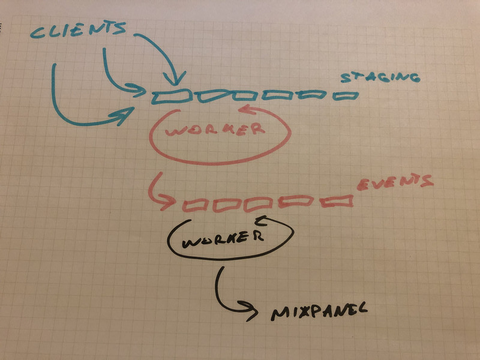
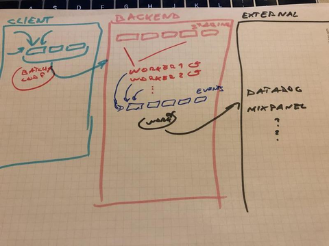
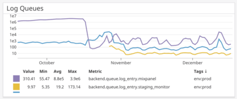
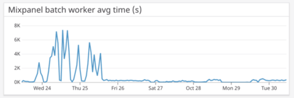
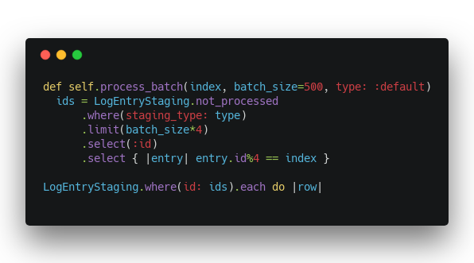
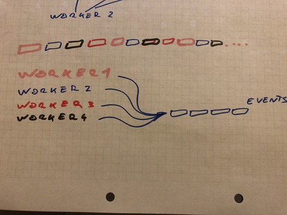
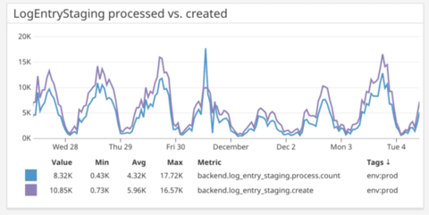
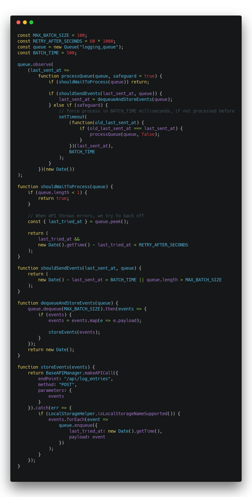

https&#x3A;//twitter.com/Swizec/status/1049786180483477504

When I was a wee lad of 21 or 23 I built my first startup. Designed for high scalability, we used Google App Engine for infinite horizontal scaling, Big Table to hold our oodles of data, many queues and sharding databases and tiny function objects that run independently on an infinite number of machines to deal with our massive scale.

  

A true engineering marvel, everyone said wow 👌

  

Early NoSQL days, nascent serverless. Forget bare metal machines and servers in the cloud. We were too tough for that! Internet scale, baby!

  

After months, _months_, of engineering, the system was ready. It would scale beautifully and turn everybody's RSS feeds into algorithmic timelines based on each user's individual behavior. I was so proud.

  

Even gave a lecture about this system we built at my databases class in college. Professor liked it so much he added _my_ lecture to the final exam. Even became part of his normal curriculum the next year. 💪

  

Moment of truth.

  

We flipped the switch. The system buzzed. The system whirred. The system melted our credit card, fell on its face, and got stuck.

  

Nothing worked.

  

One queue tried to process 5000 items per minute, pushing them into a queue that could handle 5 per hour. The database, so beautifully designed for scalability, broke down after 100 elements. Relations are hard in a key:value store. Indexing even harder.

  

10 users caused a complete meltdown of our infrastructure. 3000 articles to be scraped and processed every hour and our system just could not deal.

  

The startup never recovered.

  

## You're scaling too early

Fast forward a few years and I'm working at a startup that's actually successful. Not internet scale successful. Making real money from real users kind of successful. You know, a business.

  

We run a Ruby on Rails monolith on Heroku, using Postgres for our database, Redis for the Sidekiq job queue, JavaScript on the frontend. We think of Rails as an API server, SPA (single page app) bootstrapper, and worker runner. CloudFront and S3 host our static files.

  

We serve around 10 requests per second, store a few million rows in Postgres every day, keep a few hundred gigs of data, and process thousands of background jobs.

  

That runs on 6 Heroku web instances, 2 worker instances, and 1 medium-ish tier database server. The web dynos run at a chill 50% utilization, the workers sweat a bit. Postgres sometimes struggles with too many connections. Large queries might run out of memory if you aren't careful.

  

Heroku offers many higher tiers of database, but we try to avoid. Constraints are good for engineering.

  

So how is it that this absolutely boring stack can outperform my engineering marvel by 100x?

  

## A true approach to scale

> You don't know where it hurts until the system tells you.
>
>
>
>   
>

That's my big lesson from the past 10 years of engineering. You don't know where something's gonna break until you push it and see what happens.

  

You just can't know. You can guess the basics.

  

Like, don't use triple nested loops to process 10,000,000 rows of data. Use database indexes for common queries. Use caching to avoid computation when possible. Push expensive stuff into background jobs to maintain a fast user experience. Stuff like that.

  

But I only know about those because I've seen them break before.

  

Large systems are hard to predict. You can use queuing theory and stochastic modeling and all sorts of things in theory. They take too long and nothing ever quite matches reality.

  

Build it so it works. Let it break. Fix what breaks.

  

Otherwise you might spend weeks and months optimizing code that isn't even a bottleneck. There's always going to be _a_ bottleneck. Some part of your system that's the slowest.

  

Remember Amdahl's law: A system can never be faster than its slowest part.

  

Here's the algorithm I use to optimize systems these days:

  

1. Build it so it works
2. Observe
3. Find the bottleneck
4. Remove the bottleneck with the simplest solution possible
5. GOTO 1

## How I built a system that handles 1,721,410 entries per day with very basic technologies

First, I got plenty of help from the other [Yup](https://www.yup.com) engineers. I lead the project and it's my baby that grew over some 18 months, but when push came to shove and production ground to a halt everyone pitched in.

  

And before you scream _"Just use a pre-made solution there are literally hundreds of startups betting their entire lives on solving this problem wtf is wrong with you Swiz"_ at your monitor, let me tell you **why we built our own logging system**.

  

We wanted a logging system that fulfills these requirements:

  

1. Works from Rails
2. Works from Web
3. Works from iOS
4. Works from Android
5. Is thoroughly inspectable (you can run queries and aggregates on events)
6. Is thoroughly debuggable (you can always tell what happened to an event)
7. Lets us attach arbitrary debugging data to events
8. Never loses events
9. Never slows down clients
10. Integrates with different monitoring and logging services (Mixpanel and Datadog right now)

Using a logging SaaS of some sort gives you the first 4. Often gives you 8 and 9 as well. Sometimes gives you 7. But it never gives you 10, 6, and 5. You also can't know, if you're losing events between your system and theirs.

  

I've never seen a monitoring or logging company that lets you see the exact list of events, even ones you thought you sent but actually didn't. And a company that lets you seamlessly integrate with and migrate to other providers? Ha!

  

So we built our own. Or rather I did with some help from the team. Particularly in the area of database optimization.

  

### The initial design

  

[My initial design](https://swizec.com/blog/simple-for-loop-increased-conversions/swizec/7875) broke after about 6 months. Too naive. One queue too few.

  

The design that lasted another year looks like this 👇

  

1. Clients collect events in localstorage
2. Clients make `fetch()` requests for every event
3. Backend fast-saves each raw payload
4. A worker munches through the payloads, adds meta data, and saves them to the real DB table
5. Another worker processes those and sends them to Mixpanel or whatever

#### Clients

Saving events in local storage ensures we don't lose events. If the user disconnects, we can always send them later.

  

Payloads are designed to accept arrays of events. Sending each one right away is easier.

  

On the frontend we used a [Fast Mutex Lamport lock implementation](https://swizec.com/blog/fast-mutex-lamport-lock-javascript-promises/swizec/7532) to ensure multiple tabs can't overwrite each other's queues. LocalStorage is a single shared resource.

  

Don't need that on mobile clients.

  

The frontend queue is always cleared in full. As soon as you can. Normally this results in sending 1 event per request.

  

#### First backend "queue"

To make these requests fast, we save the raw payload in the database. No processing or anything. Just save and return `{status: OK}`.

  

No index, no relations, no nothing on this table. Just an `id`, a `created_at`, and a JSON payload. Postgres is great for JSON, you'd be surprised.

  

Average response time around 16ms.

  

Now that events and their original timestamps are in our database, we can take our sweet time processing those. A worker runs every minute or so, takes all the `processed=false` payloads from the table, and processes them.

  

During processing, events become enriched with default data based on user profiles, devices, system state, various A/B tests, etc. A few hundred default properties in all. The `logs` table is another thin JSON row: A few indexed \\important rows, a huge JSON blob with all the attributes.

  

There's some logic keeping track of errors and such, making sure rows aren't marked as processed until all the events they contain make it into our logs table. That way we can always replay processing of a row and it won't lead to double logs.

  

Exactly how that works is another article.

  

The processing worker drops `processed=true` rows after they're a few weeks old. Only reason we keep them around that long is debugging and so we can recover events in case of errors.

  

#### Second backend "queue"

Another worker runs every few minutes and sends events from the database to Mixpanel. Gives them the original timestamp, marks any errors, retries when necessary.

  

Eventually everything makes it into Mixpanel with all the properties and the right timestamps. Product people can track their metrics, engineers can see what's up if anything looks fishy.

  

At any point in the evolution of an event you can see which queue it's in, which errors occurred in processing, and you know what properties it's got. Push comes to shove you can run your own queries to perform deeper analysis than Mixpanel's UI allows.

  

### The system gets expanded

  

This system worked so well, we doubled down.

  

On top of product metrics going into Mixpanel, we needed engineering metrics. We also wanted to consolidate an older logging system based on a similar design that monitored a specific critical process.

  

Nothing to it.

  

I introduced log types. `:default` for product metrics, `:datadog` for engineering metrics, `:critical` for that one \\important process.

  

The critical process runs on the background. It can push lines directly into our logs table. Mark them as `:critical`.

  

Backend engineering metrics are easy too. Create lines directly in our logs table. Mark them as `:datadog`.

  

Frontend engineering metrics are trickier. You have to know which events are for Mixpanel and which are for Datadog. A special payload property can take care of that.

  

Engineers can use the same JavaScript/iOS/Android client to track their engineering metrics as they use for product metrics. Add a `monitor: { ... }` object to the payload.

  

Monitors can be increments, gauges, or timers. You can attach any meta data, datadog-specific values, or whatever else you need.

  

On the backend these events become part of the first raw payloads queue. When processed they skip the meta data part and go straight into the final `logs` table.

  

The `logs` table becomes two queues rolled into one. It used to be a staging area for events going into Mixpanel, now it's a store of 3 different things:

  

1. `:default` events that still have to go into Mixpanel
2. `:datadog` events that need to go into Datadog
3. `:critical` events that need no further processing

The original Mixpanel worker keeps doing its thing. Except now it focuses on rows marked as `:default`. Still using the Mixpanel Ruby client.

  

A new worker goes through `:datadog` events and sends them to Datadog. Uses their `statsd` integration, which I believe is another queue+processor layer. No retry logic with this one because Datadog can't handle custom timestamps and we don't want to mess up our graphs. Would rather drop events.

  

We went from processing about 300,000 events, to 900,000+ every day.

  

And that's when shit started hitting the fan.

  

### Shit hits the fan

All hell broke loose when we tripled the amount of data going into that `logs` table. Not just the logging system, the whole server starting to buckle under the load. Database running out of memory, connection pool running out of connections to give, slow queries hogging all the CPU, Sidekiq workers waiting for Postgres clogging up the queue, killing everything else in sight.

  

Yep, I brought down our whole system.

  

  

Worst part was we didn't even know the system broke until our PM said _"Hey guys something looks weird in our Mixpanel data. Are you sure it's all coming through?"_

  

  

3.5 million unprocessed events. Shit.

  

### The fan gets cleaned up

Log processing was working just fine, but we were pushing too many events into our system. It was never going to catch up.

  

My first fix cut the number of outstanding events down to a few thousand. Sped up processing too.

  

I changed the definition of "processable event".

  

If we know it isn't going to Mixpanel, we don't have to let the Mixpanel worker process it. If we know it isn't going into Datadog, why would that worker touch it?

  

This effectively split the queue into thirds. One third for Mixpanel, one third for Datadog, one third stays in DB.

  

We started marking things as `processed=true` and `dont_mixpanel` right away. Before any workers touched them. Because we knew in advance which workers would have to touch them.

  

This change made the Mixpanel and Datadog workers mostly catch up to the queue. Our events became almost real time.

  

We started measuring how long workers take to process batches too. Our workers process a few hundred events at a time. This creates a nice balance between how fast we process and how many workers we spawn.

  

Too many workers creates too many Postgres connections and clogs up the worker queue.

  

#### Shit cleaning step 2

  

This definition-changing solution worked okay, but our processing was still falling behind. Worse still, it started impacting performance of the rest of the system.

  

When you have a Postgres table with 300,000,000 rows that you query with a table scan every minute … shit's bad, yo.

  

Started showing up in our Mixpanel batch process times too.

  

  

No wonder shit's on fire if it takes up to _6000 seconds_ to process a single batch of events.

  

Is it inserts? Is it reads? Wtf is going on?

  

With a combination of metrics, hard thinking, inspecting database long running queries, we realized the hard part was reading batches to process from the DB.

  

I mean it worked great until the DB started locking up and workers started waiting for each other to finish. And the lock expiration was quicker than average worker run time. And ugh, so much broke I can't even remember.

  

My hair was on fire for weeks.

  

Oh and we were still going through like 500 events per minute and pushing 2000/minute at peak loads. This was a problem for Datadog especially since it doesn't support custom timestamps and needs to be processed in real-time.

  

#### Parallelizing batch processing

After a few different attempts, we settled on a parallelized approach to batch processing. Since inserts were still fast, despite our growing and ever slower indexes, we could get away with simply attempting more of them in parallel.

  

Instead of going through 500 events 1-by-1, we could go 4-by-4. Plus we could now run more often than every minute.

  

But how do you ensure independent workers don't step on each other's toes? The modulus operator!

  

A master worker runs every minute and schedules 4 sub workers for the 0th and 30th second of the minute. Sidekiq doesn't allow sub-minute crons.

  
&t=seti&l=ruby&ds=true&wc=true&wa=true&pv=48px&ph=32px&ln=false&code=%20(0..3).each%20do%20%7Cid%7C%0A%20%20Rails.application.config.log_entries%5B%3Abatch_seconds%5D.each%20do%20%7Cn%7C%0A%20%20%20%20%22LogEntriesBatchWorker%23%7Bid%7D%22.constantize.perform_in(n.seconds)%0A%20%20end%0Aend%0A)

Each worker has an ID, that helps it pick events based on a modulus.

  
&t=seti&l=ruby&ds=true&wc=true&wa=true&pv=48px&ph=32px&ln=false&code=def%20self.process_batch(index%2C%20batch_size%3D500%2C%20type%3A%20%3Adefault)%0A%20%20ids%20%3D%20LogEntryStaging.not_processed%0A%20%20%20%20%20%20.where(staging_type%3A%20type)%0A%20%20%20%20%20%20.limit(batch_size*4)%0A%20%20%20%20%20%20.select(%3Aid)%0A%20%20%20%20%20%20.select%20%7B%20%7Centry%7C%20entry.id%254%20%3D%3D%20index%20%7D%0A%0ALogEntryStaging.where(id%3A%20ids).each%20do%20%7Crow%7C%0A)

Take unprocessed staged logs, limit to 4x of batch size, gets their ids, keep every 4th id. Select those staged logs and process them.

  

  

You now have 4-way parallelism and queues are draining faster than they're filling 👌

  

  

To keep load on our database down, we tuned mixpanel processing to run only once per hour. We don't need those events to be real time, and we can always set their timestamp.

  

#### Great, now the API is eating us

This worked so well that we started logging everything. And that caused problems too.

  

Each API request triggered a logging request. Gotta jot down that you made a request. It then triggered another logging request saying that it was successful. Or wasn't. And one more that the client code that relies on the request worked too.

  

That's 4 hits on the API each time anything happens. No good.

  

Our servers started struggling and our log processing was suffering too. Payloads with 1 event take almost as much work to process as payloads with 4 or 5 or 20 events.

  

I introduced batching on the web client.

  
&t=seti&l=javascript&ds=true&wc=true&wa=true&pv=48px&ph=32px&ln=false&code=const%20MAX_BATCH_SIZE%20%3D%20100%3B%0Aconst%20RETRY_AFTER_SECONDS%20%3D%2060%20*%201000%3B%0Aconst%20queue%20%3D%20new%20Queue(%22logging_queue%22)%3B%0Aconst%20BATCH_TIME%20%3D%20500%3B%0A%0Aqueue.observe(%0A%20%20%20%20(last_sent_at%20%3D%3E%0A%20%20%20%20%20%20%20%20function%20processQueue(queue%2C%20safeguard%20%3D%20true)%20%7B%0A%20%20%20%20%20%20%20%20%20%20%20%20if%20(shouldWaitToProcess(queue))%20return%3B%0A%0A%20%20%20%20%20%20%20%20%20%20%20%20if%20(shouldSendEvents(last_sent_at%2C%20queue))%20%7B%0A%20%20%20%20%20%20%20%20%20%20%20%20%20%20%20%20last_sent_at%20%3D%20dequeueAndStoreEvents(queue)%3B%0A%20%20%20%20%20%20%20%20%20%20%20%20%7D%20else%20if%20(safeguard)%20%7B%0A%20%20%20%20%20%20%20%20%20%20%20%20%20%20%20%20%2F%2F%20force%20process%20in%20BATCH_TIME%20milliseconds%2C%20if%20not%20processed%20before%0A%20%20%20%20%20%20%20%20%20%20%20%20%20%20%20%20setTimeout(%0A%20%20%20%20%20%20%20%20%20%20%20%20%20%20%20%20%20%20%20%20(function(old_last_sent_at)%20%7B%0A%20%20%20%20%20%20%20%20%20%20%20%20%20%20%20%20%20%20%20%20%20%20%20%20if%20(old_last_sent_at%20%3D%3D%3D%20last_sent_at)%20%7B%0A%20%20%20%20%20%20%20%20%20%20%20%20%20%20%20%20%20%20%20%20%20%20%20%20%20%20%20%20processQueue(queue%2C%20false)%3B%0A%20%20%20%20%20%20%20%20%20%20%20%20%20%20%20%20%20%20%20%20%20%20%20%20%7D%0A%20%20%20%20%20%20%20%20%20%20%20%20%20%20%20%20%20%20%20%20%7D)(last_sent_at)%2C%0A%20%20%20%20%20%20%20%20%20%20%20%20%20%20%20%20%20%20%20%20BATCH_TIME%0A%20%20%20%20%20%20%20%20%20%20%20%20%20%20%20%20)%3B%0A%20%20%20%20%20%20%20%20%20%20%20%20%7D%0A%20%20%20%20%20%20%20%20%7D)(new%20Date())%0A)%3B%0A%0Afunction%20shouldWaitToProcess(queue)%20%7B%0A%20%20%20%20if%20(queue.length%20%3C%201)%20%7B%0A%20%20%20%20%20%20%20%20return%20true%3B%0A%20%20%20%20%7D%0A%0A%20%20%20%20%2F%2F%20When%20API%20throws%20errors%2C%20we%20try%20to%20back%20off%0A%20%20%20%20const%20%7B%20last_tried_at%20%7D%20%3D%20queue.peek()%3B%0A%0A%20%20%20%20return%20(%0A%20%20%20%20%20%20%20%20last_tried_at%20%26%26%0A%20%20%20%20%20%20%20%20new%20Date().getTime()%20-%20last_tried_at%20%3C%20RETRY_AFTER_SECONDS%0A%20%20%20%20)%3B%0A%7D%0A%0Afunction%20shouldSendEvents(last_sent_at%2C%20queue)%20%7B%0A%20%20%20%20return%20(%0A%20%20%20%20%20%20%20%20new%20Date()%20-%20last_sent_at%20%3E%20BATCH_TIME%20%7C%7C%20queue.length%20%3E%20MAX_BATCH_SIZE%0A%20%20%20%20)%3B%0A%7D%0A%0Afunction%20dequeueAndStoreEvents(queue)%20%7B%0A%20%20%20%20queue.dequeue(MAX_BATCH_SIZE).then(events%20%3D%3E%20%7B%0A%20%20%20%20%20%20%20%20if%20(events)%20%7B%0A%20%20%20%20%20%20%20%20%20%20%20%20events%20%3D%20events.map(e%20%3D%3E%20e.payload)%3B%0A%0A%20%20%20%20%20%20%20%20%20%20%20%20storeEvents(events)%3B%0A%20%20%20%20%20%20%20%20%7D%0A%20%20%20%20%7D)%3B%0A%20%20%20%20return%20new%20Date()%3B%0A%7D%0A%0Afunction%20storeEvents(events)%20%7B%0A%20%20%20%20return%20BaseAPIManager.makeAPICall(%7B%0A%20%20%20%20%20%20%20%20endPoint%3A%20%22%2Fapi%2Flog_entries%22%2C%0A%20%20%20%20%20%20%20%20method%3A%20%22POST%22%2C%0A%20%20%20%20%20%20%20%20parameters%3A%20%7B%0A%20%20%20%20%20%20%20%20%20%20%20%20events%0A%20%20%20%20%20%20%20%20%7D%0A%20%20%20%20%7D).catch(err%20%3D%3E%20%7B%0A%20%20%20%20%20%20%20%20if%20(LocalStorageHelper.isLocalStorageNameSupported())%20%7B%0A%20%20%20%20%20%20%20%20%20%20%20%20events.forEach(event%20%3D%3E%0A%20%20%20%20%20%20%20%20%20%20%20%20%20%20%20%20queue.enqueue(%7B%0A%20%20%20%20%20%20%20%20%20%20%20%20%20%20%20%20%20%20%20%20last_tried_at%3A%20new%20Date().getTime()%2C%0A%20%20%20%20%20%20%20%20%20%20%20%20%20%20%20%20%20%20%20%20payload%3A%20event%0A%20%20%20%20%20%20%20%20%20%20%20%20%20%20%20%20%7D)%0A%20%20%20%20%20%20%20%20%20%20%20%20)%3B%0A%20%20%20%20%20%20%20%20%7D%0A%20%20%20%20%7D)%3B%0A%7D%0A)

That's a lot of code and it isn't the easiest to understand. The code review was a struggle 😅

  

The algorithm is rather simple tho:

  

1. An event shows up on the queue
2. If queue is actually empty, don't process
3. If API has been errorring out, back off
4. If it's been more than `BATCH_TIME` (500ms) since last send, send
5. If queue is longer than `MAX_BATCH_SIZE` (100), send
6. Get as many events from queue as can
7. Send to API
8. If error, put back on queue and wait
9. If 4 or 5 didn't happen, wait for `BATCH_TIME` and try again

This ensures that events are only sent to the API every 500 milliseconds. We set a timer on every event in case a new event doesn't come along to trigger the process again. This ensures that no events stay lingering on the client.

  

### What about reads?

We now have a system that fulfills 1, 2, 3, 4, 7, 8, 9, and 10 from the original list.

  

But 5 and 6 work only in theory. Yes, we have all the events stored in our database, and we _could_ run queries on them.

  

But if you've ever tried querying a Postgres table with 500,000,000 rows that's growing by a million or two every day … well, a query can take an hour to execute if you aren't careful.

  

Indexes to the rescue!

  

We have indexes for all \\important queries, carefully tuned so those queries never run a table scan ever. The most useful index is that which eliminates most of the table and returns a small subset as a potential candidate.

  

For us that's the `created_day` index. It returns specific day's worth of entries.

  

We ever so carefully made sure all our queries use sensible settings for that parameter. Always.

  

All those indexes started having an impact on our insert performance too. And in some cases they still weren't fast enough.

  

We introduced [table partitioning](https://www.postgresql.org/docs/10/ddl-partitioning.html). I don't know or understand the specifics, but I believe it's similar to sharding in NoSQL approaches.

  

Postgres, behind the scenes, transparent to us, splits the table into week-long tables. That way each file on the hard drive holds no more than a week's worth of data, which makes it faster to read and easier to work with.

  

Our `logs` table is now a sort of view table. A process runs every week to create a new table for logs to spill into.

  

Now our reads are fast too. A few seconds. Despite having hundreds of millions of rows. Just don't query across a week boundary or else.

  

### Good for another order of magnitude or two ✌️

Our logging system can handle all demands now.

  

Client and backend engineers can log as many events as they want. They can log debugging info, monitor \\important systems, and it's easy to add or remove events.

  

Product can come up with as many metrics as they want to track. We can do it all.

  

The API is fast. Events never get lost. And if doubts arise, systems fall down, or logging services keel over, we can always look into our database to find out the truth. We can even re-run processing to make sure events eventually make it to their final destinations.

  

With more growth we'll have to spin off the logging service into its own service running on its own servers with its own database. It's already decoupled from the rest of the system. We are ready.

  

✌️