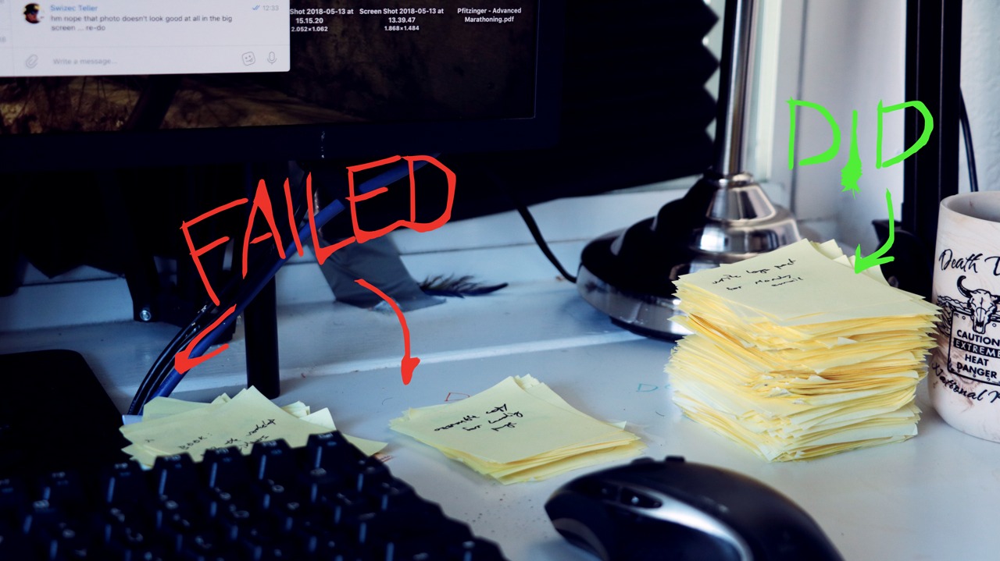
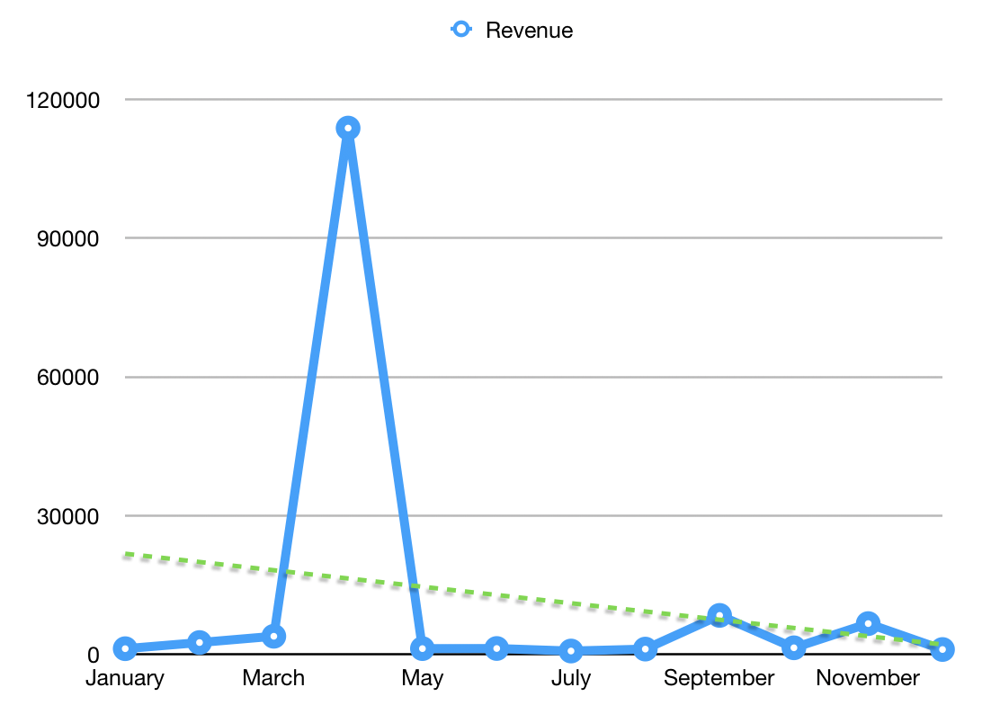
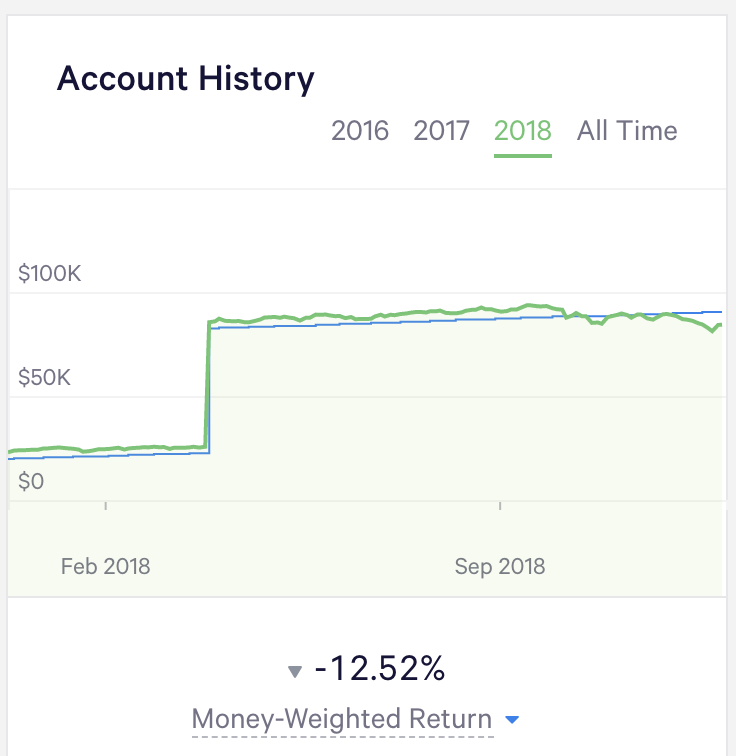
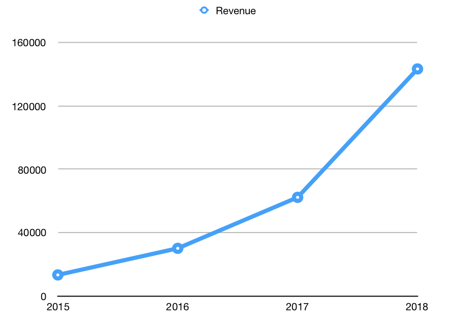

\[caption id="attachment_8833" align="alignnone" width="1280"] My year in post-its\[/caption] $180k on the side. Next to my regular startup salary. That's crazy. Absolutely bonkers. 🤯 91 blogposts, 86 emails to subscribers, 155 YouTube videos, 317 Facebook Posts, 5996 Tweets, 3 in-person workshops, 3 online workshops, 1 large client, 2 small clients, 3 mini launches, 2 large launches, 2 conference talks, 3 conferences. No wonder I'm tired.

> The mind recoils in horror, unable to communicate with the spinal column. Which is interesting because you can actually watch yourself behaving in this terrible way, but you can’t control it.

_PS: Help me help you improve your career in 2019. Answer 3 questions 👉 [a quick poll](https://swizecteller.typeform.com/to/GQP8T6)_ Ambition. It's like a disease. It eats at you from the inside. Once you get a taste of success, success of your own, not your boss giving you a pat on the back and a raise, and not your teacher or your parents saying _"Good job kiddo, we're proud"_, it's all over. I mean _real_ success. The kind where strangers think you've created something so valuable they're willing to part with their own cold hard cash to have it. _That_ success. Once you have that, you can't stop. You just can't. You want more. You press harder. Work harder. Chase bigger and bigger gains. You spend your life looking for that hit that feels as good, as exciting, as amazing, as the first $1,000 you made on your own. And that's how making $180,000 almost killed my business. https&#x3A;//www.youtube.com/watch?v=Q9WZtxRWieM

## The deal to end deals

In December 2017, the creator of Maven reached out to me. _"Hey, I like your work with React and D3. We got a team here at Big Company that needs some help"_. Sure, I said, let's talk next year. I'm busy right now. [December last year](https://swizec.com/blog/how-i-sidehustled-72167-last-year-and-what-i-wanna-do-next/swizec/8016) was one of my best sidehustle months on record. We got to talking in January. Talked about what the team needed, how I might help, what the goals were … all the things you're supposed to do when prospecting a new consulting client. I used to freelance. I got this. Then it was time to send a proposal. I swallowed hard, doubled my number, and hit send. These big companies … you gotta charge what _they_ think is real money, not what you think. https&#x3A;//www.youtube.com/watch?v=k5wayr6tYzY Your skills are worth more to a bigger company. Company with billions in revenue? If you improve their stuff by a fraction of a fraction of a percent, you're creating millions in value.  _"Tell you what, we got some budget to burn. Why don't we send you $100,000, and you tell us when it runs out"_ 😱 WHAT!? YES, OF COURSE. _cough_ I mean, yes, of course. Let us shake hands like gentlemen. I will coach your team, and they will build this amazing thing for you. We started with a 2-day workshop on site. But they didn't have a room so we squeezed it into 1.5 days. ¯\_(ツ)\_/¯ https&#x3A;//www.youtube.com/watch?v=zzV2zVijqyA Then the real work began. Every Wednesday morning at 8am, we had a chat with the team. An hour on the phone, sometimes more. We talked about their struggles, and their code, and I developed little experiments to solve specific problems they had. You may have seen a lot of strange blog posts this year. Solutions to problems so specific everyone thought _"Wtf why you write this?"_. That's why. It was for my special team. And it worked 👇

> you definitely provide a level of mentorship that nobody else here can provide you have gotten me past roadblocks which if you didn’t help unblock them… who knows where we would be right now. lol

✌️

## Excitement runs high

So in April, I finally get this $100,000 cheque. Contracts, vendor systems, NET45 … my hands are shaking all the way to the bank. The teller looks at my cheque. Coughs a little. Swallows. Regains his composure. _"Due to the size of this cheque and who it's from, it might take a few days to process"_ Totally fine by me! ✌️ First major income into my brand new Swizec LLC. Formed it just for this. Well, for this and everything else. Sidehustle getting so big I didn't feel comfortable doing it under my name on PayPal. So I've got all this money … now what? What the hell do you do with a hundred thousand dollars!? I paid off 2016 taxes. Still owed $15k. I left $20k in the company as investment. I took $5k to pad my emergency fund, enjoy life with The Girl, and go on a fancy-ass Michelin star dinner. $450/person. It was amazing. 😋 The rest, $60k, went into [Wealthfront](https://www.wealthfront.com). Don't know how to use it for my business (yet), might as well have it grow in some index funds, right? This was a mistake. We'll get to that.

## Problems at the day job

Around this time, my boss was like _"Soooooo it feels like your heart isn't quite in the game anymore. It's like you're coming to work just to get some rest before you get back to your own stuff."_ Err… _"We might have to let you go, if you don't shape up"_ But my visa! My visa says I have to be employed by your company, or I have 10 days to leave the country.  _"Yeah, so shape up, mate. We know you're working on a visa of your own and we support you in your endeavors. But if you're not useful to the company, we can't afford to be your nanny."_ He was right. I _was_ working on my own visa. The CEO even agreed to pay part of my lawyer fees because that shit's expensive and I started the process back in February. As soon as I knew about the Big Client. Before I knew when I'd get the money. Thanks, founder CEO dude. You're great. 🙏🏻 No hard feelings between me and the founder. I think. He understood that when big opportunity comes knocking, a certain type of person can't help but answer. Hell, that's why he originally hired me. My boss, however, he's more traditional. Grew up in Amazon. Very top down. He saw my wandering and my sidehustling as a betrayal, I think. He wanted to groom me into a leader, and it was going so great for the first year or two. But the startup wasn't ready yet. It didn't need leaders. We had other shit to deal with. Then the startup started taking off. We made some breakthroughs. Got stuff working. Built some money-making pipelines. And this guy, he's been low-key working on being a leader … he just up and says, _"Yo guys, I wanna focus on my own thing"_ Well, fuck that guy. My very first performance review ever (yes, after 3 years at the company, small startup okay) … it did not go great. Great engineer, sure, but all that "other" stuff we wanted from you but never said we wanted because you're supposed to just figure it out on your own as an ambitious person, you don't got that. None of it. I believe the CEO called it _"Ambitious, but not ambitious within the company"_.

## Life gets hard

So life was hard for many months. Working hard to prove my mettle at the day job, transitioning to being a contractor so we can focus on my engineering output, not on my "everything else" output. The boss was getting used to this also. 'Twas a big adjustment period for both of us. Outside work, I had this visa thing hanging over my head. Every few days, my lawyer would ask for something new. Some new piece of evidence. A new business plan. Something. Time and again, I thought, _"Ok this is it, we're submitting next week"_ and get excited, only to be met with one more request. When finally we did submit, there was an RFE, request for evidence. The whole thing went back in the grinder for one more go. Huge weight on my mind. Started thinking it wasn't even worth it anymore. Maybe I'll just quit my job, go back to Europe, and say fuck it to all this Silicon Valley nonsenses. Europe ain't so bad.

## Existing products take a back seat

While all this is happening, I still have that ambition monkey on my back.  There's $100,000 in the bank just staring at me. Telling me I got a golden ticket and why am I wasting this beautiful opportunity? Even my CEO was all like _"Dude, you're being way too cautious. Now's the time to push."_ Well, for starters, I'm not allowed to use that money for anything other than business expenses. Visa stuff. And I gotta pay San Francisco rent. Even when I do get my own visa … can I support myself on lumpy revenue? Did I just get lucky? Can I pull this off again? Heck if I know … \[caption id="attachment_8834" align="alignnone" width="1112"] Monthly revenue graph\[/caption] That is not a confidence inspiring graph. You can't pay rent on a graph like that.

### Learn While You Poop

So in April, I came up with Learn While You Poop. A subscription service with bite-sized daily content. https&#x3A;//twitter.com/Swizec/status/981932124231024640 2 minute videos every day. Subscribe to get article breakdowns for in-depth learning. The concept worked great. Social media loved it. A short video every day straight from the bathroom? Fun! Amazing! Wow. The views rolled in. The tweets got shared. People put me in newsletters. It was great. But few were buying. At peak, I had 7 active subscribers. Conversion rate as high as 9% once people saw the buy button, churn rates pretty okay, but no traffic to the landing page. According to a SaaS calculator, Learn While You Poop would make around $12,000/month before it taps out. If I could get the traffic. But Learn While You Poop had a problem: It wasn't good enough. https&#x3A;//twitter.com/Swizec/status/1035603419648516096 I just didn't have the energy to do it justice. With all the shit going on in my life, making daily videos was a miserable experience. I was snappy, I was tired, I was cranky. I never got around to writing any of those articles. Videos are still out there, and they're great. But the bathroom gimmick only goes so far. I'd have to expand. I still might.

### React + D3v4 stagnates

Meanwhile, my flagship product, [React + D3v4](https://swizec.com/reactd3js/), the one that got me so far in life, was stagnating. Withering away with marketing funnels shut off for repairs and never repaired. Dying with ideas of improvements that never got implemented. If your landing page traffic falls by half, your revenue falls by half too. https&#x3A;//twitter.com/Swizec/status/1075276171280072709 Obvious, but panic inducing also.

## Shit, I gotta make cashflow

[September comes, and I get my visa](https://swizec.com/blog/sponsored-genius-visa/swizec/8612). https&#x3A;//twitter.com/Swizec/status/1038124110180544512 I become a contractor at the day job and switch to 4 days/week. Gonna have more time for my own stuff. Just like that, $2000/month slashed from my salary. Taxes no longer deducted, so the same amount comes into my bank account as before. But I learned my lesson about taxes last year when [I got boned by taxes 2 years in a row](https://swizec.com/blog/how-i-got-boned-by-taxes-two-years-in-a-row/swizec/7582). Not about to repeat that mistake again. No sir-e. It's okay, I got this. And then the stock market starts crashing. \[caption id="attachment_8831" align="alignnone" width="736"] Bye bye returns\[/caption] This is relevant because remember that money I put away in Act 1 so it can grow while I figure out what to use it for? That money is losing value. Fast. Take money from index funds, and I lock-in the losses. Some $15,000 vanishes over night, and I never get it back. No, that money has to stay there until the market recovers. We gotta do this on cashflow alone. Oh, and the Big Client? Their $100k piggybank ran out in August, and they agreed to renew for another $100k. Fuck yeah. Until the market crashed. Now it's more like _"Yeah so we wanna build this team internally, and we don't have the budget for you anymore. How much do we owe past piggybank?"_ That's fair. Exactly what my CEO said would happen way back in January. Dude knows his markets and how big companies operate. Big Client agrees to pay for the extra 3 months of consulting I helped them with. But that's NET45 away, and NET45 came on Christmas, so yeah, I'm still waiting. Gonna ping them in the new year. Fingers crossed. 🤞 Gonna cover my credit card bill 😅

## Push comes to shove

So here I am with my back to the wall. Cashflow dropped, subscriptions not picking up, React+D3v4 neglected all year so that's barely making any money, can't use the money I got due to market conditions. At the same time, my burn is through the roof. Never been so high ever before. I just bought a motorcycle because I _really_ needed something to keep my spirits up. (it worked) https&#x3A;//twitter.com/Swizec/status/1078754200857673728 And I hired engineers back in May or June. There was no way I could pull off building Learn While You Poop on my own while also pushing hard at the day job. So I hired some help. It worked. I pulled back from the brink of burnout disaster, created a bunch of content, and learned a lot about structuring things into bite-sized pieces so customers can actually learn from me. The bite-sized approach really works. But now I gotta pay all these people. 4 freelancers in total who need both work and money every month. Plus all of a sudden, the LLC has to pay me, too. Fuck. Ok, back to basics. What do we know works? React for Data Visualization. Let's launch an update. People have been asking for one for months. The dataviz director at Visa _emailed me_ for frick's sake. Gently nudged me with a _"Hey, you should update this.”_ In August, I launched a preorder. No work done yet. Just an experiment. Sent it to my list of emails, asked one of my engineers to start building a landing page. We made $8967. Okay, okay, there's something there. Maybe this product isn't as dead as I thought it was. Work hard on the updates. A little every day. Run 3 or 4 online workshops to develop the video material. By end of October, the book was updated. But the PDF format no longer did it justice. I pivot to a full-on course. We move to Teachable. My engineers build some hacks so we can import markdown without dealing with Teachable's editor. Around Thanksgiving, another launch. $7000. Half of it comes in January because Teachable is weird like that. I'm editing videos as fast as I can. No time to fill the wonderful landing page with good copy. Still waiting on that. Still struggling with the videos. Seriously, editing 8 hours of video into bite-sized pieces is hard. Harder than I ever thought possible.

## What's next?

It's December 31st, and I can see the light at the end of the tunnel. React for Data Visualization is almost done. Videos are almost ready. Landing page waiting for my copy. I think I know what that copy is going to be. Then we can focus on rebuilding those marketing funnels. Do more marketing, and if my calculations are right, we need just 3000 visitors per month to make $100,000 in 2019 sales. And I want to launch 2 more products. Just two. I think I know how. This year was tough, but it taught me a lot about developing, building, and then launching products. A pipeline, if you will. You can [help me help you in your career with this poll](https://swizecteller.typeform.com/to/GQP8T6). 👉 [click me](https://swizecteller.typeform.com/to/GQP8T6) That's the theme for 2019. No more hustling. No more heroic efforts. Systems and processes and pipelines. Hustling got me this far, but it won't get me to the next level.  That's the trajectory I want to maintain. 🤘

## Stats and breakdowns for the curious

Realized Revenue: $145,490 Booked Revenue: $180,451 Expenses: $55,527

### Money-in breakdown:

Consulting: $102,500 Workshops: $14,377 React for Data Viz: $10,939 React + D3v4: $8,865 Patreon: $1305 Packt Royalties: $1623 Coaching: $1500 LearnWhileYouPoop: $938 ES6 Cheatsheet: $220

### Was it worth it?

1212 hours sidehustle 23 hours / week 3 hours / day $148/hour before expenses and taxes $103/hour after expenses _If the outstanding money ever comes_ 🧐

### The hustle

#### Blog

Blogposts: 91 Blog traffic: 362,000 uniques ... 430,000 sessions

#### Email

Emails sent: 86 Email subs: 2698 new for total 10,051 (1440 unsubs) Avg. Rating: 4.7 stars Would recommend: 82%

#### YouTube

YouTube videos: 155 YouTube traffic: 110,700 views ... 264,000 minutes YouTube subs: 1100 new for total 1816

#### Twitter

Tweets: 5996 Impressions: 6,725,453 Media views: 203,266 Engagements: 208,629 Follows: 64 😂

#### Facebook

FB posts: 317 FB followers: 1203 new for total 3960

* * *

Thanks for coming along for the ride. You're the best :) Happy new year Cheers, ~Swizec PS: No, really, [answer these 3 questions please](https://swizecteller.typeform.com/to/GQP8T6).
