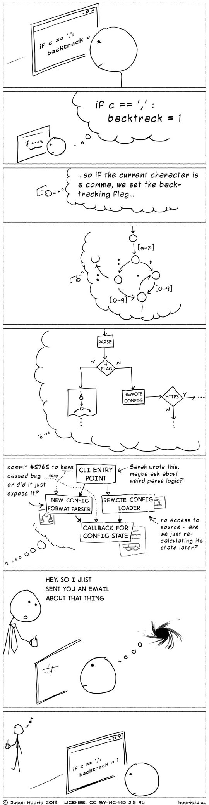
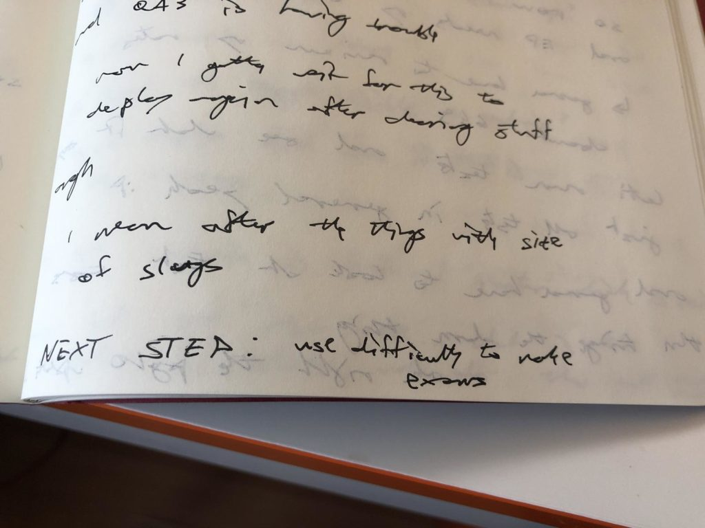

7 years ago, I developed this weird habit. On Wednesday, it saved my ass.

https&#x3A;//twitter.com/Swizec/status/1048747732922298370

It was during a gnarly compilers exam in college. We each built our own compiler for a sort of simplified Pascal.

Start of the semester, our professor presented this dumbed down Pascal he invented just for us. Familiar Pascal syntax with a subset of features like arithmetics, variable assignment, functions, stuff like that.

He also gave us a bunch of Java code. A half-built compiler.

The code knew how to take an abstract syntax tree and turn it into bytecode. You could run this bytecode on the JVM (Java Virtual Machine) as if it was a normal Java executable.

This made the task more doable in a single semester. Just like I give engineers half-built apps in my workshops and they fill-in the blanks.

Our job was to build the [compiler's frontend](https://en.wikipedia.org/wiki/Compiler#Front_end). Tokenizer, parser, semantic analyzer.

It was fun.

By semester's end, we each had our own compiler. Same input and output, different ways of getting there.

[Hey, look, I even found the code for mine on GitHub 😁](https://github.com/Swizec/compilers-homework)

And an old blogpost about [Why people making compilers are superheroes](https://swizec.com/blog/why-people-making-compilers-are-superheroes/swizec/4616).

## And then comes the exam

And then comes the exam. A 4-hour affair. Open computer, open internet, open book. Use anything you want except each other.

The task? Add features to your compiler.

2 or 3 new syntax options. I can't remember what they were, but the evaluation process was simple: Send your compiler to the professor. He compiles the compiler. Runs it on a bunch of test cases. Percentage tests pass is your exam score.

Shit. How do you focus for 4 hours? How do you keep your brain from getting fried?

TAKE NOTES! Write down everything.

Don't remember how I first got the idea, but this super critical exam was where I tried it out first.

When you're thinking, _have an output_. Write down every thought that comes to mind.

This solves 3 problems:

1. **Makes it easier to focus.** You're writing things out, so your mind automatically becomes more focused. It self-organizes and doesn't race around. Follows logical steps one after another.
2. **It slows you down** You can't write as fast as you can think. Slowing down means you think more carefully. You think before you code and that's a good thing.
3. **Never lose your place** Interruptions are real. At office, at home, internet, that errant thought that pops up. You're always going to get interrupted. Write down your thoughts and it's easy to recover.
4. **Expand your working memory** Your working memory can only hold 7 items. How often do you work on projects with just 7 moving pieces?

Don't be this guy 👇

He works on code that doesn't fit his brain, gets interrupted, and falls back to the beginning. With some notes, he could just pick up where he left off.

And that's what I did on Wednesday.

Worked on a new feature December 20th before going on break _for two weeks_. Got halfway done, forgot everything by January 2nd.

Like, I didn't even know what the feature was about anymore.

Finished that feature before day's end 🤘