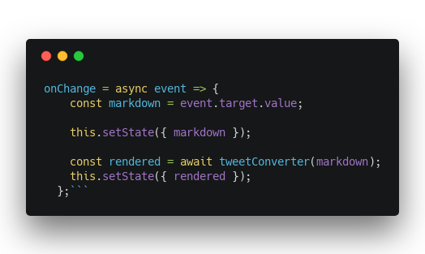

Remark plugins are a little esoteric, and with the rise of Gatsby, they’re becoming more and more \\important.


[Remark](https://github.com/remarkjs/remark) is a markdown parser built in JavaScript. "Parser" doesn't do Remark justice. Remark is a whole compiler ecosystem built on plugins.


It's the backbone of all Gatsby magic that involves converting markdown into HTML.


There are [many Remark plugins](https://github.com/remarkjs/remark/blob/master/doc/plugins.md), and the list keeps growing. This article is about how to build your own. ✌️


## Why you should build a Remark plugin


https&#x3A;//www.youtube.com/watch?v=LWvaOGVHLfE


Because you want a feature you can't find yet. Simple as that.


For me, it was two features, so I built 2 plugins. But I packaged them both in the [markdown-to-tweet](https://github.com/Swizec/markdown-to-tweet) package.


Here's an early preview 👇


https&#x3A;//twitter.com/Swizec/status/1082086702926024705


My `markdown-to-tweet` does 4 things:


1. It converts `**bold**` text into utf8 bolds: 𝗯𝗼𝗹𝗱
2. `_italic_` text into utf8 italics: 𝘪𝘵𝘢𝘭𝘪𝘤
3. `\`code\`\` text into monospace: 𝚌𝚘𝚍𝚎
4. Code blocks into carbon.now.sh screenshots





Screenshots work through an AWS lambda I built for [techletter.app](https://techletter.app) a few months ago and never got around to writing a blog about. I should fix that 🤔


Anyway, I couldn't find a remark plugin that does that, so I built my own. That was my excuse. [Kent C. Dodds](https://www.youtube.com/watch?v=NmXw8yMTjys) built one to turn YouTube and Twitter links into embeds on his blog.


You can try my [markdown-to-tweet](https://github.com/Swizec/markdown-to-tweet) thingy in this rudimentary Codesandbox 👇


Maybe I should release the underlying Remark plugins separately 🤔


## How to build a simple Remark plugin


https&#x3A;//www.youtube.com/watch?v=X7mZAsfwYng


Like I said, you can think of Remark as a compiler ecosystem. If you look at the [traditional compiler architecture](https://en.wikipedia.org/wiki/Compiler) from Wikipedia…


…your plugin sits squarely in that _"middle code generation"_ part.


A basic Remark call goes something like this:


```
\import remark from "remark";
\import html from "remark-html";

// ...

remark()
    .use(html)
    .process(input_markdown, function (err, html_output) {
        if (err) throw err;
        
        console.log(html_output)
    })
```


You \\import `remark` and `remark-html`, instantiate remark, and tell it to use the `html` plugin. Then you call `.process` on your input source, and out comes a parsed HTML for you to use.


Remark itself doesn't do much. It uses [unified](https://github.com/unifiedjs/unified) under the hood to parse Markdown into a MDAST – markdown abstract syntax tree.


Plugins take this syntax tree and perform transformations. The html plugin, for example, turns nodes into HTML.


### Transforming MDAST nodes


Thinking in abstract syntax trees is hard. Lots of recursion and strange patterns if you want to do it yourself. Just think of the last time you tried manipulating the DOM directly. It's a mess.


Lucky for you, the Remark/Unified ecosystem comes with helper methods. It's like having jQuery for abstract syntax trees.


Say you wanted to build a plugin that transforms `**bold**` nodes into utf8 bolds. You find a function that handles the utf8 conversion and build a Remark plugin.


Your Remark plugin is a function that returns a transform. Also a function.


```
\import visit from "unist-util-visit";
\import { bolden } from "./unicodeTransformer";

function utf8() {
    return function transformer(tree, file) {
        visit(tree, "strong", bold);

        function bold(node) {
            node.type = "text";
            node.value = node.children
                .map(child => bolden(child.value))
                .join(" ");
        }
    };
}

export default utf8;
```


Simple as that. Let me explain.


You \\import the `visit` helper from Unified utilities, prefixed always with `unist-util` for some reason. There's also a `map` and a `reduce` and all the other methods you commonly use to work with data.


The `visit` method deals with the mess and recursion of navigating around an abstract syntax tree.


Your `transformer` function gets the current `tree` and a reference to the `file` that's being compiled.


You call `visit()` to do your manipulations.


```
visit(tree, "strong", bold);
```


This calls your `bold` function on every node of type `strong` in your `tree`. You can see a [list of available MDAST node types here](https://github.com/syntax-tree/mdast).


Took me a while to find that list. It helps a lot. 😅


The manipulation itself happens in your node visitor – the `bold` function.


```
function bold(node) {
    node.type = "text";
    node.value = node.children
        .map(child => bolden(child.value))
        .join(" ");
}
```


You can do whatever you want. In this case, we're changing node type to `text` so future plugins know not to mess with it. Then we take all its children, which are `text` nodes, transform their text, and set the resulting string as the `value` of the current node.


Text nodes with values are the lowest level in MDAST. They're strings that (usually) don't get changed further and eventually flatten into your output.


Changing node type is very \\important if you don't want other plugins to mess with your changes. Or if you _do_ and want to tell them how.


This is called [the visitor pattern](https://en.wikipedia.org/wiki/Visitor_pattern), by the way. It works because JavaScript uses pass-by-reference.


## How to build an async Remark plugin


https&#x3A;//www.youtube.com/watch?v=uzzvwnjtaPs


Asynchronous Remark plugins is where it gets tricky. Remark _does_ support async plugins, but you might find it has a tendency to skip your plugin if you do it wrong. Had that problem myself.


Thanks to [Huy Nguyen's post](https://www.huynguyen.io/2018-05-remark-gatsby-plugin-part-3/) for helping me figure it out.


Async plugins work in two phases:


1. Collect nodes to change
2. Change those nodes


Around that, your transformer has to return a Promise and resolve it after you're done changing nodes. Like this 👇


```
function codeScreenshot() {
    return tree =>
        new Promise(async (resolve, reject) => {
            const nodesToChange = [];
            visit(tree, "code", node => {
                nodesToChange.push({
                    node
                });
            });
            for (const { node } of nodesToChange) {
                try {
                    const url = await getCodeScreenshot(node.value);
                    node.value = url;
                } catch (e) {
                    console.log("ERROR", e);
                    return reject(e);
                }
            }

            resolve();
        });
}
```


`codeScreenshot` is the Remark plugin in this case. It returns a function that returns a Promise.


Inside that Promise, you can see the two phases of an async Remark plugin.


### Collect nodes to change


```
const nodesToChange = [];
visit(tree, "code", node => {
    nodesToChange.push({
        node
    });
});
```


The first step collects nodes we want to change. We're still using the visitor pattern with the `visit` helper.


But instead of changing the nodes, we push them into a `nodesToChange` array. That's because the `visit` function can't deal with asynchronous code.


This is where I got stuck for a couple hours 😅


### Change those nodes


```
for (const { node } of nodesToChange) {
    try {
        const url = await getCodeScreenshot(node.value);
        node.value = url;
    } catch (e) {
        console.log("ERROR", e);
        return reject(e);
    }
}

resolve();
```


Here we iterate over the nodes we collected earlier. `getCodeScreenshot` takes a node value, passes it into an API, and returns a URL. Eventually.


We `await` that url, then change the node. This is where I should change the node type as well. Maybe turn it into an image? 🤔


Thanks to how `await` magic works, we know our loop finishes only once all the URls have been fetched from the internet. We call `resolve()` to tell Remark we're done transforming nodes.


Remark handles the rest.


## In conclusion


- Remark plugins are functions.
- Use the visitor pattern to manipulate nodes
- For async plugins collect first, change later


That's how you build a Remark plugin. You have a new superpower 💪


Please use it to add wonderful magnificent things to the Remark and Gatsby ecosystem and supercharge all our websites.


Everyone's moving their blogs to Gatsby right now. It's hot. **You** can make them hotter!