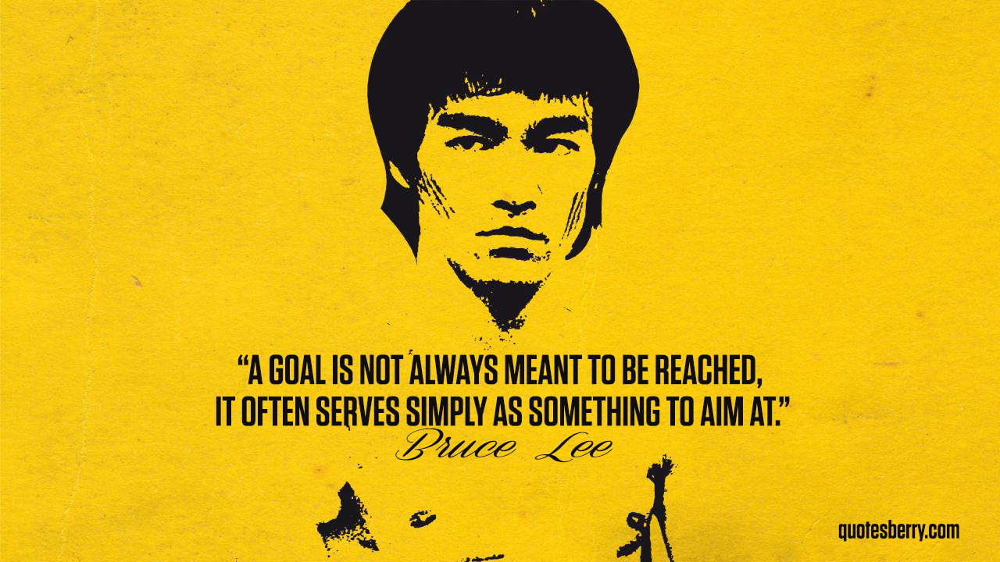
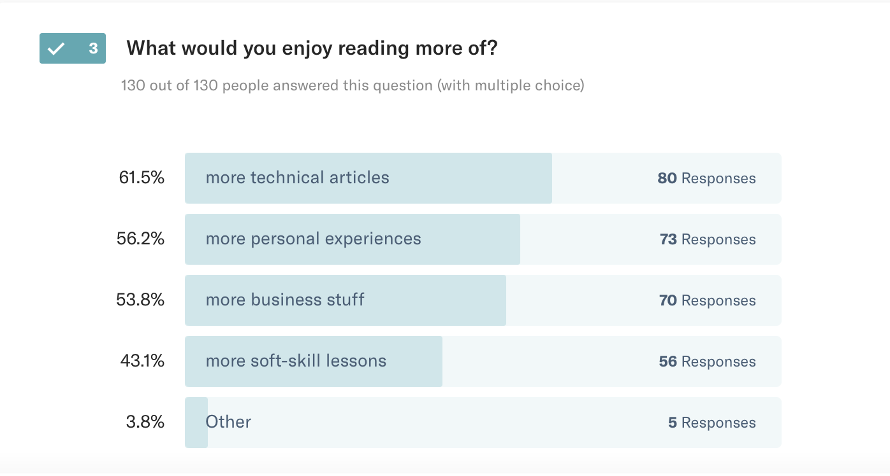

> A goal is not always meant to be reached, it often serves simply as something to aim at.

January is the month of new year's resolutions. Have you been to a gym lately? PACKED! Have you been to a gym in December? _empty_

Why is that?

People focus on the wrong things, get discouraged, and quit. You can't control the outcomes, but you _can_ control the inputs.

Stoic philosophy in a nutshell. Great philosophy to look into, I recommend reading [A Guide to the Good Life](https://amzn.to/2H6t6g3). Amazing book. Very eye-opening.

So what does it mean you can't control outcomes?

Say you're looking for a job. Trying to get hired as a software engineer at BigCo.

What do you do?

You apply for jobs. You go to interviews. You get a job.

_Multiple_ applications. _Multiple_ interviews. **One** job.

🤔

That means there's a funnel. A process, if you will. You are not in control of any one job offer. Somebody else makes that decision based on many factors good and bad. But ultimately it's _their_ choice, not yours.

So you're not in control.

But you know that if you apply for 10 jobs, you get 1 interview. If you go to 10 interviews, you get 1 job offer. If you get 10 job offers, you get 3 that fit your criteria.

Of those 3, you can negotiate for the best offer.

You _do_ have criteria what you're looking for, don't you? You're not just blindly looking for _any_ job, are you? You want a _good_ job? I hope so. I believe in you and think you deserve the dreamiest job you can imagine.

Okay, so your goal is to get 3 good job offers. There's probably a time component as well. You need a job before you run out of money.

You can't control job offers – the outcomes. You _can_ control your inputs.

So if it takes 10 job offers for 3 good ones, you need 10 offers. If it takes 10 interviews for 1 offer, you need 100 interviews. If it takes 10 applications for 1 interview, you need 1000 applications.

And now you're in control.

Submit 1000 job applications. Get 100 interviews. Get 10 offers. Get 3 good offers. Have a dream job.

Same principle works for the gym: Don't focus on the pounds, backtrack your goal to its inputs, then focus on the process. Doing the work will make the result.

Do think _"I run 3 miles on Monday, Wednesday, and Friday morning"_, not I want to run a 15K in 5 months, but that's overwhelming, so I'll take a nap instead.

Do think _"I study for the GMAT for 1 hour every day"_, not I want to get into business school but have to pass the GMAT in March, and that's so overwhelming I can't even get started, so I watch Netflix.

Do think _"I work on something cool for 1 hour every evening"_, not I want to learn more technologies, but the choice is overwhelming, and I can't keep up.

## My example of process-not-goal focus

To share an example, here are my process goals for the start of 2019. In 3 months, I will measure and adjust 👇

For general health and well-being:

1. Boxing 4 times per week. Monday, Tuesday, Thursday, Friday
2. Lifting 1x per week. Wednesday
3. Long relaxing walk with The Girl 1x per week. Saturday

For my marathon in March. I said no more marathons last year, and yet here we are:

1. Run 5 to 10km twice per week. Wednesday, Friday
2. Run long distance (23km+) every Sunday

For my business:

1. Write 2 technical blogs per week. Monday, Wednesday
2. Write 1 soft blog per week. Friday
3. Apply to 1 conference or meetup CFP every week
4. Get in touch with 1 consulting lead per week

For business and personal learning:

1. Livecode something cool for at least 1 hour at least 4x per week
2. Write [^200wordsTIL](https://twitter.com/hashtag/200wordsTIL?src=hash) every day about something new I learned that day

My writing comes straight out of your preferences. You can [still answer these 3 questions to make me create better stuff for you](https://swizecteller.typeform.com/to/GQP8T6).

What about you? What are you trying to achieve this year? How are you getting there? Can I help?