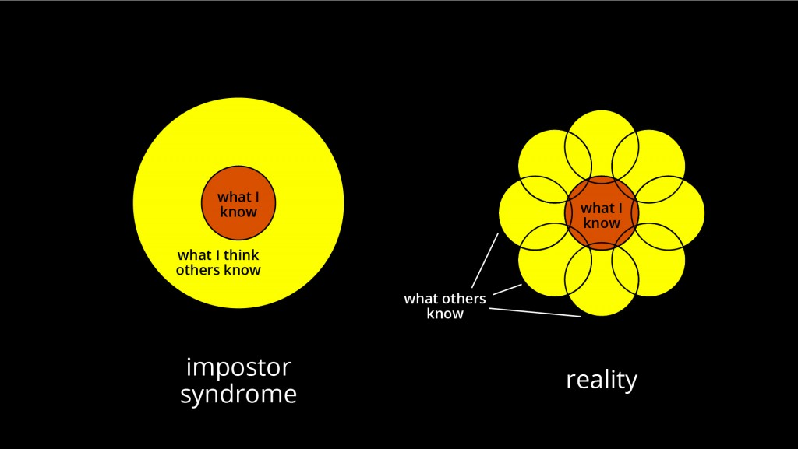

Here is something true: You are not the best engineer.

Here is also something true: You are not the worst engineer.

You're about average. Almost everyone is. You know how I know? Stats.

Let's assume engineering skill follows a normal distribution from crazy bad to super good. It skews to the good side because very bad engineers aren't likely to get hired and don't keep jobs for long.

Normal distribution looks like this 👇

_The_ average engineer is that mid point. Very thin slice. I don't think such a person exists. Just like the [average American household is 2.53 people](https://www.statista.com/statistics/183648/average-size-of-households-in-the-us/) and I have yet to see a 0.53 person walking around.

What people _mean_ when they say "about average" or just "average", is the 1 standard deviation spread. That's 68%.

Well … they tend to think of "modus" (the most observed value) when thinking of the average engineer and that's due to [representation bias](https://en.wikipedia.org/wiki/Representativeness_heuristic).

Anyway, **68% of engineers are average**. _Most_ engineers are average.

Therefore, it is safe to assume you are average, too.

Did you know that 80% of people asked about their driving skill say they're better than average? Yep, [80% of drivers think they're above average](https://www.ncbi.nlm.nih.gov/pubmed/3730094).

Doesn't compute, does it?

Grab two standard deviations and you've got 95% of the population. That is literally almost everyone.

Why am I telling you this? Because it's \\important.

## Impostor syndrome and you

Wikipedia describes [impostor syndrome](https://en.wikipedia.org/wiki/Impostor_syndrome) as

> a psychological pattern in which an individual doubts their accomplishments and has a persistent internalized fear of being exposed as a "fraud". Despite external evidence of their competence, those experiencing this phenomenon remain convinced that they are frauds, and do not deserve all they have achieved.

I get this a lot. It comes out in tweets where I am flabbergasted that people walk up to me and say things like, _"Dude, I love your newsletter. It's really helped me a lot. Please keep going.”_

https&#x3A;//twitter.com/Swizec/status/1086331894600331264

_Everyone gets impostor syndrome_. It's normal. You get it most when you are surrounded by people who know more than you about something.

You know what else you get when surrounded by people who know more than you? Growth.

Just like when people say that you often don't recognize opportunity when it comes knocking because it's wearing overalls and looks like work. So too you often shy away from opportunity because you're not sure you can handle it.

Fuck that. Yes, you can. You can grab the bull by the horns and Figure It Out.

That's your greatest superpower as an engineer. Figuring shit out.

You take a problem you've never solved before and you solve it. That's what engineers do.

Impostor syndrome is your friend. That annoying friend who reminds you that you're about to do something hard, something you've never done before, and what's worse, you're surrounded by experts who could do it ever so easily.

But you know what?

If you're surrounded by experts, that means you've got someone to ask. You're gonna do just fine.

And remember, just because they know more than you about one thing doesn't mean they know more than you about all things. They don't.

## So what do you do when you don't think you're good enough?

Acknowledge that you feel this way. Think about why you feel this way. Then do the things.

Don't know how to do it? Learn.

Team better than you? Great! Ask questions. Use your team as a resource.

Stuck and nothing works? Breathe, take a break, try a different approach.

Anxiety? That's tough. Here's what helps 👇

Build a portfolio of successes. Every time you complete a difficult project, write it down. Just a note in a file, a couple of words in a writeup, perhaps. What made it hard, how did you solve it, what obstacles did you overcome?

**Challenge!** Write down 5 accomplishments from the past few years. Think hard. What are the 5 things you're most proud of building?

Awesome! You got it.

Next time you feel like you're struggling, go back and read those 5 accomplishments. Keep adding new ones.

Remind yourself how good you are when times are tough and motivation is low.

✌️

# In other news

First talk of the year! Gave a talk at the [Real World React Meetup this week](https://www.meetup.com/Real-World-React/events/256448268/) about my experience building a #24hrstartup.

Really, it was more about how amazing the web has gotten and you can be crazy productive and everything is awesome and this is the best time ever to be a frontend engineer.

Talk wasn't recorded, but a few people came up to me afterwards and said it reminded them of this much better talk from Chris Coyier.

https&#x3A;//twitter.com/JoelGMcKinnon/status/1086337624791441409

https&#x3A;//www.youtube.com/watch?v=grSxHfGoaeg

Oh, and React for Data Visualization is going okay. We're at 77 videos, and I really need to wrap up and launch this thing.

https&#x3A;//twitter.com/Swizec/status/1084956382153961473

# Some things I learned this week

My #200wordsTIL practice of learning something new every day and writing a Twitter thread has been going great. Only missed 1 day so far and that was because I went drinking after the meetup on Thursday. Oops.

https&#x3A;//twitter.com/Swizec/status/1085071994196877312

https&#x3A;//twitter.com/Swizec/status/1085440195179114497

https&#x3A;//twitter.com/Swizec/status/1085799975735291904

https&#x3A;//twitter.com/Swizec/status/1086532951829934081

https&#x3A;//twitter.com/Swizec/status/1086805930887372801

# A few cool things

Here's some cool stuff I discovered recently 👇

- [This webMIDI thing projecting notes on a keyboard so you can learn how to play](https://twitter.com/asutherland/status/1086488060664131589)
- Lars Heemskerk shares a [plot of dataviz tools](https://twitter.com/larsheemskerk/status/1085046655290753025) so you can compare which one is better for your usecase. Pretty neat.
- Trevor Bedford of [nextstrain.org](https://nextstrain.org) shares [this cool improvement](https://twitter.com/trvrb/status/844289196940410881) to how charts on their dashboard interact. You can now better follow how various diseases spread.
- You should read this post on stoicism and how it applies to your job 👉 [If Marcus Aurelius were a software developer](https://codeandtechno.com/posts/stoicism-for-developers/)
- Dave Ceddia shared a great post about [The Path to Becoming a Front End Developer in 2019](https://daveceddia.com/path-to-frontend-developer-2019/)