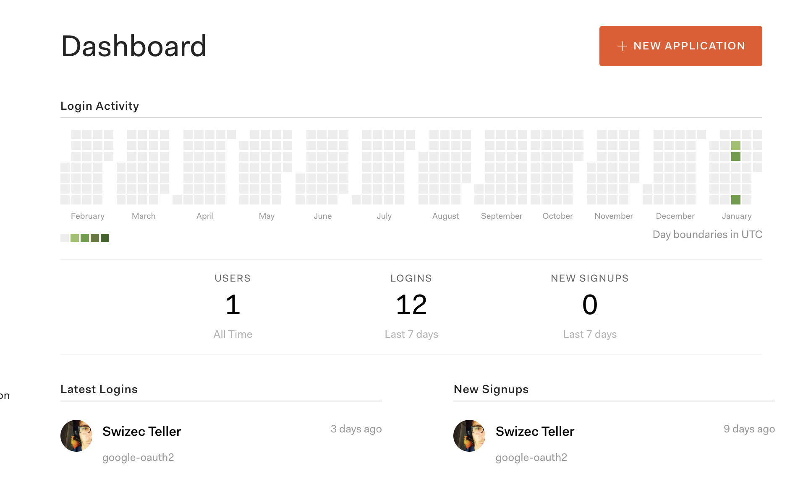
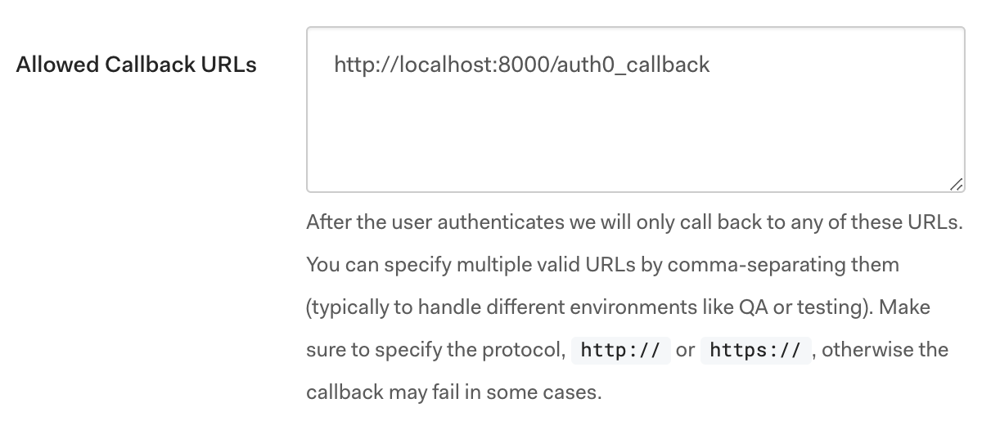

In my quest never to set up a server ever again, I discovered Auth0 – a serverless authentication service. You give them keys to the kingdom, and they keep you and your users secure.


You don't even have to store anything. 👌


Since Gatsby is my favorite way to build new React apps with server-side rendering and super-fast performance, I decided to combine the two. Easy in theory, but turns out tricky in practice.


Took me 3 livecoding sessions to figure out. [Luke Oliff's article on Gatsby v1 + Auth0](https://auth0.com/blog/building-a-blog-with-gatsby-react-and-webtask/) article helped a lot, as did [Auth0's React SPA setup guide](https://auth0.com/docs/quickstart/spa/react/01-login).


You can think of this article as a distillation of those guides and these 3 hours of coding 👇


https&#x3A;//www.youtube.com/watch?v=xwyOQqi7Xm8


https&#x3A;//www.youtube.com/watch?v=jF0AIV8EtJk


https&#x3A;//www.youtube.com/watch?v=eWPpTIb98YM


## Step 1: Get an Auth0 account


This one's easy. Go to [Auth0](https://www.auth0.com) sign up for a free account. They even have a "Just playing around" option, and you're set.


Right now, a free account will hold you over up to 7,000 active users. I don't know about you, but none of _my_ side projects ever hit 7000 DAU (daily active users).


See, it's just me on this one


\[caption id="attachment_8894" align="alignnone" width="1882"] Auth0 dashboard screenshot\[/caption]


## Step 2: Create an app, get domain and client id


Click the big fat New Application button, fill out the form, and get your application's domain and client id. You'll need these to configure your Auth0 client.


The domain is where your login form will live. Your app is going to redirect people there. They'll see a login screen, do the things, and come back to your site with a redirect and a bunch of params.


Client ID tells the Auth0 machinery which site it's working with.


Strangely, you never have to set up a client secret. They generate one for you, but I haven't needed to use it yet. Maybe when you're doing server-to-server authentication?


## Step 3: Whitelist your callback URL


Like I said, Auth0 redirects users back to your site after login. You give it a URL, and that's where they end up.


For your safety, callback URLs must be whitelisted. There's an `Allowed Callback URLs` field in your app settings.


Add `http://localhost:8000/auth0_callback`. I like to prefix callbacks with a service name because you never know how many you'll need.


\[caption id="attachment_8893" align="alignnone" width="1222"] Callback config\[/caption]


## Step 4: Start a new Gatsby project


This part is easy.


```
$ gatsby new gatsby-auth0-playground
```


Creates a new [Gatsby](https://gatsbyjs.org) site with the basic setup. You're welcome to use a starter. This guide should work with all of them.


## Step 5: The auth service


All your Auth0 stuff lives in `/utils/auth.js`. It's like a library on top of Auth0's library that makes your life a little easier.


You're best off copy-pasting this whole file verbatim into your project. Make sure to configure `AUTH0_DOMAIN` and `AUTH0_CLIENT_ID`. If I was a particularly good human, I'd put this on NPM and make it configurable through package.json, but we're not there yet :P


https&#x3A;//twitter.com/Swizec/status/1087224394257031168


```
// src/utils/auth.js

\import auth0 from 'auth0-js'
\import { navigate } from 'gatsby'

const AUTH0_DOMAIN = '.auth0.com'
const AUTH0_CLIENT_ID = ''

export default class Auth {
  auth0 = new auth0.WebAuth({
    domain: AUTH0_DOMAIN,
    clientID: AUTH0_CLIENT_ID,
    redirectUri: 'http://localhost:8000/auth0_callback',
    audience: `https://${AUTH0_DOMAIN}/api/v2/`,
    responseType: 'token id_token',
    scope: 'openid profile email',
  })

  login = () => {
    this.auth0.authorize()
  }

  logout = () => {
    localStorage.removeItem('access_token')
    localStorage.removeItem('id_token')
    localStorage.removeItem('expires_at')
    localStorage.removeItem('user')
  }

  handleAuthentication = () => {
    if (typeof window !== 'undefined') {
      // this must've been the trick
      this.auth0.parseHash((err, authResult) => {
        if (authResult && authResult.accessToken && authResult.idToken) {
          this.setSession(authResult)
        } else if (err) {
          console.log(err)
        }

        // Return to the homepage after authentication.
        navigate('/')
      })
    }
  }

  isAuthenticated = () => {
    const expiresAt = JSON.parse(localStorage.getItem('expires_at'))
    return new Date().getTime() < expiresAt
  }

  setSession = authResult => {
    const expiresAt = JSON.stringify(
      authResult.expiresIn * 1000 + new Date().getTime()
    )
    localStorage.setItem('access_token', authResult.accessToken)
    localStorage.setItem('id_token', authResult.idToken)
    localStorage.setItem('expires_at', expiresAt)

    this.auth0.client.userInfo(authResult.accessToken, (err, user) => {
      localStorage.setItem('user', JSON.stringify(user))
    })
  }

  getUser = () => {
    if (localStorage.getItem('user')) {
      return JSON.parse(localStorage.getItem('user'))
    }
  }

  getUserName = () => {
    if (this.getUser()) {
      return this.getUser().name
    }
  }
}
```


You don't have to understand how all this works, which is the beauty of using a service like Auth0, so here's a nutshell explanation:


1. You set up an `auth0` client with config, put it in `this.auth0`
2. When you call `auth.login()`, the client takes over
3. Redirects to `AUTH0_DOMAIN` with some params
4. Users login through Auth0's beautiful UI
5. Auth0 redirects back to `redirectUri`
6. Your callback page calls `auth.handleAuthentication`
7. Your `auth0` client parses URL params and decides all's good
8. `setSession` takes auth result and updates info in LocalStorage
9. Gatsby navigates back to your home page with `navigate('/')`


We also have a couple convenience methods like `isAuthenticated`, `getUser`, and `getUserName`. You might want to make these into proper ES6 getters. I haven't decided yet if that's better or not but it sure looks neater.


## Step 6: Gatsby callback page


I mentioned a "callback page". You might think that's complicated, but with Gatsby, it's not. You just need a React component that loads on `/auth0_callback` and calls `handleAuthentication` on mount.


Like this 👇


```
// src/pages/auth0_callback.js

\import React from 'react'
\import { ClipLoader } from 'react-spinners'

\import Auth from '../utils/auth'
\import Layout from '../components/layout'
\import useComponentDidMount from '../useComponentDidMount'

const Auth0CallbackPage = () => {
  useComponentDidMount(() => {
    const auth = new Auth()
    auth.handleAuthentication()
  })

  return (
    
      

        This is the auth callback page, you should be redirected immediately.
      

      
    
  )
}

export default Auth0CallbackPage
```


I'm using React hooks, but don't let that distract you.


Gatsby turns every file in the `/src/pages` directory into a static page. So you now have a page that renders some text and a loading spinner from `react-spinners`.


When the component mounts, that's only in browsers, we create a new `Auth()` object and call `auth.handleAuthentication()`. Our auth service takes care of the rest.


PS: the `useComponentDidMount` hook looks like this:


```
export default function useComponentDidMount(onMounted) {
  const [mounted, setMounted] = useState(false)
  useEffect(
    () => {
      setMounted(true)

      onMounted()
    },
    [mounted]
  )
}
```


It's a combination of `useState` and `useEffect` that ensures a function runs once and only once – on component mount. My understanding is that `useEffect` runs any time React touches our component and I wanted to make certain the auth code runs once.


If you run `handleAuthentication` multiple times, it leads to strange errors. State gets corrupted, tokens are out of date, everything breaks.


## Step 8: A login button


Now all you need is a login button.


```
// src/components/Login.js

\import React from 'react'
\import { Button } from 'reakit'
\import Auth from '../utils/Auth'

const auth = new Auth()

const Login = () => {
  const { isAuthenticated } = auth

  if (isAuthenticated()) {
    return Logout {auth.getUserName()}
  } else {
    return Login
  }
}

export default Login
```


Since Auth0 handles all our user state, we don't need any sort of props or state management. Just a component that instantiates an Auth0 object and renders a button.


Use the `isAuthenticated` helper to decide whether to say `Login` or `Logout` and call the appropriate methods on click.


That's it.


https&#x3A;//twitter.com/Swizec/status/1088117007138975744