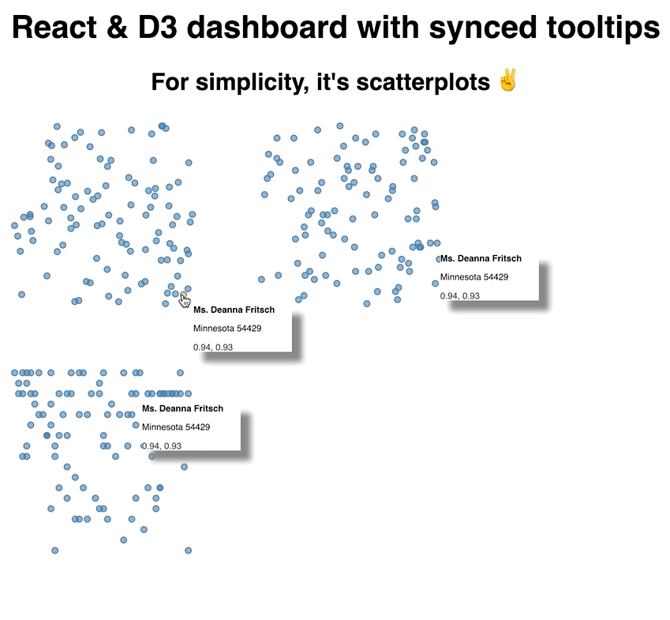
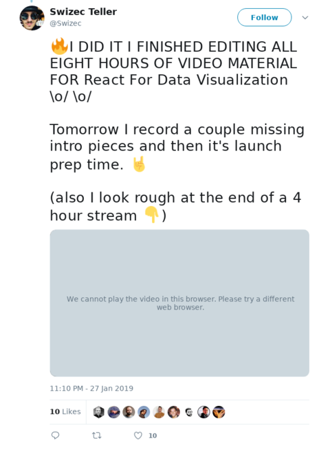
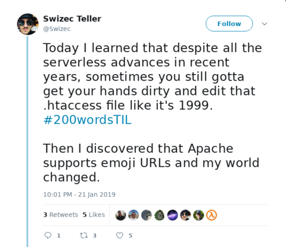
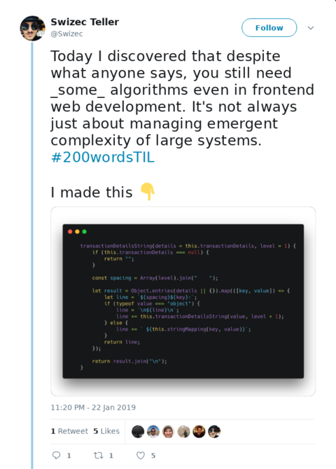
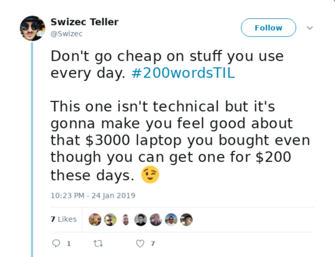
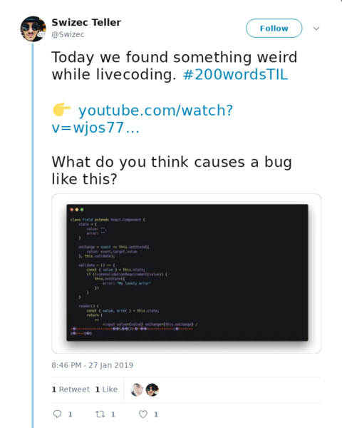

One of the most common burning questions readers ask 👉 _"How do I add tooltips to my charts?"_ followed by _"How do I sync them between multiple charts?"_


So we played around and got that working on a stream 👇


Using hooks because why not. It's fun to experiment with the future :)


We built a simple dashboard with 3 scatterplots because scatterplots are easy to build. Filled with random data because real small datasets are hard to find.





Scatterplots with synchronized tooltips


Here's a CodeSandbox, try it out 👇


## First, you need a context and some state


We're using context to share state between charts. No prop passing, just state that everyone has access to. It's like a Redux or MobX store without the setup.


A couple lines is all we need:


```
// src/useTooltip.js

\import React, { useState } from "react";

const tooltipContext = React.createContext();

function useTooltip() {
  const [tooltip, setTooltip] = useState(false);

  return { tooltip, setTooltip };
}

export { useTooltip, tooltipContext };
```


Not sure yet how I feel about this state pattern with hooks, need to play around some more. Here's the idea:


1. Create a `tooltipContext`
2. Create a custom `useTooltip` hook with 1 piece of state, the tooltip value
3. Return value and setter from the hook
4. Export hook and context


Might look cleaner to export context in the `useTooltip` hook itself? 🤔


Either way, the idea here is that every component has access to the same tooltip state. It tells them whether to display a tooltip and its context. Any component can take over, usually on mouse over, and call `setTooltip` to set a new tooltip.


If your system has just 1 mouse cursor, like most computers do, this approach works great. If you want to support multiple simultaneous mouse over events, you could run into trouble.


## Second, you need a scatterplot


Like I said, we used scatterplots because they're quick to build. Take some data, pick two dimensions, iterate and draw circles.


```
// src/Scatterplot.js

\import { tooltipContext } from "./useTooltip";

export default ({
  x,
  y,
  width,
  height,
  data,
  xDimension,
  yDimension,
  padding = 10
}) => {
  const { tooltip, setTooltip } = useContext(tooltipContext);

  const xScale = d3
    .scaleLinear()
    .domain(d3.extent(data, xDimension))
    .range([padding, width - padding]);
  const yScale = d3
    .scaleLinear()
    .domain(d3.extent(data, yDimension))
    .range([padding, height - padding]);

  return (
    
      {data.map(d => (
         setTooltip(d)}
          onMouseOut={() => setTooltip(false)}
        />
      ))}
      {tooltip && (
        
      )}
    
  );
};
```


We use the `useContext` hook to get access to our tooltip state. Here's where using `useTooltip` would be nicer but I couldn't quite figure out how to make it work.


That gives us `tooltip` and `setTooltip`. I'll show you how they get into our context in a bit.


Then we set up two D3 scales: One for horizontal coordinates, `xScale`, one for vertical coordinates, `yScale`.


We return a grouping element using the `transform` prop to position at `(x, y)`, iterate over our data, and render circles.


Each circle gets a position based on our scale and a passed-in value accessor. `xDimension` or `yDimension`. This lets us re-use the same scatterplot for random looks into our data you'll see. `onMouseOver` we set the tooltip to current datapoint, `onMouseOut` we reset it back to `false`.


Then we render the `` component.


## Third, you need a ``


The `` component takes coordinates and content. Renders them in an SVG `foreignObject` so we can leverage HTML's built-in text formatting abilities.


Reflowing text in SVG yourself is painful 😉


```
// src/Scatterplot.js

const Tooltip = ({ x, y, info }) => (
  
    

      {info.name}
      
        {info.state} {info.zipCode}
      
      


        {info.number1.toFixed(2)}, {info.number2.toFixed(2)}
      


    

  
);
```


This one is very dataset specific. We know each `info` has a `name`, a `zipCode`, and two numbers. Display them in some nice format and that's that.


_Each_ of our scatterplots now has its own instance of a tooltip. They're all driven by the same state in context, but they're different tooltips.


This is crucial.


## Fourth, you need an App to hold it all together


Our App component holds everything together. Generates data, renders scatterplots, sets up a context provider. Everything.


Looks like this


```
function App() {
  // Generate random data on first load
  const data = useMemo(
    () =>
      range(100).map(i => ({
        id: i,
        number1: Math.random(),
        number2: Math.random(),
        name: Faker.name.findName(),
        zipCode: Faker.address.zipCode(),
        state: Faker.address.state(),
        color: Faker.internet.color()
      })),
    []
  );

  // bucketize states into 50 buckets
  const stateToNumber = scaleOrdinal()
    .domain(data.map(d => d.state))
    .range(range(50));

  // alphabetize letters into 25 buckets
  const alphabet = scaleOrdinal()
    .domain("abcdefghijklmnoprstuvwxyz".split(""))
    .range(range(25));

  const state = useTooltip();

  return (
    

      
React & D3 dashboard with synced tooltips

      
For simplicity, it's scatterplots ✌️

      
        
           d.number1}
            yDimension={d => d.number2}
          />

           d.number1}
            yDimension={d => stateToNumber(d.state)}
          />

           stateToNumber(d.state)}
            yDimension={d => alphabet(d.name[0])}
          />
        
      
    

  );
}
```


So that's a long ass function. This is our hook-based future I'm afraid. Surely patterns will develop to clean this stuff up?


But also we were just playing around. No need to make it clean :)


We start with some fake data. `useMemo` makes sure we calculate it once and keep it in memory through any re-renders. Makes our dataviz look more consistent.


Two ordinal scales help us turn state names and zip codes into linear numbers. Easier than changing our scatterplots to support ordinal data.


The `useTooltip` hook from earlier gives us a state object that we'll feed into our `tooltipContext`. Again a good opportunity to make this easier to use, but need to play around some more.


For the rendering, we wrap our dashboard with `tooltipContext.Provider`, give it our state, render an SVG element, and plop down three scatterplots.


This is where making scatterplots flexible comes handy. We're reusing the same component, giving it different params, and it gives us different insights into the same dataset.


The result, a dashboard with synchronized tooltips.


Scatterplots with synchronized tooltips


✌️


# In other news


I DID IT I FINISHED EDITING ALL EIGHT HOURS OF VIDEO FOR React For Data Visualization \\o/


[](https://twitter.com/Swizec/status/1089782724510965760)


Only took 4 months, heh 😅


But now we know. This is a good datapoint for the future.


The process started in August with research, writing, running online workshops to test the material and flow. Well, the _real_ process started in April 2015 with the first React + D3 book …


Fingers crossed it doesn't take me 4 years to produce the next full video course 🤞 I think the 5 month flow is doable.


Right now we've got 94 videos in 27 sections and 133 lessons. Today I'm recording a couple explainer intro videos to give context and ease onboarding and then we're off to the races launching this thing.


Thanks everyone for your patience. Watch your emails for more info coming soon :)


Oh also I started ramping up for another marathon because I'm dumb


[](https://twitter.com/Swizec/status/1089614535047110656)


# A few TIL lessons from the week


These days I post a cool tip in the form of a TodayILearned on twitter every day. Here are some good ones from this week. Click on them, they're threads 👇


[](https://twitter.com/Swizec/status/1087591170174115845)


[](https://twitter.com/Swizec/status/1087973312288952322)


[](https://twitter.com/Swizec/status/1088683833321390081)


[](https://twitter.com/Swizec/status/1089384771510128640)


This one has some cool CompSci fundamentals ^


[](https://twitter.com/Swizec/status/1089746524748140544)


This one is an epic mystery with a weird resolution


# A few cool things


And as always on a Monday, some cool stuff I discovered this week 👇


[Script-8](https://script-8.github.io/) which is a whole 8-bit computer built in JavaScript. Great for making retro games.


dmaydan published [this neat maze builder and solver](https://github.com/dmaydan/Maze_Solver_Generator) that renders on canvas. If you find that cool, you'll enjoy Bostock's epic [maze generation algorithms](https://bost.ocks.org/mike/algorithms/#maze-generation) article.


This is C++ but I really liked it: A [KABOOM animation in 180 lines of C++](https://github.com/ssloy/tinykaboom/wiki). Neat effect and good writeup on how to get there.


And I think this is a cool idea, but I haven't had time to listen to the episodes. [A React learning course compiled out of podcasts](https://www.reddit.com/r/reactjs/comments/akf1bb/i_created_a_react_learning_course_made_of_podcast/?st=JRFLRUI0&sh=697a92d8)


Hope you have a great week. and to that person who asked _Do you even read these?_ in the typeform below: Yes I do but I can't reply.


Cheers,  
~Swizec