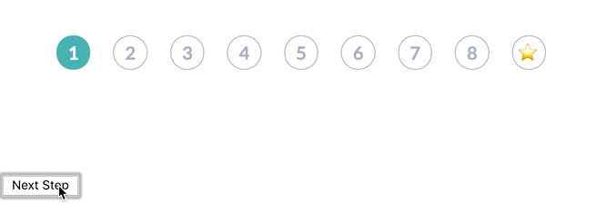

 Modern CSS-in-JS is the best thing that's happened to the web since components. Hands down. Let me explain. 👇 First we had the `style` prop and that sucked. I hated CSS-in-JS and thought it was stupid. You can pry my CSS from my dead cold hands! _shakes fist_ Then came experiments. Can we make the style prop easier to use? Can we still use class names to style with BEM like we used to? What about CSS files with fat semantic classes? Scoped styles maybe? None of it quite worked. Everything was awkward in some way. The style prop is great for individual components and breaks down when you want to change your general font size. Class names give you all the power of CSS and BEM (tiny classes like .font1 .bold .bla). And it breaks down when you reuse components like building blocks. A component has the color defined and if you want to overwrite that you need something that understands classes and decides which one takes power and ugh don't get me started. I may have once tried to make that work ... Scoped CSS is better. That's what Vue uses. But it still sucks, if you ask me. You get a weird mix of global styles with local overwrites and mixing BEM and semantic classes and it gets messy fast. Leads to weird code too. But then, then some beautiful soul came up with [styled-components](https://www.styled-components.com/). I was in love. All the simplicity of scoped CSS with the power of the style prop. You write CSS, yes, _but you can inject JavaScript too_.

## Why styled-components are win, an example

The best way to make my argument is with an example. I recently implemented a colorful React stepper component for a client project. Styled components and a couple libraries [@Diegohaz](https://twitter.com/diegohaz) built on top made it so easy it feels like cheating.

> Wow [@diegohaz](https://twitter.com/diegohaz?ref_src=twsrc%5Etfw)'s libs made this ridiculously easy to build. Blog coming soon [pic.twitter.com/Cpp7LoMrHC](https://t.co/Cpp7LoMrHC)
>
> — Swizec Teller (@Swizec) [January 29, 2019](https://twitter.com/Swizec/status/1090146315361636352?ref_src=twsrc%5Etfw)

You have 9 steps. Each a different color once done. Blank with a grey outline otherwise. Here's a CodeSandbox you can try.  Pretty isn't it? I think it is. Here's all the component code 👇

    const Step = ({ index, done, last }) => (
      <Circle index={index} done={done} last={last}>
        {last ? "⭐️" : index + 1}
      </Circle>
    );

    export default ({ step, maxSteps }) => (
      <Steps row>
        {range(maxSteps).map(i => (
          <Step index={i} key={i} last={i === maxSteps - 1} done={i < step} />
        ))}
      </Steps>
    );

Yep that's it. 12 lines of code. A `<Stepper>` component, the default export, takes the current `step` and max number of steps, `maxSteps`. It renders a `<Steps>` component which deals with layouting. Inside goes an array of `<Step>`s. Each `<Step>` gets an index, a flag saying whether it's `last`, and whether it's been `done` yet. Highlighted vs. unhighlighted state. Steps render a `<Circle>` component, pass-in the props, and inside goes either a number or a star emoji. Star is last.

## All style logic goes in styles

Moving your _visual_ UI logic out of your components and into styles is where CSS-in-JS shines. Focus your components on business logic, user experience, and hierarchy. Let your styles take care of your styling. Just like our [CSS Garden](http://www.csszengarden.com/) forebears envisioned. Remember CSS Gardens? You might be too young. The world has moved on. CSS's initial promise is that we would completely decouple styling from document hierarchy and live a Zen stress free life. Now look at us. BUT ALL IS NOT LOST! Look at this beauty.

    import { Box, Flex, Heading, styled } from "reakit";

    const Steps = styled(Flex)`
        align-items: center;
        justify-content: center;
        padding-top: 40px;
    `;

I'm using Diegohaz's [reakit](https://reakit.io/) for base CSS stuff. He built a bunch of components on top of styled-components that have sane defaults and great composability. No styles, just some basics. `Flex`, for example, is a `div` with `display: flex`. That's all. `<Steps>` then is a flexbox div that centers its children and adds a `40px` padding on top. Easy 👌 And then comes the `<Circle>` component. The individual steps.

    import { theme, palette, withProp, ifProp } from "styled-tools";

    const Circle = styled(Box)`
        border-radius: 100%;
        border: 1px solid;
        border-color: ${ifProp(
            "done",
            withProp("index", index => palette("steps", index)),
            palette("grey", 2)
        )}
        color: ${ifProp("done", "white", palette("grey", 2))};
        background: ${ifProp(
            "done",
            withProp("index", index => palette("steps", index)),
            "white"
        )}
        font-size: ${palette("size", 1)};
        ${theme("bold")}
        width: 30px;
        height: 30px;
        line-height: 30px;
        text-align: center;
        margin-right: 20px;

        &:last-child {
            margin-right: 0px;
        }
    `;

A few things are happening here. Let me explain.

1.  I'm using another of Diegohaz's libraries [styled-tools](https://github.com/diegohaz/styled-tools). It's a suite of helper functions that make it easier to use component props from your CSS-in-JS styles
2.  I'm using a _theme_ behind the scenes. A concept built into Reakit that lets you define global styles. Things like UI colors, font sizes, stuff like that.
3.  **ALL** of my visual logic is in this style

Let's break it down. We start with a `Box`, which is just a `div`.

    const Circle = styled(Box)`

Then we turn it into a circle with a border.

        border-radius: 100%;
        border: 1px solid;

Border and background color come from our `theme`, based on the combination of `index` and `done` props.

        border-color: ${ifProp(
            "done",
            withProp("index", index => palette("steps", index)),
            palette("grey", 2)
        )}
        background: ${ifProp(
            "done",
            withProp("index", index => palette("steps", index)),
            "white"
        )}

Here's how you read that:

1.  If prop `done` is true, get first argument, otherwise the second.
2.  With prop `index` run method.
3.  Get the `steps` palette from theme and take the `index` color.
4.  Otherwise, get the `grey` palette and take the `2`nd color

Palettes are arrays in your theme object. Pure JavaScript. You can see it in the CodeSandbox above. A similar process gives you the font color.

        color: ${ifProp("done", "white", palette("grey", 2))};

If step is `done`, color is `white`, otherwise the 2nd color from the `grey` palette. Then we have font size, bold fonts, widths and heights, and other normal CSS stuff to round off each step.

        font-size: ${palette("size", 1)};
        ${theme("bold")}
        width: 30px;
        height: 30px;
        line-height: 30px;
        text-align: center;
        margin-right: 20px;

        &:last-child {
            margin-right: 0px;
        }
    `;

You can still use CSS nesting and meta classes just like you're used to. `&:last-child` matches the last `<Step>` and removes its margin so it doesn't mess with the layout. 👌

## Conclusion

This flavor of CSS-in-JS is _the_ best most ridiculously easy way I've ever seen to style modern JavaScript components. I pray that it works for Vue as well as it does for React because I want to get my frontend peeps at the dayjob excited about it. To recap:

1.  Components deal with business logic and UX
2.  Styles handle all visual logic
3.  Global theme handles generics

Yes that means you ca rebrand your whole app just by changing `theme.js`.

