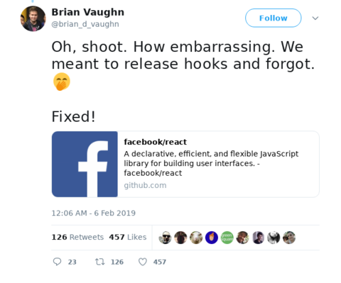

Yay hooks are here! \\o/

Long awaited big updated to the React ecosystem. Very exciting.

To celebrate, we're gonna do a special livecode **tonight around 9:30pm Pacific.** It's going to be recorded and an edited cleaned up version will become part of React for Data Visualization launching later this month.

### Here's the plan

1. Take the big example project from React for Data Visualization ([this one](https://swizec.github.io/h1b-software-salaries/#*-*-*))
2. Refactor the dataviz parts to React Hooks 🎣
3. Explain why and how hooks make your life easier
4. Have fun

While I _have_ played with hooks before, this will be my first time trying to refactor this particular project. You'll get to see how it all comes together from scratch. We might even discover some completely new techniques. Exciting.

For a quick primer, read these articles from last year 👇

[Building a React dataviz with React hooks](https://swizec.com/blog/building-a-react-dataviz-with-react-hooks/swizec/8801)  

[Building a React dataviz with React hooks](https://swizec.com/blog/easy-d3-blackbox-components-react-hooks/swizec/8689)

### How to join?

Plenty of ways. You'll get another email with links around 9pm. Just in case you forget :)

You can [come watch on YouTube](https://www.youtube.com/swizecteller) might be best to subscribe

You can [join us on Twitch](https://www.twitch.tv/swizec)

It's going to be [live on Facebook](https://facebook.com/swizecpage)

And also [announced on Twitter with an embed stream](https://twitter.com/swizec). But I hear those have shit quality

**Tonight 9:30pm Pacific. See you there ✌️**

Cheers,  
~Swizec