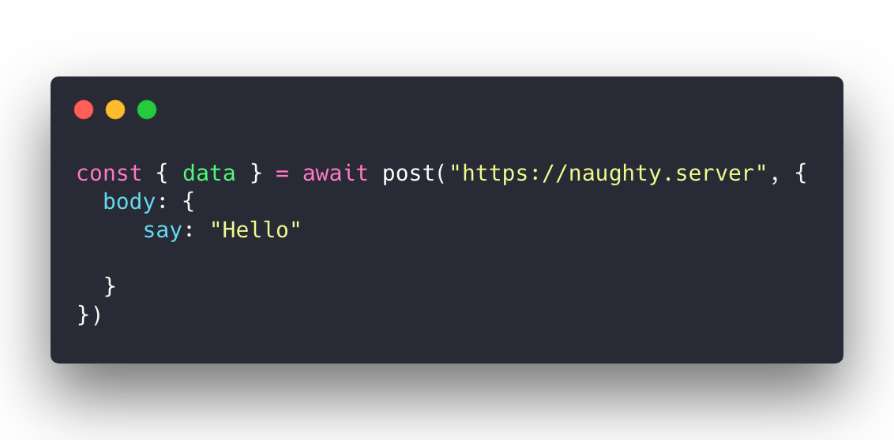
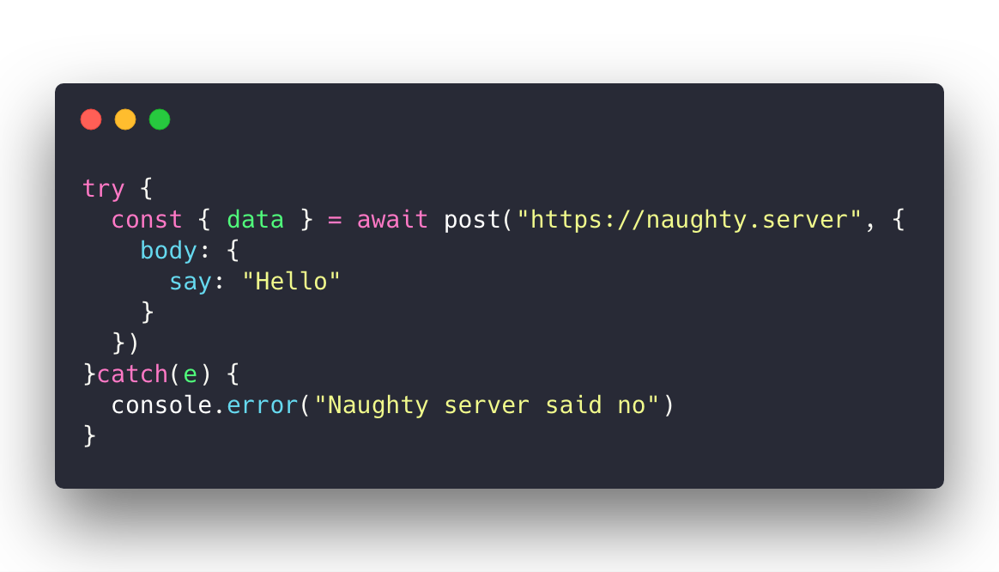
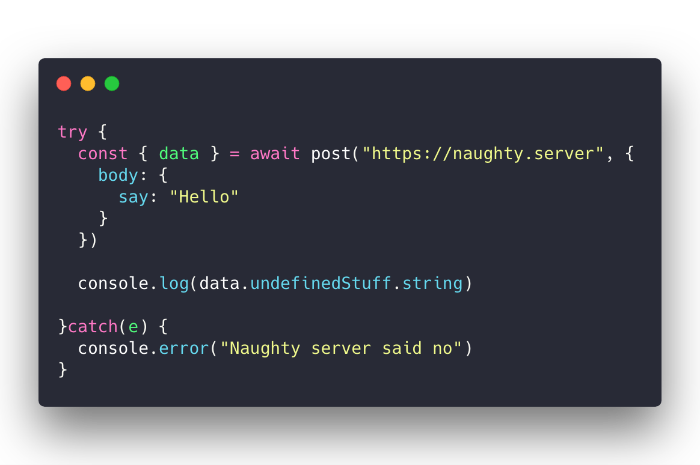
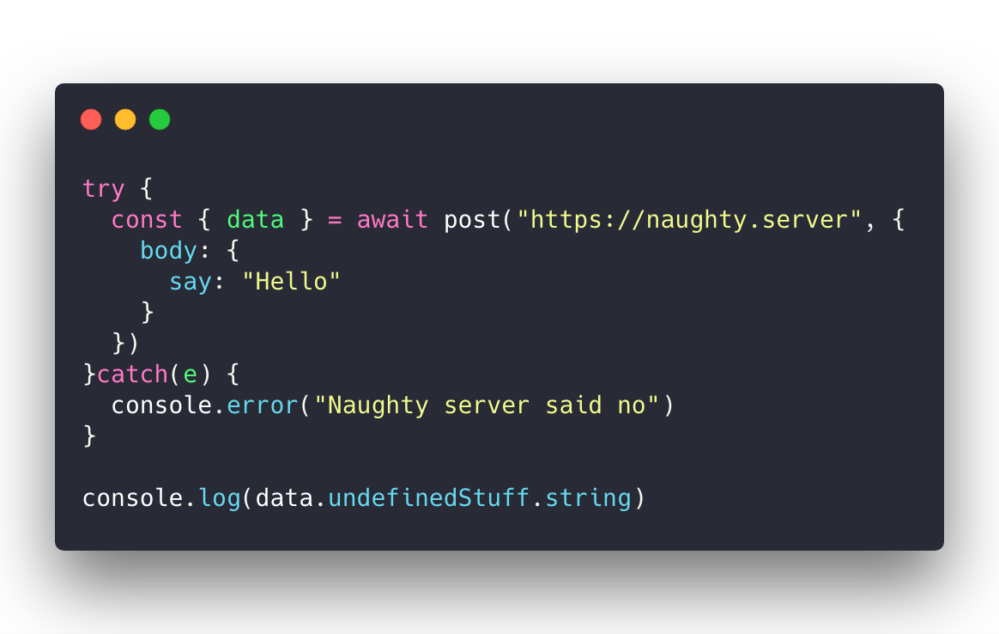
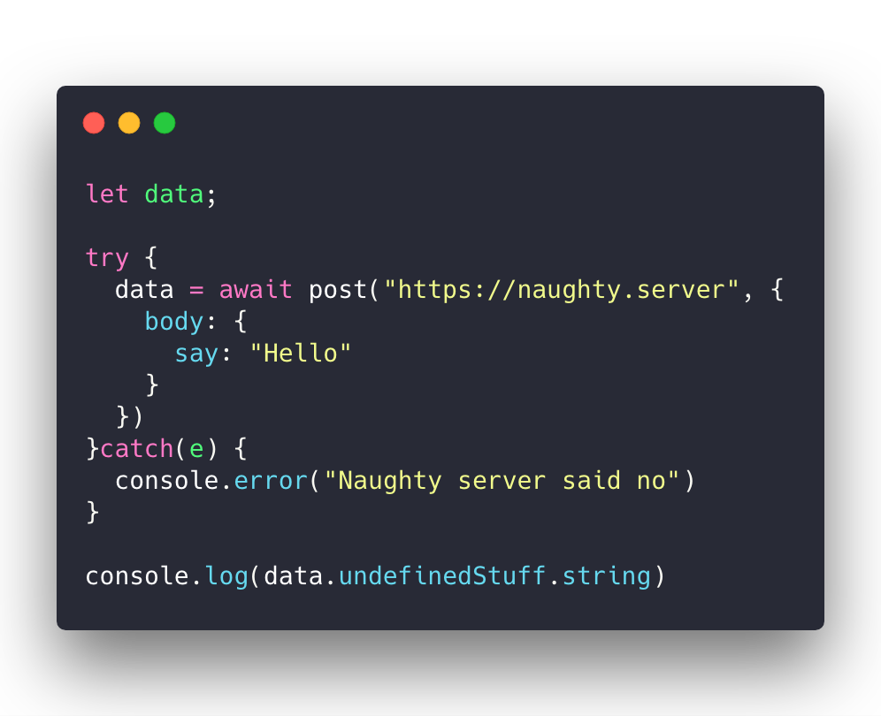
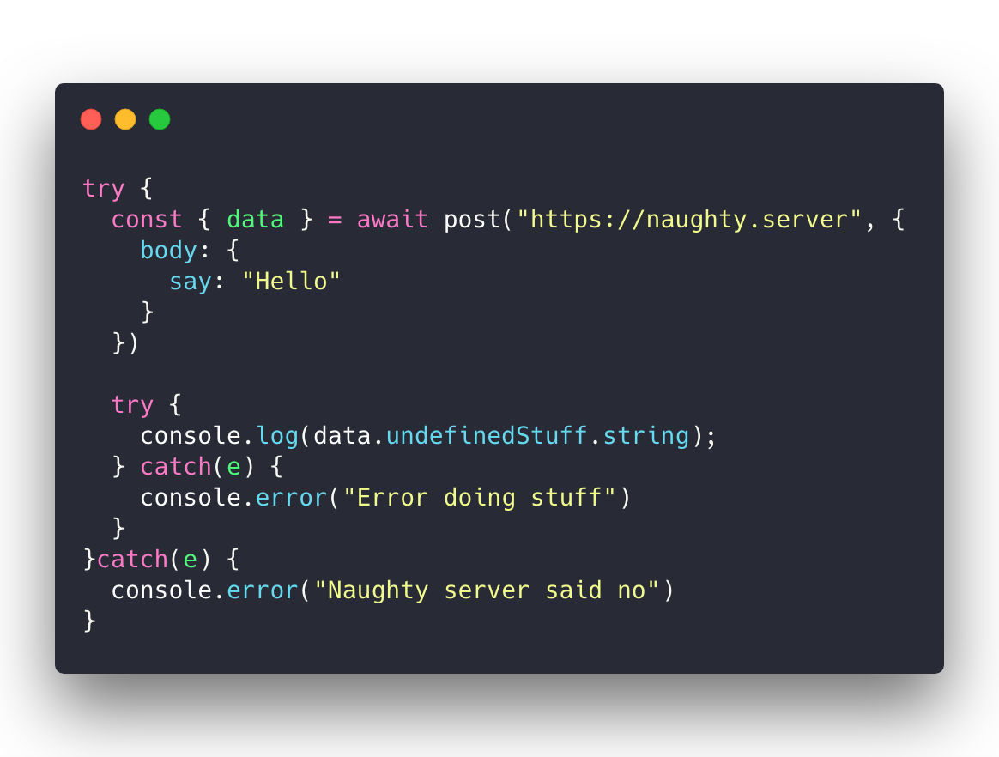
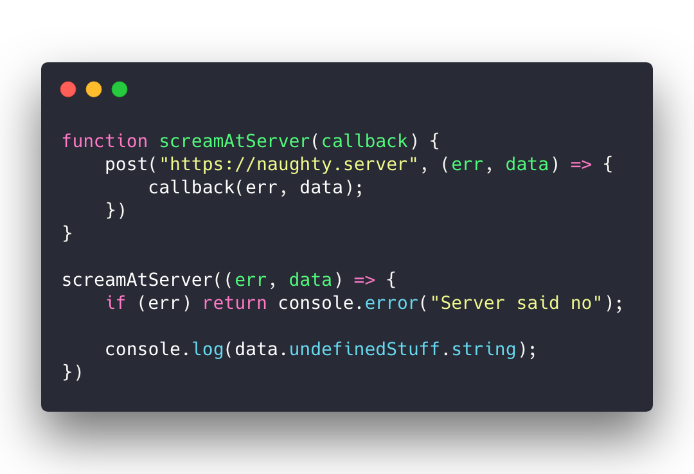
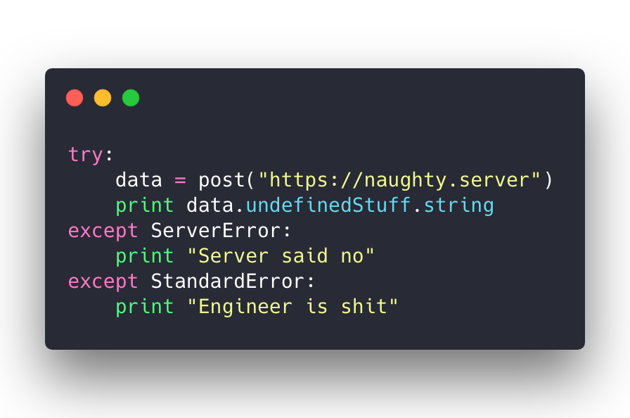
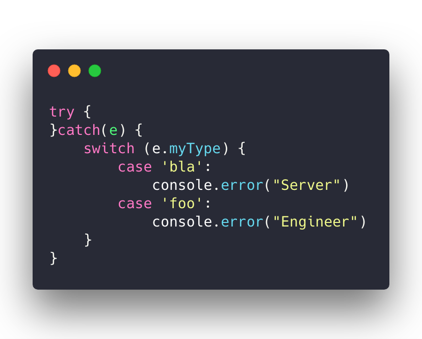

Async/await is great. Makes your code easier to read 👌 But the error handling ... oof 🙄

Yes try catch is great, it might even make your code easier to read. Combined with JavaScript's modern block scoping it gives rise to the vile side of exception handling. check this out 👇 Say you're using [@lukeed05's httpie](https://github.com/lukeed/httpie) to scream at a server.

A post request to a naughty server. But the naughty server says no. What do you do? Add a try catch. Wanna handle those JavaScript errors and show a message to the user.

You're talking to a naughty server and handling errors like you're supposed to. 👏 What about not errors? You can take the data and do something.

Oh no what just happened!? 😱 You're getting a "Naughty server said no" error even though _you_ made the mistake. You can't just access properties on undefinedStuff. JavaScript doesn't like that. Blaming the server for your mistakes, tsk

Oh I know! We can move using data to after the catch block, right? That should work.

Nope. Now data isn't defined because `const { data }` only works within that try block. 🤦‍♂️ You could solve that with a `var`, but that's old school JavaScript and we all agreed we'd stop using it. What about this?

This works. But pre-declaring your variables like it's 1978? No thanks. That's why [variable hoisting](https://en.wikipedia.org/wiki/JavaScript_syntax#hoisting) was invented in the first place, lol. You _could_ wrap your code in another level of try/catch ...

And that's never ever going to get out of hand is it? 😅 I'm gonna be honest with you: There's no solution. Not a nice one. Not in JavaScript. Other languages let you catch specific error types. As far as I know, JavaScript doesn't (can't?) support that :/

## We have stumbled upon the basic truth of exception handling

It sucks. It always sucks. Whichever way you do it, it's going to make your head spin. You see there's 2 ways software can approach errors:

1.  Error passing
2.  Exceptions

### Error passing

Error passing is what we used to do with JavaScript in the era of callbacks. Callbacks break try/catch for deep technical reasons so we stopped using them. The logic behind error passing is simple: Every function can return an error, or a result. Great in theory. Except now _every function has to check for errors._. Our code looked like this:

1st argument out of a function is an error object, 2nd argument is the result. Check for errors, go into the error path, no errors, do the stuff. Error handling spreads through your codebase like a virus. All languages have this problem. Some on purpose, some by accident. I know Golang made the conscious decision to use error passing because exceptions are a mess and errors should be handled right away. Luke proposes function wrappers to give your async/await code error passing superpowers. \[https&#x3A;//twitter.com/lukeed05/status/1093226585853841409] \[https&#x3A;//twitter.com/lukeed05/status/1093227112805191681] 🤨 I'm not convinced but _I guess_

### Exceptions "improve" error passing

Many moons ago someone had the bright idea that hey error passing sucks, let's use exceptions instead. [Wikipedia says it was Lisp in the 1960s](https://en.wikipedia.org/wiki/Exception_handling#History). Something like this:

1.  Error handling sucks
2.  Passing errors around and staying vigilant at all times leads to bugs
3.  What if we had a sort of error context that handles it behind the scenes?

So instead of functions returning errors, they _raise_ exceptions and hope for the best 🤞 When you raise an exception your code stops. The computer then goes back up through the entire call stack to find the nearest `catch` block. That catch block handles your error and execution continues from there. _NOT_ from where the error was raised. This is crucial. It means that 90% of the time you're writing happy path code and don't have to worry about errors. And somewhere in your code you make sure to handle all errors. For example that's how Ruby on Rails can make sure that no matter what you do, if all goes to shit, RoR itself will serve a beautiful 500 page telling the user what's up. 👌 Python does it great too. You never know what sort of error or exception some code might raise and you hope that someone somewhere will know how to handle it. You focus on the good stuff.

## JavaScript's missing exception piece

JavaScript's missing piece are exception types. Take this Python code for example:

Beautiful ❤️ Write happy path code in one block, followed by a series of error handling code for different types of errors. This works across function calls, across entire systems, it just works. It works really really well. If _you_ don't handle the error, it bubbles up the stack. _Someone_ will handle it. When all goes to shit, the Python environment itself runs your code in a try/except of sorts so it can print an error message. ✌️

## What can you do?

Give up. You're already writing code. There's your first mistake 😛 Error handling is always going to suck. I'm sorry. But you can emulate the python/ruby/java/etc approach in JavaScript and make your life a little easier. You'll have to coordinate with your team because there's no language support, but something like this might work:

Of course then you have to set `myType` on every error you raise and that's tedious too 🤔 Sorry that's the best we can do. 🙈

# Five things Friday

As promised last week, here's five cool things [The httpie library](https://github.com/lukeed/httpie) my favorite way to talk to servers from JavaScript. Really happy with it. [Check out my twitter thread review of httpie](https://twitter.com/Swizec/status/1092820724836757504) React Hooks are out. 🎣 [Here's a good overview from SebHastian](https://sebhastian.com/react-hooks-introduction) You can also read my [twitter thread about hooks](https://twitter.com/Swizec/status/1093562515122864129) where I get panned for Doing It Wrong. Fun times. This isn't technical but it _is_ amazing. [@shl reflects on his failure to build a billion dollar company](https://medium.com/@shl/reflecting-on-my-failure-to-build-a-billion-dollar-company-b0c31d7db0e7). Instead he built an amazing business that works. (Gumroad) Michel Westrase whose name I can never spell right (he made MobX) writes [a great article about UI as an afterthought](https://michel.codes/blogs/ui-as-an-afterthought) Enjoy your weekend ✌️ Cheers, ~Swizec
