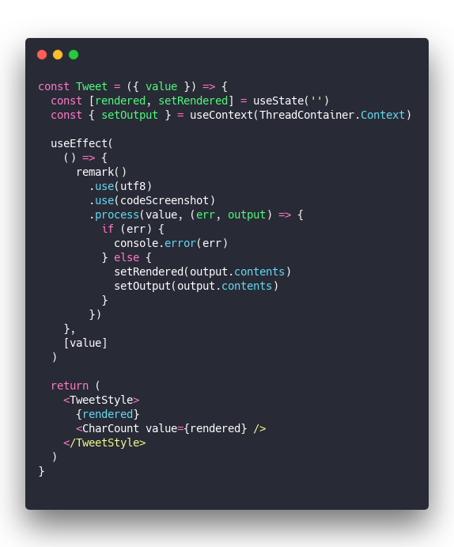
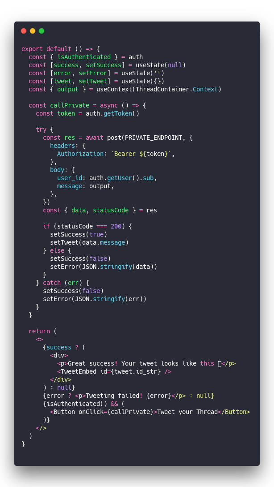
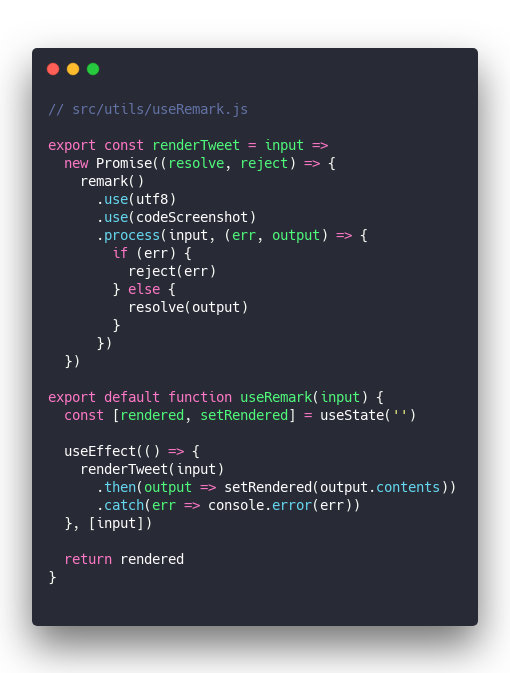
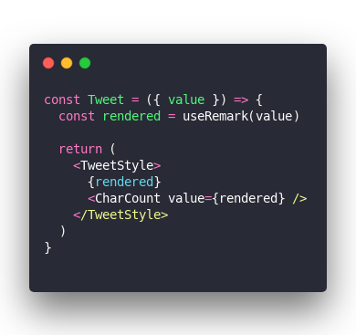
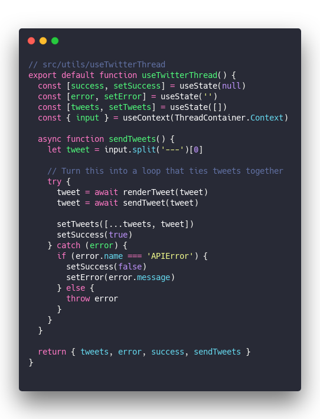
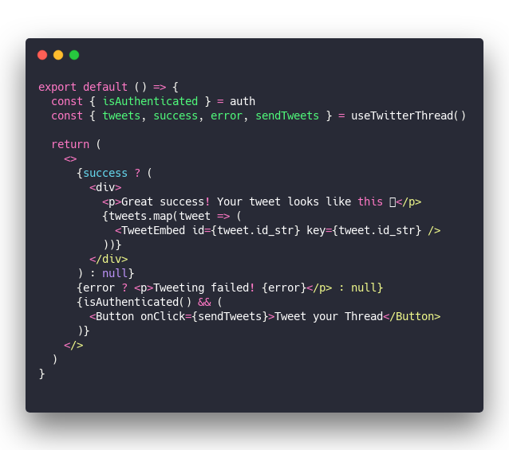

_This is a story full of wonderful new possibilities, beautiful codey things, and components clean as the mountain air. All thanks to custom react hooks ❤️_

While livecoding on the ThreadCompiler project yesterday, I noticed that with hooks our logic was getting tied up with presentation. All state was local, all logic inside components, shared state was weird, and our components looked like crap.

Here's an example.

A component that takes user input from React Context using [Constate](https://github.com/diegohaz/constate), passes it through a Remark compiler, then puts the result back in context (so other components can use it), and renders the result locally.

Local result for user preview, context for `TweetButton` so we can send it into the world.

&t=seti&l=javascript&ds=true&wc=true&wa=true&pv=48px&ph=32px&ln=false&code=const%20Tweet%20%3D%20(%7B%20value%20%7D)%20%3D%3E%20%7B%0A%20%20const%20%5Brendered%2C%20setRendered%5D%20%3D%20useState('')%0A%20%20const%20%7B%20setOutput%20%7D%20%3D%20useContext(ThreadContainer.Context)%0A%0A%20%20useEffect(%0A%20%20%20%20()%20%3D%3E%20%7B%0A%20%20%20%20%20%20remark()%0A%20%20%20%20%20%20%20%20.use(utf8)%0A%20%20%20%20%20%20%20%20.use(codeScreenshot)%0A%20%20%20%20%20%20%20%20.process(value%2C%20(err%2C%20output)%20%3D%3E%20%7B%0A%20%20%20%20%20%20%20%20%20%20if%20(err)%20%7B%0A%20%20%20%20%20%20%20%20%20%20%20%20console.error(err)%0A%20%20%20%20%20%20%20%20%20%20%7D%20else%20%7B%0A%20%20%20%20%20%20%20%20%20%20%20%20setRendered(output.contents)%0A%20%20%20%20%20%20%20%20%20%20%20%20setOutput(output.contents)%0A%20%20%20%20%20%20%20%20%20%20%7D%0A%20%20%20%20%20%20%20%20%7D)%0A%20%20%20%20%7D%2C%0A%20%20%20%20%5Bvalue%5D%0A%20%20)%0A%0A%20%20return%20(%0A%20%20%20%20%3CTweetStyle%3E%0A%20%20%20%20%20%20%7Brendered%7D%0A%20%20%20%20%20%20%3CCharCount%20value%3D%7Brendered%7D%20%2F%3E%0A%20%20%20%20%3C%2FTweetStyle%3E%0A%20%20)%0A%7D%0A)

What a mess 🤮

We have a `rendered` state and its setter, then a `useEffect` that runs on `value` changes. Passes `value` through Remark with custom plugins and gets the result.

Result goes into local state via `setRendered`, triggering a re-render showing a user preview. Result also goes into context with `setOutput` which triggers a re-render in `<TweetButton>` making it ready to tweet things out. ugh

TweetButton is even worse …

&t=seti&l=javascript&ds=true&wc=true&wa=true&pv=48px&ph=32px&ln=false&code=export%20default%20()%20%3D%3E%20%7B%0A%20%20const%20%7B%20isAuthenticated%20%7D%20%3D%20auth%0A%20%20const%20%5Bsuccess%2C%20setSuccess%5D%20%3D%20useState(null)%0A%20%20const%20%5Berror%2C%20setError%5D%20%3D%20useState('')%0A%20%20const%20%5Btweet%2C%20setTweet%5D%20%3D%20useState(%7B%7D)%0A%20%20const%20%7B%20output%20%7D%20%3D%20useContext(ThreadContainer.Context)%0A%0A%20%20const%20callPrivate%20%3D%20async%20()%20%3D%3E%20%7B%0A%20%20%20%20const%20token%20%3D%20auth.getToken()%0A%0A%20%20%20%20try%20%7B%0A%20%20%20%20%20%20const%20res%20%3D%20await%20post(PRIVATE_ENDPOINT%2C%20%7B%0A%20%20%20%20%20%20%20%20headers%3A%20%7B%0A%20%20%20%20%20%20%20%20%20%20Authorization%3A%20%60Bearer%20%24%7Btoken%7D%60%2C%0A%20%20%20%20%20%20%20%20%7D%2C%0A%20%20%20%20%20%20%20%20body%3A%20%7B%0A%20%20%20%20%20%20%20%20%20%20user_id%3A%20auth.getUser().sub%2C%0A%20%20%20%20%20%20%20%20%20%20message%3A%20output%2C%0A%20%20%20%20%20%20%20%20%7D%2C%0A%20%20%20%20%20%20%7D)%0A%20%20%20%20%20%20const%20%7B%20data%2C%20statusCode%20%7D%20%3D%20res%0A%0A%20%20%20%20%20%20if%20(statusCode%20%3D%3D%3D%20200)%20%7B%0A%20%20%20%20%20%20%20%20setSuccess(true)%0A%20%20%20%20%20%20%20%20setTweet(data.message)%0A%20%20%20%20%20%20%7D%20else%20%7B%0A%20%20%20%20%20%20%20%20setSuccess(false)%0A%20%20%20%20%20%20%20%20setError(JSON.stringify(data))%0A%20%20%20%20%20%20%7D%0A%20%20%20%20%7D%20catch%20(err)%20%7B%0A%20%20%20%20%20%20setSuccess(false)%0A%20%20%20%20%20%20setError(JSON.stringify(err))%0A%20%20%20%20%7D%0A%20%20%7D%0A%0A%20%20return%20(%0A%20%20%20%20%3C%3E%0A%20%20%20%20%20%20%7Bsuccess%20%3F%20(%0A%20%20%20%20%20%20%20%20%3Cdiv%3E%0A%20%20%20%20%20%20%20%20%20%20%3Cp%3EGreat%20success!%20Your%20tweet%20looks%20like%20this%20%F0%9F%91%87%3C%2Fp%3E%0A%20%20%20%20%20%20%20%20%20%20%3CTweetEmbed%20id%3D%7Btweet.id_str%7D%20%2F%3E%0A%20%20%20%20%20%20%20%20%3C%2Fdiv%3E%0A%20%20%20%20%20%20)%20%3A%20null%7D%0A%20%20%20%20%20%20%7Berror%20%3F%20%3Cp%3ETweeting%20failed!%20%7Berror%7D%3C%2Fp%3E%20%3A%20null%7D%0A%20%20%20%20%20%20%7BisAuthenticated()%20%26%26%20(%0A%20%20%20%20%20%20%20%20%3CButton%20onClick%3D%7BcallPrivate%7D%3ETweet%20your%20Thread%3C%2FButton%3E%0A%20%20%20%20%20%20)%7D%0A%20%20%20%20%3C%2F%3E%0A%20%20)%0A%7D%0A)

We have 3 local states for success, error, and API result. A whole API call function, and some rendering. All inside this poor little component that's supposed to be a button.

Oy vey 🙄

## How to fix your mess with a custom hook

We can clean this up with custom hooks.

Custom hooks are functions built on top of basic React Hooks. You can build them anywhere in your project, use them in a component, and it just works. 👌

Starting with the `<Tweet>` component, we can take out all that logic and wrap it in a new function.

&t=seti&l=javascript&ds=true&wc=true&wa=true&pv=48px&ph=32px&ln=false&code=%2F%2F%20src%2Futils%2FuseRemark.js%0A%0Aexport%20const%20renderTweet%20%3D%20input%20%3D%3E%0A%20%20new%20Promise((resolve%2C%20reject)%20%3D%3E%20%7B%0A%20%20%20%20remark()%0A%20%20%20%20%20%20.use(utf8)%0A%20%20%20%20%20%20.use(codeScreenshot)%0A%20%20%20%20%20%20.process(input%2C%20(err%2C%20output)%20%3D%3E%20%7B%0A%20%20%20%20%20%20%20%20if%20(err)%20%7B%0A%20%20%20%20%20%20%20%20%20%20reject(err)%0A%20%20%20%20%20%20%20%20%7D%20else%20%7B%0A%20%20%20%20%20%20%20%20%20%20resolve(output)%0A%20%20%20%20%20%20%20%20%7D%0A%20%20%20%20%20%20%7D)%0A%20%20%7D)%0A%0Aexport%20default%20function%20useRemark(input)%20%7B%0A%20%20const%20%5Brendered%2C%20setRendered%5D%20%3D%20useState('')%0A%0A%20%20useEffect(()%20%3D%3E%20%7B%0A%20%20%20%20renderTweet(input)%0A%20%20%20%20%20%20.then(output%20%3D%3E%20setRendered(output.contents))%0A%20%20%20%20%20%20.catch(err%20%3D%3E%20console.error(err))%0A%20%20%7D%2C%20%5Binput%5D)%0A%0A%20%20return%20rendered%0A%7D%0A)

It's customary to prefix your hooks with `use`. I like to put them in a directory.

We now have a `useRemark` hook with local state and an effect. When `input` changes it runs through `renderTweet`. The promise result goes into state. We return the current `rendered` state.

Extracting the Remark stuff itself into a `renderTweet` method makes it easier to use in `<TweetButton>`. You'll see.

This new custom hook makes `<Tweet>` the sweet little component it was always meant to be.

&t=seti&l=javascript&ds=true&wc=true&wa=true&pv=48px&ph=32px&ln=false&code=const%20Tweet%20%3D%20(%7B%20value%20%7D)%20%3D%3E%20%7B%0A%20%20const%20rendered%20%3D%20useRemark(value)%0A%0A%20%20return%20(%0A%20%20%20%20%3CTweetStyle%3E%0A%20%20%20%20%20%20%7Brendered%7D%0A%20%20%20%20%20%20%3CCharCount%20value%3D%7Brendered%7D%20%2F%3E%0A%20%20%20%20%3C%2FTweetStyle%3E%0A%20%20)%0A%7D%0A)

Beautiful ❤️

Something similar happens when we extract the `<TweetButton>` mess into a hook. Check this out 👇

Custom hook

&t=seti&l=javascript&ds=true&wc=true&wa=true&pv=48px&ph=32px&ln=false&code=%2F%2F%20src%2Futils%2FuseTwitterThread%0Aexport%20default%20function%20useTwitterThread()%20%7B%0A%20%20const%20%5Bsuccess%2C%20setSuccess%5D%20%3D%20useState(null)%0A%20%20const%20%5Berror%2C%20setError%5D%20%3D%20useState('')%0A%20%20const%20%5Btweets%2C%20setTweets%5D%20%3D%20useState(%5B%5D)%0A%20%20const%20%7B%20input%20%7D%20%3D%20useContext(ThreadContainer.Context)%0A%0A%20%20async%20function%20sendTweets()%20%7B%0A%20%20%20%20let%20tweet%20%3D%20input.split('---')%5B0%5D%0A%0A%20%20%20%20%2F%2F%20Turn%20this%20into%20a%20loop%20that%20ties%20tweets%20together%0A%20%20%20%20try%20%7B%0A%20%20%20%20%20%20tweet%20%3D%20await%20renderTweet(tweet)%0A%20%20%20%20%20%20tweet%20%3D%20await%20sendTweet(tweet)%0A%0A%20%20%20%20%20%20setTweets(%5B...tweets%2C%20tweet%5D)%0A%20%20%20%20%20%20setSuccess(true)%0A%20%20%20%20%7D%20catch%20(error)%20%7B%0A%20%20%20%20%20%20if%20(error.name%20%3D%3D%3D%20'APIError')%20%7B%0A%20%20%20%20%20%20%20%20setSuccess(false)%0A%20%20%20%20%20%20%20%20setError(error.message)%0A%20%20%20%20%20%20%7D%20else%20%7B%0A%20%20%20%20%20%20%20%20throw%20error%0A%20%20%20%20%20%20%7D%0A%20%20%20%20%7D%0A%20%20%7D%0A%0A%20%20return%20%7B%20tweets%2C%20error%2C%20success%2C%20sendTweets%20%7D%0A%7D%0A)

Almost same code as before.

You've got your 3 local states, and your `sendTweets` function. Moved the actual API call to a separate `sendTweet` function to clean up some more.

Upon success we update the array of tweet responses, update error and success states, etc.

The hook returns an object with everything your component needs to use it. List of `tweets`, current `error`, the `success` state, and a `sendTweets` method.

Your button component now looks like a button ❤️

&t=seti&l=javascript&ds=true&wc=true&wa=true&pv=48px&ph=32px&ln=false&code=export%20default%20()%20%3D%3E%20%7B%0A%20%20const%20%7B%20isAuthenticated%20%7D%20%3D%20auth%0A%20%20const%20%7B%20tweets%2C%20success%2C%20error%2C%20sendTweets%20%7D%20%3D%20useTwitterThread()%0A%0A%20%20return%20(%0A%20%20%20%20%3C%3E%0A%20%20%20%20%20%20%7Bsuccess%20%3F%20(%0A%20%20%20%20%20%20%20%20%3Cdiv%3E%0A%20%20%20%20%20%20%20%20%20%20%3Cp%3EGreat%20success!%20Your%20tweet%20looks%20like%20this%20%F0%9F%91%87%3C%2Fp%3E%0A%20%20%20%20%20%20%20%20%20%20%7Btweets.map(tweet%20%3D%3E%20(%0A%20%20%20%20%20%20%20%20%20%20%20%20%3CTweetEmbed%20id%3D%7Btweet.id_str%7D%20key%3D%7Btweet.id_str%7D%20%2F%3E%0A%20%20%20%20%20%20%20%20%20%20))%7D%0A%20%20%20%20%20%20%20%20%3C%2Fdiv%3E%0A%20%20%20%20%20%20)%20%3A%20null%7D%0A%20%20%20%20%20%20%7Berror%20%3F%20%3Cp%3ETweeting%20failed!%20%7Berror%7D%3C%2Fp%3E%20%3A%20null%7D%0A%20%20%20%20%20%20%7BisAuthenticated()%20%26%26%20(%0A%20%20%20%20%20%20%20%20%3CButton%20onClick%3D%7BsendTweets%7D%3ETweet%20your%20Thread%3C%2FButton%3E%0A%20%20%20%20%20%20)%7D%0A%20%20%20%20%3C%2F%3E%0A%20%20)%0A%7D%0A)

Much clearer 👌

## So how'd we do it?

Nothing special. You might even say _"Wait that's it?"_

You take your hooky mess, wrap it in a new method, call it `useSomething`, and voila: that method is a React hook and you've just created a custom hook. Congratz 👏

Enjoy your week

Cheers, ~Swizec

PS: I discovered [the floppotron](https://www.youtube.com/watch?v=PYnqVUx0Dzw) this morning. It is amazing