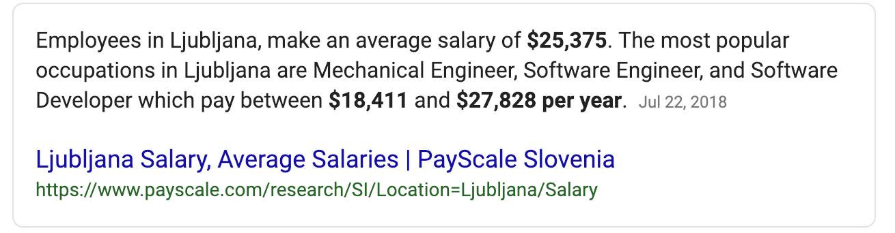

_You don't need millions of dollars, thousands of employees, and a groundbreaking idea. 2 hours per day, some help, and an okay idea is all you need to build a business that's more profitable than Uber._

I'm poking fun at Uber racing towards IPO [despite record breaking losses](https://www.bloomberg.com/news/articles/2019-02-15/uber-results-show-revenue-growth-slows-amid-persistent-losses) of course, but there is a lesson. My Twitter thread from Saturday got a lot of love so I wanted to share it with you and add some answers to common questions.

> Some fun stats from product sidehustle land 👇
>
> Since March 2015
>
>
>
> 2695 hours 1.8 hrs/day average
>
>
>
> 3-ish products ~2800 sales $139,208 revenue post fees $81,767 expenses
>
>
>
> $21/hour 🤔
>
>
>
> This must be why most people share only the revenue numbers [#open](https://twitter.com/hashtag/open?src=hash&ref_src=twsrc%5Etfw)
>
>
>
> — Swizec Teller (@Swizec) [February 17, 2019](https://twitter.com/Swizec/status/1096953072385875968?ref_src=twsrc%5Etfw)

## But why?

Now the obvious question: Why would anyone do this?

Well for starters it's still better than a coding job back home. My first job building websites was for $7/hour.

That was in high school.

I eventually got better jobs, yes. Mostly thanks to moving into freelancing, being picky about clients, and choosing to work for foreign clients (primarily US startup land) whenever possible.

That got me to about $70,000/year. It was great. Lived like a king.

Median wage in Slovenia is around $25,000/year by the way. That was my environment.

Google result for "Slovenia median wage"

So at about $70k I was making bank.

But I soon realized that selling your time doesn't scale. There's only so much time you can sell.

Even with productized consulting, you're still doing the work. You have to sit down and do the things. Your only way to scale is charging more.

Charging more has limits too. At some point clients are gonna be like "_Yeah no we'd rather hire a team of people we don't care how good you are or how much competition there is for your time"_

And even then. If you can't do the work, you don't get paid. This creates all sorts of weird incentives.

Imagine taking a vacation when a day of your time is worth $5000. Or $10,000.

Pretty hard right?

## Compounding and free time

Products don't have this problem. It doesn't matter what your product is: a SaaS, a book, a course, or something else. They all follow the same laws.

Products provide value when you aren't working.

That means you can make money when you're not working.

And that's when everything changes.

If you buy my book or course (or read a blog), I don't have to be there. You're getting value while I'm working on the next thing, or sweating at the gym, or anything really.

My value to society is no longer bound to time spent working.

Now this whole value-detached-from-time concept, it follows the laws of compound returns.

First you operate at a loss. You're putting in the work and nothing happens.

Also known as the [SaaS ramp of death](https://baremetrics.com/blog/long-slow-saas-ramp-of-death).

But every blog you write, every course you launch, every book you publish, every customer you get. They build on one another. They lead to more sales, more ideas, more things you can make.

Everything compounds.

And if all goes well, eventually, with some luck, you make more money from products than you ever could from selling your time.

That's the beauty of it. That's what makes the initial pain worth it.

## So what's expenses anyway?

Several people asked what counts as "expenses" to make up that whopping $81,767 figure up there. Don't feel like recalculating exact numbers so here's a list in descending order of magnitude:

1. **Ads.** You need ads in the modern digital age. Think of it as paying rent for your storefront in the olden days. This includes newsletter sponsorships, facebook, twitter, reddit, etc.
2. **Freelancers.** You can do a lot yourself, but with 2 hours/day your time is limited. Delegate.
3. **SaaS** Another way to save time is software. SaaS-es built by others. This includes email list software, server hosting, payment processing apps, Zapier stuff, all sorts of things.

In my tax returns I also include technology purchases (laptops, cameras, etc) as my expenses, some travel time when I can, online courses I take, and books I buy. Anything that helps my business goes into reducing taxes.

But I didn't include it in the number above because it's not directly related.

## You really track your time that carefully?

Yes. How will you know your investment is worth it, if you don't know how much you invested?

My time on "sidehustle" includes writing blogs, these emails, working on the products themselves, marketing, customer support, videos, etc.

## Swiz, I'm an employee not a consultant or freelancer

That's okay. You're still selling your time and your "scale" depends on charging more and more for your services.

A good way to scale beyond Just Time as an employee is to go into management of some sort. When you're responsible for the output of 5, 10, 500 employees, that's worth a lot.

The management track also affords you the benefits of providing value without working. When you delegate well enough your team can keep providing value even when you're on vacation.

And you get paid vacation time so you never run into the weird incentive of vacations having opportunity cost. That's great 👌

If you get equity, with a little luck, you might even have compound returns on your input. Depends how the company goes, but that's not in your control.

## Wait, $21/hour are you kidding me?

This is where people outside the US says _"Holy shit that's amazing!!"_ and people inside the US go _"Eh that's barely better than a Starbucks barista"_. Coastal US people at least. 😅

Yes it's true, you can make 5x that as an engineer.

Charge $100/hour for writing code and no-one bats an eye. Even a full-time job with benefits and equity and all the rest pays at least $45/hour for an engineer. Probably more.

But you know what? This is on top of a full-time job and it scales. That number's only gonna go up. First you invest, then you gain ✌️

## What could you do with an extra $57,000?

That's the real question. An extra $57,000 on top of your salary after expenses. What could you do with that?

Pay-off your loans? Downpayment for a house? Buy a car or three? Travel the world for 1 year [like my friends are](https://www.instagram.com/wanderingadeux/)?

And that brings us nicely to [my Reactathon workshop about building and launching full-stack web apps](https://ti.to/real-world-react/modern-app-with-react-workshop) that's almost sold out.

> Wat both early bird tiers for my "Build a whole React app" workshop already sold out at Reactathon
>
> O.O [pic.twitter.com/LsMASLi2Of](https://t.co/LsMASLi2Of)
>
>
>
> — Swizec Teller (@Swizec) [February 18, 2019](https://twitter.com/Swizec/status/1097361230799429632?ref_src=twsrc%5Etfw)

I didn't mean this to be a pitch but it just fits so nice 😇

# In other news

Launch prep for React for Data Visualization is in full swing. I know it doesn't really fit the tone of this email but I'm excited. Been working on this for months 😅

Got a new chapter on using React Hooks yesterday, a bunch of extra videos for the more theoretical sections and furiously writing copy for the launch. First time that I'm planning a launch in advance and not just flying by the seat of my pants.

Wish me luck and enjoy your week 😘

Cheers, ~Swizec