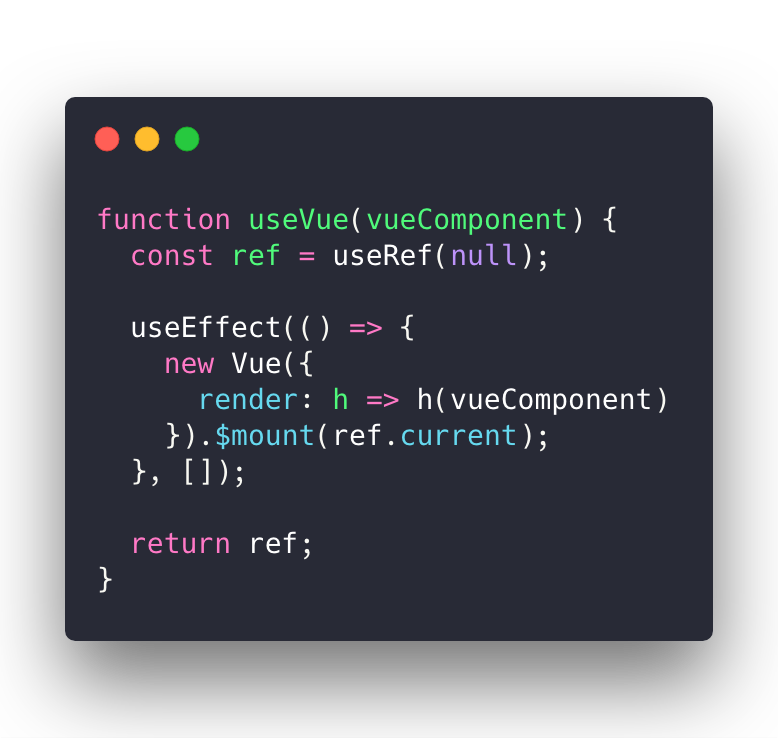
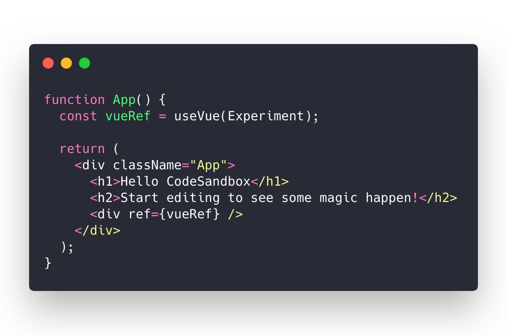
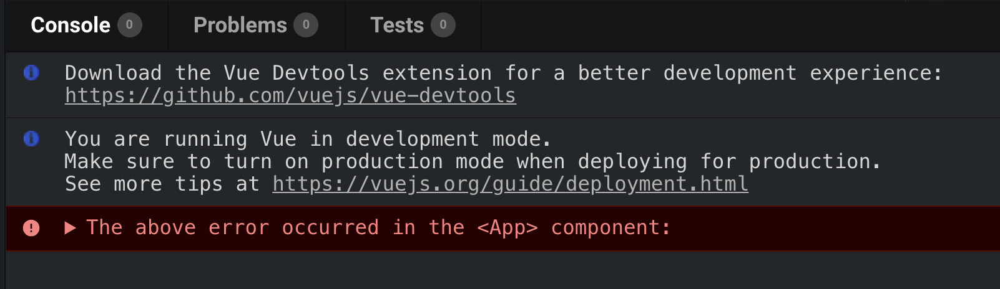

Last night I tried an experiment. It failed miserably but it wasn't my fault.

The goal was to build a `useVue` React hook that would let us render Vue components inside React. Why would anyone do this? Good question.

Here's what it looks like

It's based on my [D3blackbox approach](https://d3blackbox.com/) to wrapping random D3 examples in React components. Quick for meeting deadlines, great for small components you don't wanna build yourself.

Same thing here:

1. `useRef` creates a React ref
2. `useEffect` runs on component mount and does Vue stuff

You use `useVue` by passing in a Vue component and receiving a React ref. Then you render an anchor element. `useVue` places your Vue component in that element.

Like this

Great, right?

Except this is where it all falls apart. I can't figure out how to set up [my Codesandbox](https://codesandbox.io/s/l9r49oqo57) to support both Vue and React at the same time.

Start with a Vue project and JSX doesn't work. Building your React components with `React.createElement` is no fun.

Start with a React project and you can \\import `.vue` files but they \\import as a string. No JavaScript, no `<template>` tags, no nothing.

Just a little error saying Swizec is dumb.

Doesn't even have the decency to show an error. Dig deep and you see it's something like `This large 30 line string is not a DOM element`. No shit it isn't.

I know it's possible to have React and Vue in the same project. We've done it at dayjob.exe for ... reasons.

Would like to avoid building my own Webpack config from scratch just to prove this experiment works. 😅 You'd need to basically say _"Ok, use Vue for .vue files, React for .js files"_

Have you tried this before? Got any tips? Hit reply or answer this tweet

> But who can I ask about configuring a Codesandbox for both Vue and React?[@CompuIves](https://twitter.com/CompuIves?ref_src=twsrc%5Etfw) anyone tried this before? Is it possible?
>
> — Swizec Teller (@Swizec) [February 20, 2019](https://twitter.com/Swizec/status/1098269284378103808?ref_src=twsrc%5Etfw)