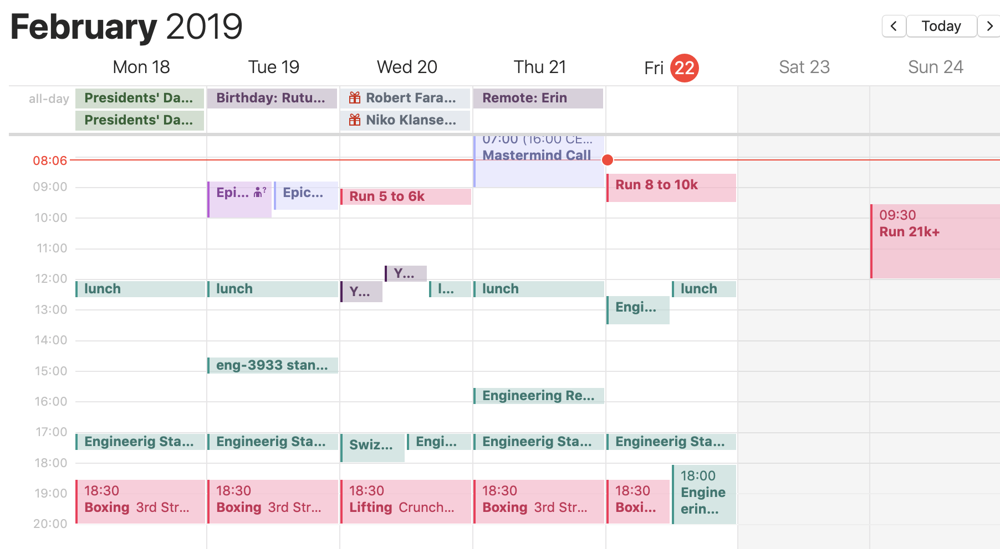
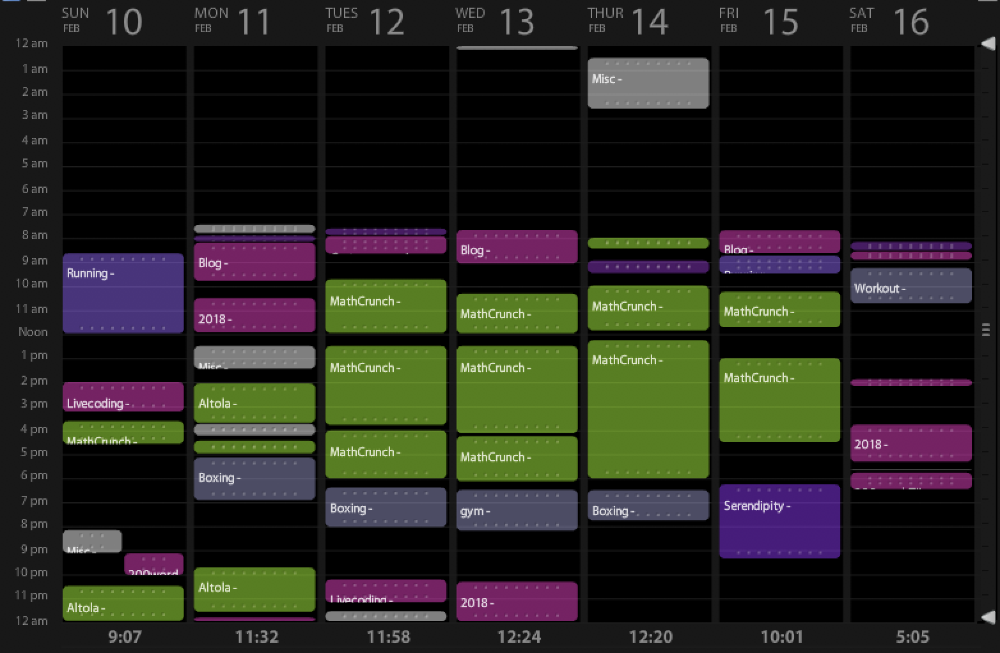
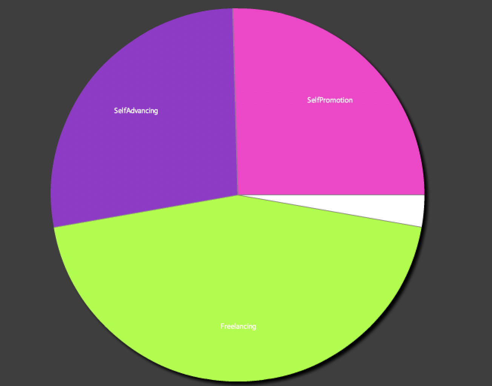
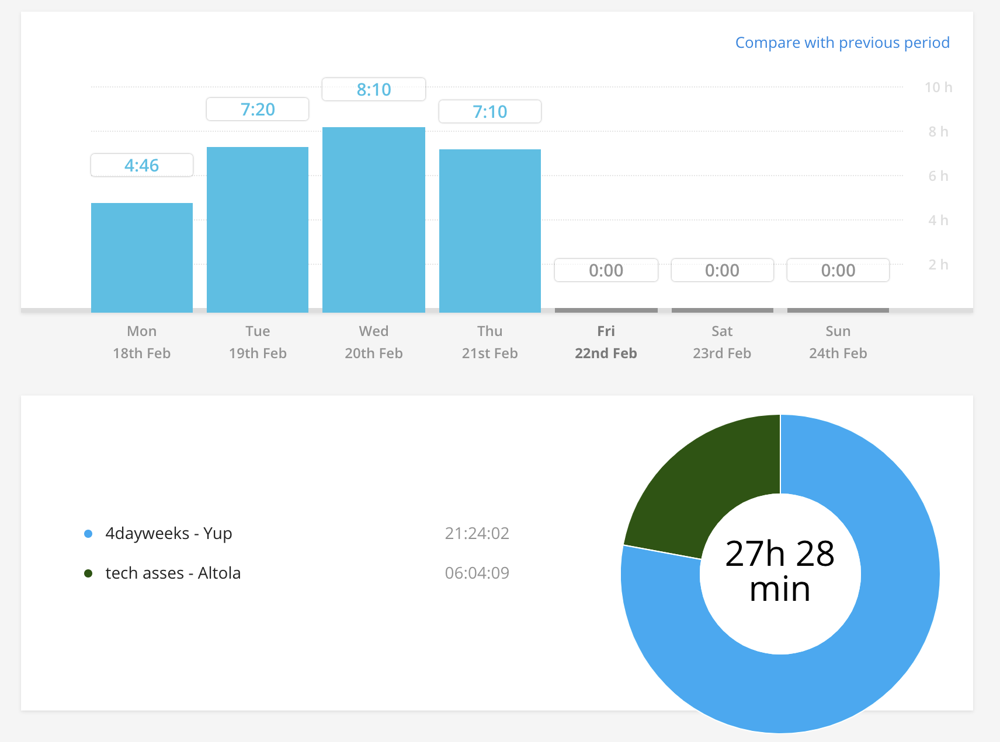
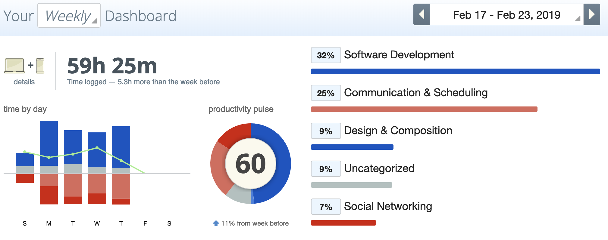
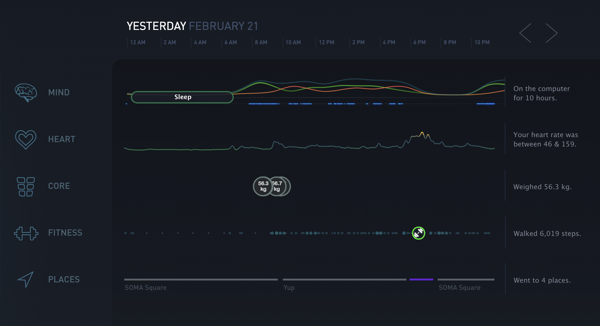
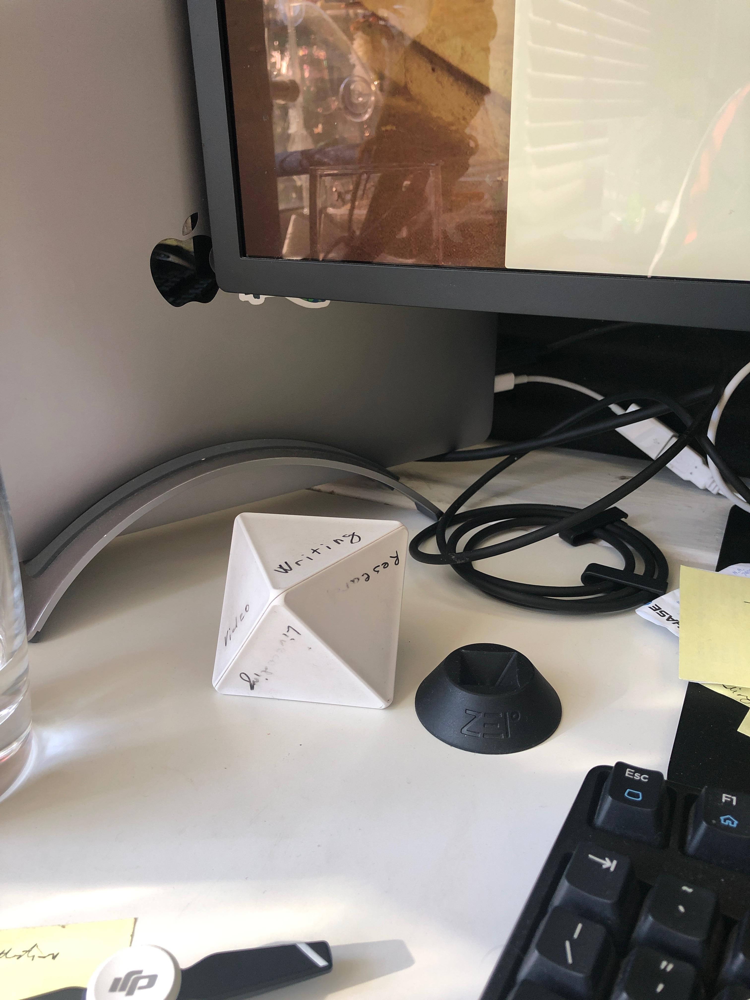
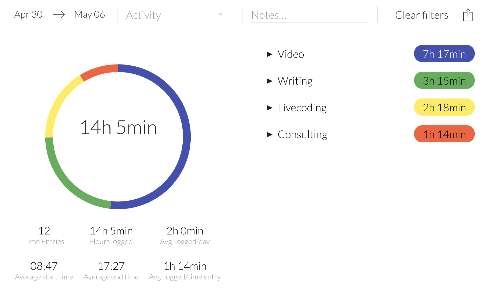

Jonas asks if I use any special time tracking software. A common question in fact. People ask me all the time 🤔

Yes, several.

I have 2 primary and 2 secondary time trackers these days. Used to experiment with a lot of different tools and according to The Good Shit Stays principle, this is what stuck.

- [Klok](http://getklok.com/) for areas of time
- [Toggl](https://toggl.com/) for billable hours
- [RescueTime](https://www.rescuetime.com/) for focus tracking
- [Timeular](https://timeular.com/) for sidehustle areas of time

## Areas of time – Klok

You're familiar with calendars. They specify your agenda, your plan for the week. If you color code events you can take one look and see how much time you spend in meetings, at the gym, studying, or whatever.

Here's my calendar

I suck at calendars. Never could make them work for me. Been trying for 10 years.

When was the last time you did everything in exactly the same order at exactly the same time as your calendar said? For me the answer is never.

That's where Klok comes in. Klok gives you a birds-eye view of **what happened**. Not what you _intended_ to happen.

I use it to track time on broad projects. How much time working out? How much time sidehustling? How much time writing? How much time at work?

Here's a fairly typical week

Pink-ish is sidehustle stuff, green is client work, purple is running, grey-ish is gym time.

You can see I've been good about going to bed around midnight, waking up early, and that I took Valentine's Day evening off to hang with The Girl.

You even get a high level piechart of how you spend your time.

About half my time goes to paid work, a quarter goes to sidehustle, and a quarter to self improvement. Self improvement tracks high these days because of marathon training and some Ramit Sethi courses I'm doing.

Got data going as far back as 2009. Some fun stats:

- 1807 hours on my first startup
- 5073 hours on blog, sidehustle, etc
- 6181 hours on self improvement
- 1971 hours on college
- 10352 hours on paid work

So now we know why I never graduated 😅

## Billable hours – Toggl

Never bill by the hour. Always know how many hours you're spending.

That's how you know if the project fee (or your paycheck) was worth it. Try to account for all time spent, not just butt in seat time.

Toggl is great because it's a timer.

Click track and it starts tracking. Klok does that too btw but I find Toggl is more fine-grained. I can track overhead and work work separately.

You get pretty charts. Helps you know how much time you're spending and where. Differences between Klok and Toggl are good area to optimize.

Klok says you spent 10 hours at the office and Toggl says you worked 8. Why?

## Focus – RescueTime

RescueTime runs in the background and keeps watch. Tells you when you're being focused and when you aren't.

This level of detail is too fine-grained for manual tracking and that's the point. You tell RescueTime which apps you consider productive and which you don't and it makes pretty graphs based on your activity.

You can see I've been pretty good this week. Actually spent more time creating than talking about creating.

And only 7% social networking! 🤘

A great companion for RescueTime is [Gyrosco.pe](https://gyrosco.pe/). One of the most beautiful apps I've ever seen built with React and D3.

Here's a look at [my public dashboard](https://gyrosco.pe/swizec/helix/)

Those intertwined green and red lines, that's how focused I was through the day. Great way to visualize it.

## Sidehustle areas – Timeular

Timeular is the newest addition to my flock of time tracking apps. I use it to measure different areas of creativity.

Writing, video, livecoding, marketing, stuff like that.

It isn't super useful and I don't look at the charts very often, but I like that it comes with a physical device that you twist and turn and plop down to start your timer.

I waver between _"That has too many sides"_ and _"Ugh not enough options"_. It's neat though, great idea.

If I had one at work I'd use this instead of Toggl :D

The charts are ... okay

🤨

And that's how I track my time, do you track your time?

Also that was 5 things wasn't it? Five things Friday! 🤘

Cheers, ~Swizec

PS: honorable mention because it's really cool. Kristian Heruc compiled a list of many hundreds [React Resources](https://reactresources.com) It's real good. There's even a list of [some of my React stuff](https://reactresources.com/people/swizec-teller) ❤️