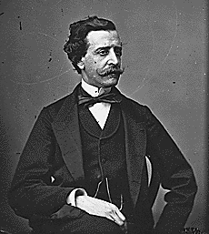
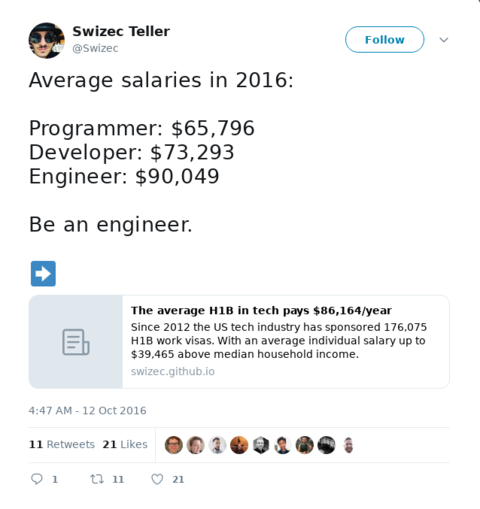
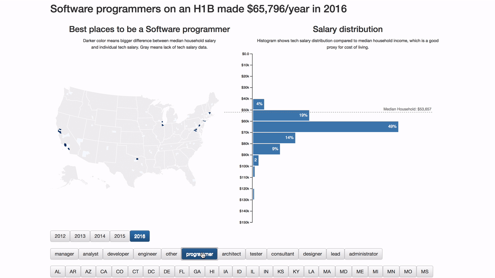
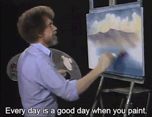

Imagine living in 1854 London. It's the center of the world. The richest city in the richest empire. Every day exciting new scientific, engineering, and medical discoveries. The age of enlightenment in full swing. People dress like this

A Victorian businessman

Very dashing. New railways all around you. Modern steam ships bring tea and spices from distant lands at unprecedented speeds. Never has life been so cushy. 🎩 But London also smells bad. The streets are full of horse manure, the river Thames is filled with waste. You wear special shoe covers to keep shoes shiny while wading through mud and poop on your way to work. People getting sick from Cholera all around you. Thousands of people. Nobody knows why. Miasma is everyone's best bet. Invisible air particles. What else could it be? The air smells bad and people get sick. The worse the air smells the sicker they are. Right? Maybe it's all the smog ... or the poop? Maybe industrial waste evaporating from the river? You try to hold your breath. And then John Snow draws a map. A very important map.

John Snow's Map

John Snow was studying Cholera outbreaks to figure out how they work. He had a bright idea: _"What if I take a map and draw a line for every person sick from Cholera?"_ It worked. John looked at the map and realized these cases weren't random at all! They happen around a single water pump on Broad Street. 616 cases and the closer you get to the pump, the more common they become. _"IT MUST BE THE WATER! Cholera spreads through bad water!!"_ I bet he was excited. Epidemiology was born. It would take another 26 years before everyone agreed that germs exist. An early win for data visualization 💪

## Engineers and developers

Software engineers, software developers, and programmers have the same job right? They solve business problems with code and systems. You come to them with an idea, a business problem, or a feature request. They figure out how to build it, how to make sure it works, how it fits into existing systems, and build a solution. You probably do that all the time. But did you know engineers make almost $30,000/year more than programmers? 🤨 It's true, I was just as surprised as you are.  I was looking into US visas a few years ago and realized that the H1B process creates a public dataset of salaries. When companies apply for your visa, they have to add salary info. It's one of the criteria. The government announces results publicly. 🤔 So I took the 177,826 software jobs I could find and visualized them on a graph. Filtered by job title, state, and year. The results were shocking

Not only do engineers average almost $30,000/year more than programmers, everyone who codes makes more than an entire median household in their area. 🤯 wow Think about that next time you call yourself a programmer ;)

## Dinosaurs

Say you're a scientist, a data scientist maybe, and you need a concise way to talk about a dataset. What do you do? Summary statistics is what you do. Mean, standard deviation, correlation. ✌️ The mean tells you what an average datapoint looks like. Standard deviation tells you how close to the mean most values lie. John Snow's map is one big standard deviation example. Correlation tells you how much one variable affects another. If you change X, how much does Y change? But what if vastly different datasets had the same summary statistics? That's what Matejka and Fitzmaurice of Autodesk set out to discover in their research. They came up with this 👇

12 datasets, 12 pictures, 1 set of stats. One version even renders as a dinosaur! And that's why you have to visualize your data to really understand what's going. Want to understand dinosaurs, engineers, or cholera? Gotta draw it out.

So tell me what's a time you were surprised by data? [Tweet me](https://twitter.com/Swizec) PS: did you know you're more likely to get hit by lighting thrice in the same year than to pick the perfect march madness bracket? Stats are weird
