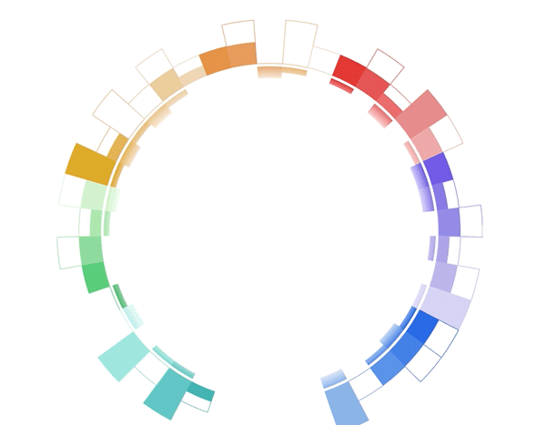
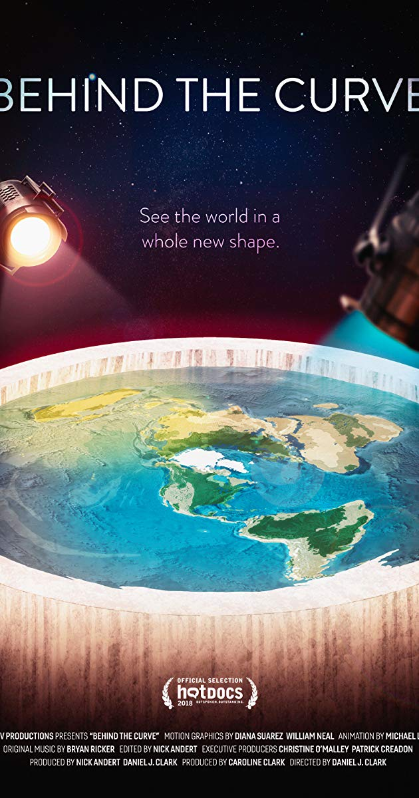
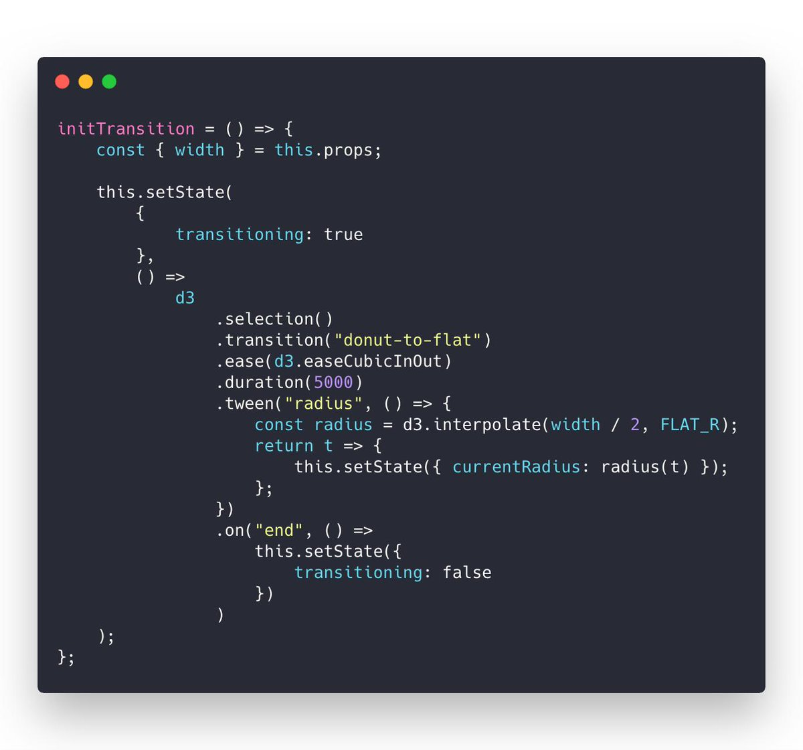

Last night I built something so cool it's still blowing my mind. And I got the idea from the flat earth society. Wat

It's a donut chart that transitions to a bar chart. Same component, same React code, different radius. 29,905px instead of 728px. 🤯

I _actually_ got the idea from that flat earth documentary on Netflix. Behind the Curve. No joke.

Sure, I haven't watched it yet but the twitter buzz put flatearthers on my mind. Apparently there's a scene where they confidently disprove their own theory and it's pure gold.

Gotta watch this for the lulz 😂

Why do flat earth people believe the earth is flat?

It's because the curve is soooooooo big that it looks flat.

That gave me an idea for a client project I've been working on. They asked me to build a smooth transition from a donut-shaped visualization to a bar chart shape.

No idea how to pull that off so I built eeeeverything else first. Sometimes that's just how it be. You put the hardest things off as long as you can get away with 😇

And then I made a break through.

> I just discovered a new approach to React + D3 transitions 🤯 Of course this happens juuuust when I think React for Data Visualization is complete
>
> Check this out, it combines the "game loop via state changes" with the "D3 runs transitions" approach [pic.twitter.com/mMglR4hDwp](https://t.co/mMglR4hDwp)
>
>
>
> — Swizec Teller (@Swizec) [March 5, 2019](https://twitter.com/Swizec/status/1102818340991430656?ref_src=twsrc%5Etfw)

You can _combine the two approaches to animation_ I teach in [React for Data Visualization](https://reactfordataviz.com)

React for Data Visualization and my workshop teach you about two ways to animate in dataviz:

1) **The game loop approach.** Borrows ideas from the gaming industry. Call `this.setState` 60 times per second and your React component animates. Wonderful.

2) **The D3 transition approach.** You take a React component, use props as a staging area, render from state, and use `componentDidMount` or `useEffect` to hand rendering control over to D3. D3 runs its transition, manipulates the DOM directly, then hands control back to React.

## A new approach to complex transitions

Now there's a 3rd approach. Something I never thought of before and it works beautifully. Adding it to [React for Data Visualization](https://reactfordataviz.com/) this weekend ✌️

Let's look at the transition again

Here's what happens behind the scenes to make that work:

1. A `<Donut>` component renders a bunch of `<Arc>`s
2. Each `<Arc>` takes care of its complex shape. Built from 3 different D3 arc generators
3. The whole thing is driven by D3's pie generator. It calculates start and end angles for individual arcs
4. Donut size is a function of radius. The bigger the radius, the bigger the donut.
5. As the radius increases from 728 to 29,905 the donut grows
6. And it moves down as fast as it grows. Without moving it would fly off the screen and you'd never see it again
7. To keep the pie exactly 728px wide even though it's rendered on a 29,905px donut ... well you gotta calculate [the arc segment](https://planetcalc.com/1421/) and derive start and end angles from that

🤯

That's a lot of stuff.

And it's all driven by this code. The transition 👇

I call this on component mount. Could be on a click event or whatever. Starts a custom tween transition with D3.

That lets D3 control the timing, the easing functions, keeping it smooth, all of that. You don't have to think about any of it.

But instead of changing a DOM attribute, my tween calls `this.setState` on the React component. Meaning it's _changing React state_ instead.

Since the donut bar chart knows how to render itself based on a radius ... well ... you can keep re-rendering at various radiuses and It Just Works.

Smooth transition by re-rendering the whole visualization 60 times per second. Even though it's a super complex component. Lots of moving parts and subcomponents.

Knowing everything that's going on behind the scenes I am _blown away_ by how well it works.

React is magic.

You can learn more in-depth about animating with React and D3 in my brand new course React for Data Visualization

Check it out 👉 [reactfordataviz.com](https://reactfordataviz.com/)

PS: 29905px is a very precise number. Chrome has a bug and the flat bar breaks at 29906. Works on Firefox and Safari tho