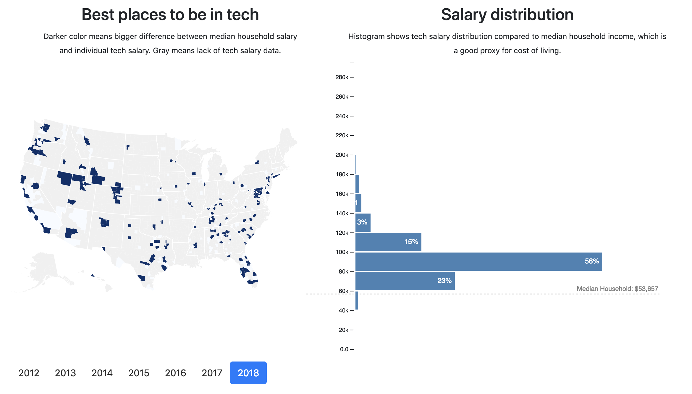
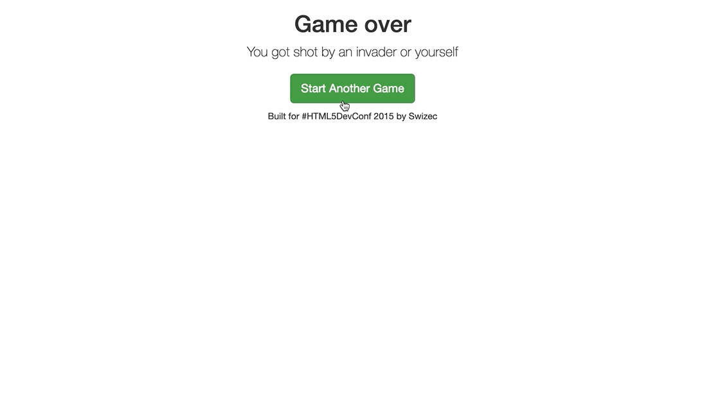

Ah the infamous TODOapp. Remember those?

Feels like TODOapps were everywhere a few years ago.

_"Look at me! I built a TODOapp with React"_

_"Mine's in Vue!"_

_"Mine's Angular"_

_"Hey over here, this TODOapp uses styled components and GraphQL"_

Who cares. How many TODOapps do you need, sheesh

The TODOapp and the counter component star in every tutorial for a new framework or language. Quick to understand, a little complex but not too much, absolutely boring to build and look at.

Don't you want something better to do?

Why not learn modern React by building apps you can show off?

Something you can show your friends and they'll say _"Wow that's cool"_, show your spouse and they'll go _"That's nice honey"_, or your mum and she'll say _"Holy shitballs that's the most amazingest thing I have ever seen did you eat your veggies!?"_

Veggies are \\important.

Don't you want to build something you're gonna have fun building? Something that makes you proud and looks good on your portfolio.

Yeah me too :)

Here's how I learned React 👇

Straight to the HackerNews front page it went. 21,259 people saw my very first React app on its first day. 71,894 in total. That's a new screenshot from localhost, I need to update production :)

You build this in [React for Data Visualization](https://reactfordataviz.com/). Yours is gonna use modern React patterns and a special chapter shows you how to refactor with React Hooks. Those came out just last month. 🤙

My next app was about learning Flux.

This was before Redux. First time people started talking about the "unidirectional dataflow" and how it revolutionizes the way we think about web apps.

So I built a space invaders game.

That's when I realized building a data visualization is just like a video game. Everything you build with React is like a video game.

You have your game engine, that's React, it handles renders and rerenders, figures out what changes from one paint to another, etc. You never have to worry about any of that.Build your components, take care of your business logic, and React figures out how to translate your imagination to your DOM.

👌

[React Space Invaders](http://swizec.github.io/space-invaders/) was good enough for a talk at a huge conference in San Francisco. My room was packed full. No pressure 😅

This one doesn't feature in [React for Data Visualization](https://reactfordataviz.com/) but the lessons I learned are all there: A whole chapter on the game loop approach to fine-tuned animation.

Then someone asked me _"What if we have tens of thousands of datapoints to display?"_

And I decided to find out. Why not learn Redux while we're at it. The result was a semi-famous React particle generator that animates 20,000 data points even on your phone. 😱

Fun to build and that series of blog posts got thousands of readers. Even got me a spot on a web animation panel at ForwardJS that year. 🤘

I bombed the panel but I was there. That looked _great_ on my visa application.

Here's another popular one: The dancing pythagorean fractal tree. Started as an experiment in recursion with React components, turned into a stress test, then a comparison of web frameworks.

@\_developit, creator of Preact, and @youyuxi, creator of Vue, liked it so much they built their own versions to test Preact and Vue. The experiment features in [React for Data Visualization](https://reactfordataviz.com) so you can compare and see which framework fits your style.

D3 doesn't discriminate. Same approach works with all modern component-based frameworks. I just happen to like React :)

Here's another fun one

Did you know more Americans move to Mexico every decade than the other way around? UN data says so.

I don't know what I tried to learn there but it looks cool. Colors for intensity of immigration, arcs with flying circles show density, searchable dropdown helps you explore the map.

Makes people go wow at the dinner table 😛

Ready to make _your_ dinner table go wow? Consider joining React for Data Visualization 👇

[reactfordataviz.com](https://reactfordataviz.com)

Prices go up this Friday.

Cheers, ~Swizec

PS: I'm adding a bunch of bonus material this weekend. Plus a gift for students who buy this week